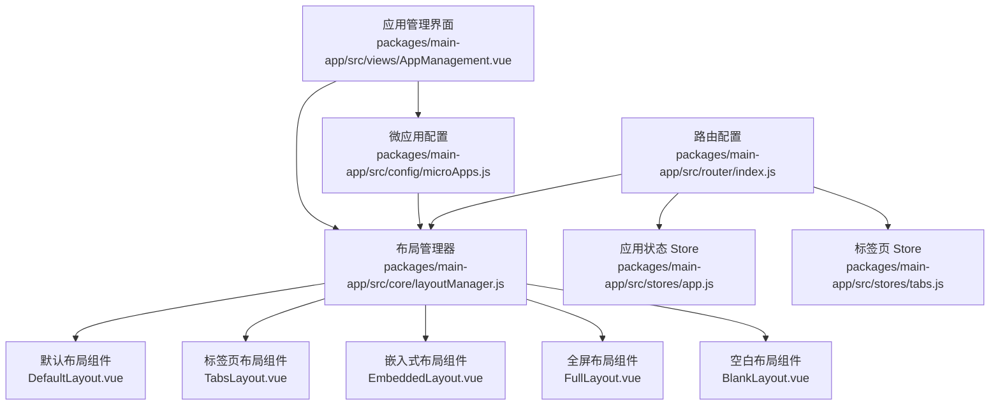
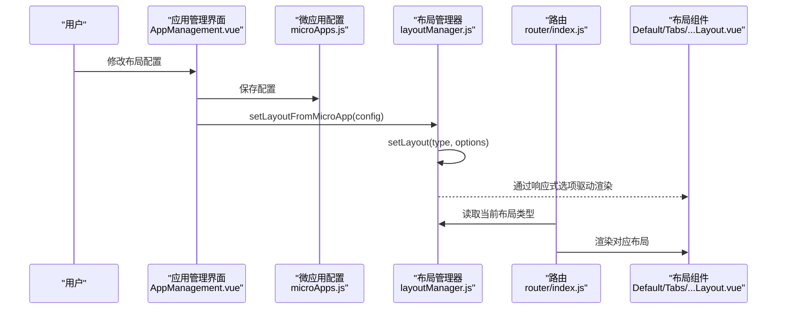
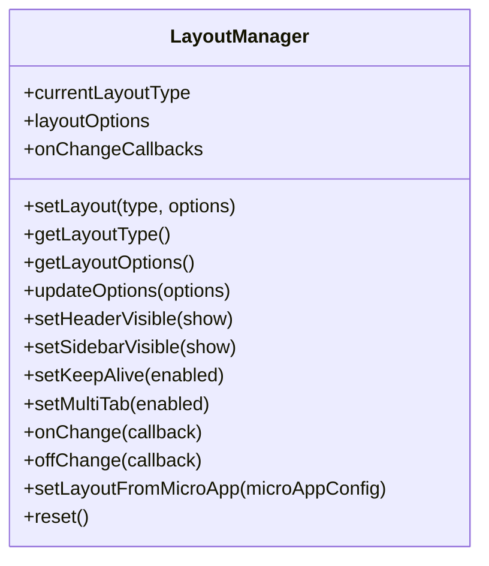
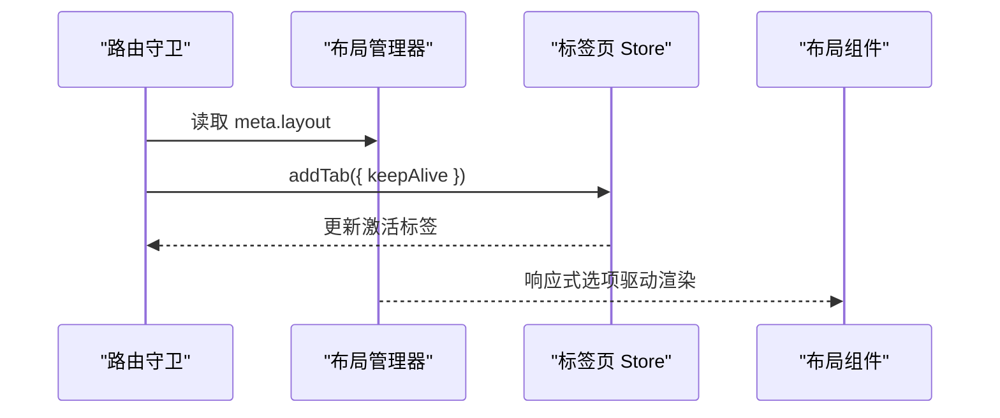
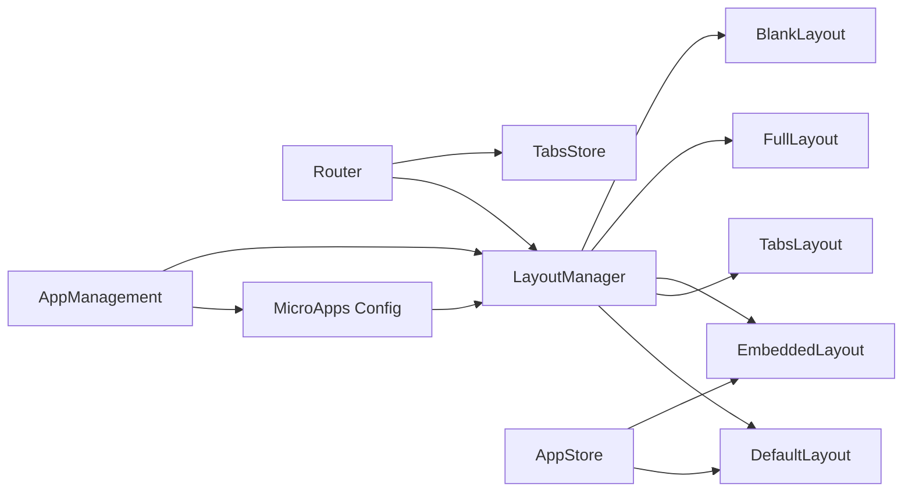

# 布局配置

<cite>
**本文引用的文件**
- [packages/main-app/src/core/layoutManager.js](file://packages/main-app/src/core/layoutManager.js)
- [packages/main-app/src/components/layout/DefaultLayout.vue](file://packages/main-app/src/components/layout/DefaultLayout.vue)
- [packages/main-app/src/components/layout/TabsLayout.vue](file://packages/main-app/src/components/layout/TabsLayout.vue)
- [packages/main-app/src/components/layout/EmbeddedLayout.vue](file://packages/main-app/src/components/layout/EmbeddedLayout.vue)
- [packages/main-app/src/components/layout/FullLayout.vue](file://packages/main-app/src/components/layout/FullLayout.vue)
- [packages/main-app/src/components/layout/BlankLayout.vue](file://packages/main-app/src/components/layout/BlankLayout.vue)
- [packages/main-app/src/router/index.js](file://packages/main-app/src/router/index.js)
- [packages/main-app/src/config/microApps.js](file://packages/main-app/src/config/microApps.js)
- [packages/main-app/src/views/AppManagement.vue](file://packages/main-app/src/views/AppManagement.vue)
- [packages/main-app/src/stores/app.js](file://packages/main-app/src/stores/app.js)
- [packages/main-app/src/stores/tabs.js](file://packages/main-app/src/stores/tabs.js)
- [user-docs/guide/layout-system.md](file://user-docs/guide/layout-system.md)
</cite>

## 目录
1. [简介](#简介)
2. [项目结构](#项目结构)
3. [核心组件](#核心组件)
4. [架构总览](#架构总览)
5. [详细组件分析](#详细组件分析)
6. [依赖关系分析](#依赖关系分析)
7. [性能考量](#性能考量)
8. [故障排查指南](#故障排查指南)
9. [结论](#结论)
10. [附录](#附录)

## 简介
本指南围绕微前端平台的布局系统，系统讲解 layoutType 与 layoutOptions 的配置项与行为，覆盖默认布局、全屏布局、标签页布局、嵌入式布局、空白布局五种布局类型及其适用场景；阐明布局配置的优先级、继承机制与动态切换方法；提供布局定制化与样式覆盖的实践建议，并总结最佳实践、性能优化与常见问题解决方案。

## 项目结构
布局系统由“布局管理器”“布局组件”“路由与标签页”“微应用配置与管理界面”共同构成，采用集中式布局管理与组件化布局渲染相结合的方式，确保在不同路由与微应用上下文中一致地应用布局策略。

图表来源
- [packages/main-app/src/core/layoutManager.js](file://packages/main-app/src/core/layoutManager.js#L1-L174)
- [packages/main-app/src/router/index.js](file://packages/main-app/src/router/index.js#L1-L130)
- [packages/main-app/src/stores/app.js](file://packages/main-app/src/stores/app.js#L1-L110)
- [packages/main-app/src/stores/tabs.js](file://packages/main-app/src/stores/tabs.js#L1-L144)
- [packages/main-app/src/config/microApps.js](file://packages/main-app/src/config/microApps.js#L1-L69)
- [packages/main-app/src/views/AppManagement.vue](file://packages/main-app/src/views/AppManagement.vue#L1-L370)
- [packages/main-app/src/components/layout/DefaultLayout.vue](file://packages/main-app/src/components/layout/DefaultLayout.vue#L1-L259)
- [packages/main-app/src/components/layout/TabsLayout.vue](file://packages/main-app/src/components/layout/TabsLayout.vue#L1-L227)
- [packages/main-app/src/components/layout/EmbeddedLayout.vue](file://packages/main-app/src/components/layout/EmbeddedLayout.vue#L1-L39)
- [packages/main-app/src/components/layout/FullLayout.vue](file://packages/main-app/src/components/layout/FullLayout.vue#L1-L16)
- [packages/main-app/src/components/layout/BlankLayout.vue](file://packages/main-app/src/components/layout/BlankLayout.vue#L1-L16)

章节来源
- [packages/main-app/src/core/layoutManager.js](file://packages/main-app/src/core/layoutManager.js#L1-L174)
- [packages/main-app/src/router/index.js](file://packages/main-app/src/router/index.js#L1-L130)
- [packages/main-app/src/stores/app.js](file://packages/main-app/src/stores/app.js#L1-L110)
- [packages/main-app/src/stores/tabs.js](file://packages/main-app/src/stores/tabs.js#L1-L144)
- [packages/main-app/src/config/microApps.js](file://packages/main-app/src/config/microApps.js#L1-L69)
- [packages/main-app/src/views/AppManagement.vue](file://packages/main-app/src/views/AppManagement.vue#L1-L370)

## 核心组件
- 布局管理器：统一维护当前布局类型与布局选项，提供动态切换、选项更新、从微应用配置导入、重置等能力，并通过回调通知布局变更。
- 布局组件：按布局类型渲染对应 UI 结构，如默认布局包含头部与侧边栏，标签页布局包含标签栏，嵌入式布局用于非路由替换的嵌入场景，全屏布局与空白布局分别用于最大化空间或独立页面。
- 路由与标签页：路由守卫根据 meta.layout 决定布局类型；标签页 Store 在启用多标签时负责标签增删与缓存控制。
- 微应用配置与管理界面：微应用配置中可指定 layoutType 与 layoutOptions；应用管理界面提供可视化编辑与持久化保存。

章节来源
- [packages/main-app/src/core/layoutManager.js](file://packages/main-app/src/core/layoutManager.js#L1-L174)
- [packages/main-app/src/components/layout/DefaultLayout.vue](file://packages/main-app/src/components/layout/DefaultLayout.vue#L1-L259)
- [packages/main-app/src/components/layout/TabsLayout.vue](file://packages/main-app/src/components/layout/TabsLayout.vue#L1-L227)
- [packages/main-app/src/components/layout/EmbeddedLayout.vue](file://packages/main-app/src/components/layout/EmbeddedLayout.vue#L1-L39)
- [packages/main-app/src/components/layout/FullLayout.vue](file://packages/main-app/src/components/layout/FullLayout.vue#L1-L16)
- [packages/main-app/src/components/layout/BlankLayout.vue](file://packages/main-app/src/components/layout/BlankLayout.vue#L1-L16)
- [packages/main-app/src/router/index.js](file://packages/main-app/src/router/index.js#L1-L130)
- [packages/main-app/src/stores/tabs.js](file://packages/main-app/src/stores/tabs.js#L1-L144)
- [packages/main-app/src/config/microApps.js](file://packages/main-app/src/config/microApps.js#L1-L69)
- [packages/main-app/src/views/AppManagement.vue](file://packages/main-app/src/views/AppManagement.vue#L1-L370)

## 架构总览
布局系统遵循“集中式管理 + 组件化渲染”的设计：布局管理器持有全局布局状态，布局组件基于该状态进行条件渲染；路由与标签页 Store 协助在导航过程中维护布局与标签状态；微应用配置与管理界面提供配置入口与持久化。

图表来源
- [packages/main-app/src/views/AppManagement.vue](file://packages/main-app/src/views/AppManagement.vue#L287-L328)
- [packages/main-app/src/config/microApps.js](file://packages/main-app/src/config/microApps.js#L1-L69)
- [packages/main-app/src/core/layoutManager.js](file://packages/main-app/src/core/layoutManager.js#L147-L156)
- [packages/main-app/src/router/index.js](file://packages/main-app/src/router/index.js#L1-L130)
- [packages/main-app/src/components/layout/DefaultLayout.vue](file://packages/main-app/src/components/layout/DefaultLayout.vue#L1-L259)
- [packages/main-app/src/components/layout/TabsLayout.vue](file://packages/main-app/src/components/layout/TabsLayout.vue#L1-L227)

## 详细组件分析

### 布局类型与选项详解
- 布局类型（layoutType）
  - default：默认布局，包含头部与侧边栏，适用于大多数业务页面。
  - full：全屏布局，无头部与侧边栏，子应用占满容器，适用于全屏展示类场景。
  - tabs：标签页布局，带侧边栏与标签栏，支持多标签切换与关闭，适用于多任务场景。
  - embedded：嵌入式布局，不替换主路由，适合在现有页面内嵌入子应用。
  - blank：空白布局，完全空白，适用于登录页、404 等独立页面。
- 布局选项（layoutOptions）
  - showHeader：是否显示头部。
  - showSidebar：是否显示侧边栏。
  - keepAlive：是否启用页面缓存（与标签页缓存协同）。
  - multiTab：是否启用多标签模式（影响标签页 Store 的行为）。

章节来源
- [user-docs/guide/layout-system.md](file://user-docs/guide/layout-system.md#L3-L66)
- [packages/main-app/src/core/layoutManager.js](file://packages/main-app/src/core/layoutManager.js#L24-L29)
- [packages/main-app/src/components/layout/DefaultLayout.vue](file://packages/main-app/src/components/layout/DefaultLayout.vue#L60-L95)
- [packages/main-app/src/components/layout/TabsLayout.vue](file://packages/main-app/src/components/layout/TabsLayout.vue#L50-L79)
- [packages/main-app/src/router/index.js](file://packages/main-app/src/router/index.js#L78-L84)

### 布局管理器（LayoutManager）
- 职责
  - 维护当前布局类型与布局选项（响应式）。
  - 提供 setLayout、updateOptions、setHeaderVisible、setSidebarVisible、setKeepAlive、setMultiTab 等方法。
  - 提供 onChange/offChange 回调机制，便于订阅布局变化。
  - 提供 setLayoutFromMicroApp 与 reset 方法，支持从微应用配置导入与重置。
- 关键流程
  - setLayout：校验布局类型，合并选项，触发回调。
  - updateOptions：浅合并新选项。
  - setLayoutFromMicroApp：从微应用配置导入布局类型与选项。
  - reset：恢复默认布局与选项。

图表来源
- [packages/main-app/src/core/layoutManager.js](file://packages/main-app/src/core/layoutManager.js#L18-L174)

章节来源
- [packages/main-app/src/core/layoutManager.js](file://packages/main-app/src/core/layoutManager.js#L1-L174)

### 默认布局（DefaultLayout）
- 特点
  - 条件渲染头部与侧边栏，由 layoutOptions 控制。
  - 内置面包屑、用户下拉菜单、折叠侧边栏交互。
  - 与应用 Store 和用户 Store 协作，保持状态同步。
- 与布局管理器的关系
  - 通过计算属性绑定 layoutManager.layoutOptions，实现响应式控制。

章节来源
- [packages/main-app/src/components/layout/DefaultLayout.vue](file://packages/main-app/src/components/layout/DefaultLayout.vue#L1-L259)
- [packages/main-app/src/core/layoutManager.js](file://packages/main-app/src/core/layoutManager.js#L130)

### 标签页布局（TabsLayout）
- 特点
  - 固定侧边栏与头部区域，中间为主内容区。
  - 提供标签栏与标签操作（刷新、关闭其他、关闭全部）。
  - 与标签页 Store 协作，维护标签集合与激活状态。
- 与布局选项的关系
  - multiTab 与 keepAlive 通常配合标签页使用，由路由守卫与标签页 Store 共同处理。

章节来源
- [packages/main-app/src/components/layout/TabsLayout.vue](file://packages/main-app/src/components/layout/TabsLayout.vue#L1-L227)
- [packages/main-app/src/stores/tabs.js](file://packages/main-app/src/stores/tabs.js#L1-L144)

### 嵌入式布局（EmbeddedLayout）
- 特点
  - 不替换主路由，仅在现有页面内嵌入子应用。
  - 适合仪表盘、报告页等场景。
- 适用性
  - 与 layoutOptions 中的 showHeader 可结合使用，决定是否显示嵌入式头部。

章节来源
- [packages/main-app/src/components/layout/EmbeddedLayout.vue](file://packages/main-app/src/components/layout/EmbeddedLayout.vue#L1-L39)

### 全屏布局（FullLayout）
- 特点
  - 最小化装饰，子应用占满容器，适合视频播放、大屏展示等场景。
- 适用性
  - 一般不与 showHeader/showSidebar 组合使用，但可作为 layoutOptions 的占位。

章节来源
- [packages/main-app/src/components/layout/FullLayout.vue](file://packages/main-app/src/components/layout/FullLayout.vue#L1-L16)

### 空白布局（BlankLayout）
- 特点
  - 完全空白，适合登录页、404 页面等独立页面。
- 适用性
  - 与路由 meta.layout='blank' 配合使用。

章节来源
- [packages/main-app/src/components/layout/BlankLayout.vue](file://packages/main-app/src/components/layout/BlankLayout.vue#L1-L16)
- [packages/main-app/src/router/index.js](file://packages/main-app/src/router/index.js#L78-L84)

### 路由与布局联动
- 路由守卫
  - beforeEach：设置加载状态、激活应用 ID。
  - afterEach：添加标签页（含 keepAlive），并根据 meta.layout 决定布局类型。
- 标签页 Store
  - addTab/removeTab/removeOtherTabs/removeAllTabs/setActiveTab/refreshTab 等方法，配合 keepAlive 控制缓存。

图表来源
- [packages/main-app/src/router/index.js](file://packages/main-app/src/router/index.js#L93-L127)
- [packages/main-app/src/stores/tabs.js](file://packages/main-app/src/stores/tabs.js#L25-L108)
- [packages/main-app/src/core/layoutManager.js](file://packages/main-app/src/core/layoutManager.js#L130)

章节来源
- [packages/main-app/src/router/index.js](file://packages/main-app/src/router/index.js#L1-L130)
- [packages/main-app/src/stores/tabs.js](file://packages/main-app/src/stores/tabs.js#L1-L144)

### 微应用配置与动态切换
- 微应用配置
  - 在微应用配置中设置 layoutType 与 layoutOptions，作为默认布局策略。
- 动态切换
  - 通过 layoutManager.setLayout 与 updateOptions 实现运行时切换与选项更新。
  - 通过 setLayoutFromMicroApp 从配置导入布局策略。
  - 通过 reset 恢复默认布局。

章节来源
- [packages/main-app/src/config/microApps.js](file://packages/main-app/src/config/microApps.js#L1-L69)
- [packages/main-app/src/core/layoutManager.js](file://packages/main-app/src/core/layoutManager.js#L40-L94)
- [packages/main-app/src/core/layoutManager.js](file://packages/main-app/src/core/layoutManager.js#L147-L168)
- [packages/main-app/src/views/AppManagement.vue](file://packages/main-app/src/views/AppManagement.vue#L287-L328)

## 依赖关系分析
- 布局管理器对布局组件的依赖：通过响应式选项驱动组件渲染。
- 路由对布局管理器与标签页 Store 的依赖：根据 meta.layout 与 keepAlive 决策。
- 应用管理界面与微应用配置：提供可视化配置与持久化。
- 应用 Store 与用户 Store：为默认布局提供状态与交互。

图表来源
- [packages/main-app/src/core/layoutManager.js](file://packages/main-app/src/core/layoutManager.js#L1-L174)
- [packages/main-app/src/router/index.js](file://packages/main-app/src/router/index.js#L1-L130)
- [packages/main-app/src/stores/tabs.js](file://packages/main-app/src/stores/tabs.js#L1-L144)
- [packages/main-app/src/stores/app.js](file://packages/main-app/src/stores/app.js#L1-L110)
- [packages/main-app/src/config/microApps.js](file://packages/main-app/src/config/microApps.js#L1-L69)
- [packages/main-app/src/views/AppManagement.vue](file://packages/main-app/src/views/AppManagement.vue#L1-L370)

章节来源
- [packages/main-app/src/core/layoutManager.js](file://packages/main-app/src/core/layoutManager.js#L1-L174)
- [packages/main-app/src/router/index.js](file://packages/main-app/src/router/index.js#L1-L130)
- [packages/main-app/src/stores/tabs.js](file://packages/main-app/src/stores/tabs.js#L1-L144)
- [packages/main-app/src/stores/app.js](file://packages/main-app/src/stores/app.js#L1-L110)
- [packages/main-app/src/config/microApps.js](file://packages/main-app/src/config/microApps.js#L1-L69)
- [packages/main-app/src/views/AppManagement.vue](file://packages/main-app/src/views/AppManagement.vue#L1-L370)

## 性能考量
- KeepAlive 与标签页缓存
  - 在 TabsLayout 中启用 keepAlive 可减少重复渲染成本，但需注意内存占用与状态清理。
  - 通过标签页 Store 的 addCachedView/removeCachedView 精细控制缓存生命周期。
- 路由守卫中的开销
  - 路由守卫中仅执行必要逻辑（设置激活应用、添加标签），避免阻塞导航。
- 布局切换的最小化重绘
  - 通过响应式选项与条件渲染，仅在必要区域重绘，降低 DOM 变更成本。
- 预加载与布局无关但影响整体体验
  - 在应用管理界面中对支持预加载的应用进行预加载，提升首屏与切换速度。

章节来源
- [packages/main-app/src/stores/tabs.js](file://packages/main-app/src/stores/tabs.js#L86-L108)
- [packages/main-app/src/router/index.js](file://packages/main-app/src/router/index.js#L111-L127)
- [packages/main-app/src/views/AppManagement.vue](file://packages/main-app/src/views/AppManagement.vue#L264-L272)

## 故障排查指南
- 布局类型无效
  - 现象：传入未知布局类型后被回退为默认布局。
  - 排查：确认传入类型是否在枚举范围内；检查 setLayout 的调用处。
- 头部/侧边栏未按预期显示
  - 现象：showHeader 或 showSidebar 未生效。
  - 排查：确认 layoutOptions 的值是否正确合并；检查布局组件中的条件渲染逻辑。
- 多标签页不工作
  - 现象：点击标签页无法切换或无法关闭。
  - 排查：确认 multiTab 已启用；检查标签页 Store 的 addTab/removeTab 流程；核对路由 meta.keepAlive。
- 嵌入式布局与路由冲突
  - 现象：嵌入式布局仍触发主路由替换。
  - 排查：确认未在路由中设置 replace 或错误的导航逻辑；确保使用嵌入式布局的场景不与主路由切换混用。
- 布局切换回调未触发
  - 现象：订阅 onChange 未收到通知。
  - 排查：确认回调已通过 onChange 注册；检查 setLayout 是否被正确调用。

章节来源
- [packages/main-app/src/core/layoutManager.js](file://packages/main-app/src/core/layoutManager.js#L40-L67)
- [packages/main-app/src/components/layout/DefaultLayout.vue](file://packages/main-app/src/components/layout/DefaultLayout.vue#L6-L95)
- [packages/main-app/src/stores/tabs.js](file://packages/main-app/src/stores/tabs.js#L25-L80)
- [packages/main-app/src/router/index.js](file://packages/main-app/src/router/index.js#L111-L127)

## 结论
布局系统通过集中式管理器与组件化渲染实现了灵活而可控的布局策略。合理使用 layoutType 与 layoutOptions，结合路由与标签页 Store，可在多场景下获得一致且高性能的用户体验。建议在复杂场景中优先启用 keepAlive 与多标签模式，并通过应用管理界面进行可视化配置与持久化。

## 附录

### 布局类型与适用场景速览
- default：通用业务页面，需要头部与侧边栏导航。
- full：全屏展示、大屏看板、视频播放等。
- tabs：多任务切换、多页面并行操作。
- embedded：在现有页面内嵌入子应用，不替换主路由。
- blank：独立页面，如登录、404。

章节来源
- [user-docs/guide/layout-system.md](file://user-docs/guide/layout-system.md#L3-L66)

### 布局选项与默认值
- showHeader：默认 true
- showSidebar：默认 true
- keepAlive：默认 false
- multiTab：默认 false

章节来源
- [packages/main-app/src/core/layoutManager.js](file://packages/main-app/src/core/layoutManager.js#L24-L29)
- [user-docs/guide/layout-system.md](file://user-docs/guide/layout-system.md#L117-L125)

### 配置优先级与继承机制
- 微应用配置优先于默认值：微应用配置中的 layoutType 与 layoutOptions 作为默认策略。
- 运行时动态切换优先于静态配置：通过 layoutManager.setLayout/updateOptions 的调用会覆盖当前状态。
- 路由 meta.layout 与标签页 Store：在导航过程中根据 meta.keepAlive 与标签页状态进行补充与修正。

章节来源
- [packages/main-app/src/config/microApps.js](file://packages/main-app/src/config/microApps.js#L1-L69)
- [packages/main-app/src/core/layoutManager.js](file://packages/main-app/src/core/layoutManager.js#L147-L156)
- [packages/main-app/src/router/index.js](file://packages/main-app/src/router/index.js#L111-L127)

### 动态切换方法
- 切换布局类型与选项：调用 setLayout(type, options)。
- 更新选项：调用 updateOptions(options)。
- 从微应用配置导入：调用 setLayoutFromMicroApp(config)。
- 重置为默认：调用 reset()。

章节来源
- [packages/main-app/src/core/layoutManager.js](file://packages/main-app/src/core/layoutManager.js#L40-L94)
- [packages/main-app/src/core/layoutManager.js](file://packages/main-app/src/core/layoutManager.js#L147-L168)
- [packages/main-app/src/views/AppManagement.vue](file://packages/main-app/src/views/AppManagement.vue#L287-L328)

### 布局定制化与样式覆盖
- 布局组件样式
  - 默认布局、标签页布局、嵌入式布局、全屏布局、空白布局均提供 scoped 样式，可通过深度选择器覆盖内部元素。
- 建议
  - 使用深度选择器覆盖组件内部元素（如 :deep(.el-tabs)）。
  - 为自定义主题提供变量与命名空间，避免与 Element Plus 默认样式冲突。
  - 对 keepAlive 与标签页缓存进行精细化控制，避免内存泄漏。

章节来源
- [packages/main-app/src/components/layout/DefaultLayout.vue](file://packages/main-app/src/components/layout/DefaultLayout.vue#L169-L258)
- [packages/main-app/src/components/layout/TabsLayout.vue](file://packages/main-app/src/components/layout/TabsLayout.vue#L141-L226)
- [packages/main-app/src/components/layout/EmbeddedLayout.vue](file://packages/main-app/src/components/layout/EmbeddedLayout.vue#L18-L38)
- [packages/main-app/src/components/layout/FullLayout.vue](file://packages/main-app/src/components/layout/FullLayout.vue#L10-L16)
- [packages/main-app/src/components/layout/BlankLayout.vue](file://packages/main-app/src/components/layout/BlankLayout.vue#L10-L16)

### 最佳实践
- 明确场景选择布局类型：通用页面用 default，全屏展示用 full，多任务用 tabs，嵌入场景用 embedded，独立页面用 blank。
- 合理启用 keepAlive：在 TabsLayout 中启用，注意缓存清理与状态复位。
- 使用路由 meta.keepAlive：与标签页 Store 协同，确保切换时的状态一致性。
- 通过应用管理界面进行可视化配置：便于团队协作与配置持久化。
- 监听布局变化：使用 onChange 回调在布局切换时执行必要的副作用（如埋点、统计）。

章节来源
- [packages/main-app/src/router/index.js](file://packages/main-app/src/router/index.js#L111-L127)
- [packages/main-app/src/stores/tabs.js](file://packages/main-app/src/stores/tabs.js#L25-L108)
- [packages/main-app/src/views/AppManagement.vue](file://packages/main-app/src/views/AppManagement.vue#L187-L208)
- [packages/main-app/src/core/layoutManager.js](file://packages/main-app/src/core/layoutManager.js#L132-L145)