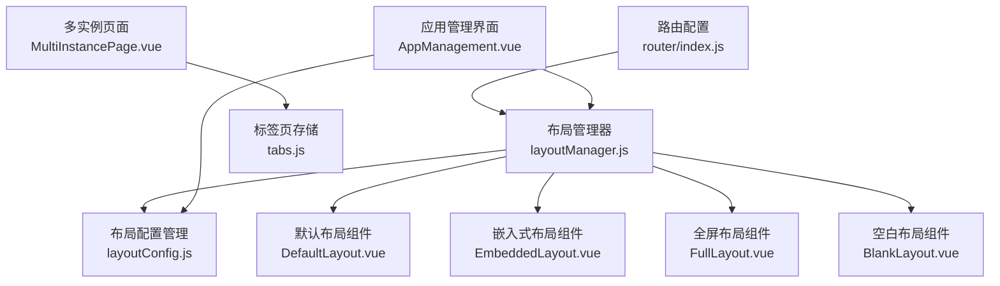
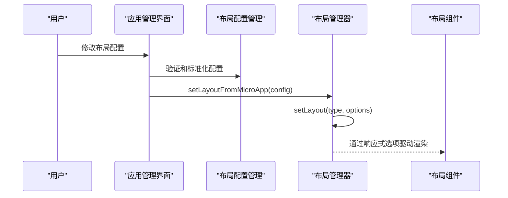
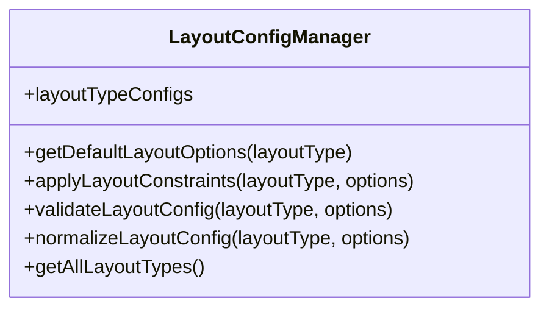
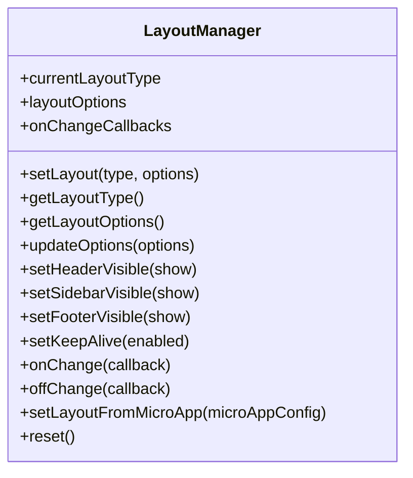
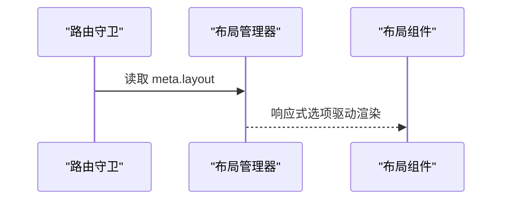
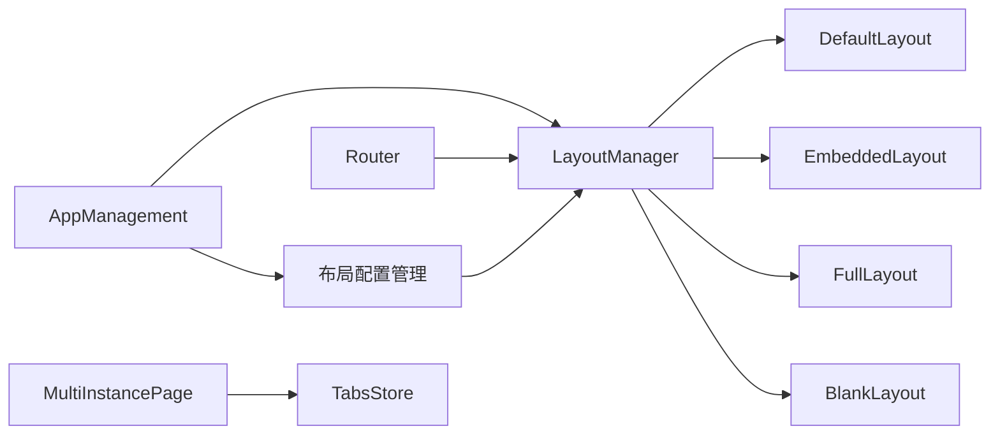

# 布局配置

<cite>
**本文引用的文件**
- [packages/main-app/src/core/layoutManager.js](file://packages/main-app/src/core/layoutManager.js)
- [packages/main-app/src/config/layoutConfig.js](file://packages/main-app/src/config/layoutConfig.js)
- [packages/main-app/src/components/layout/DefaultLayout.vue](file://packages/main-app/src/components/layout/DefaultLayout.vue)
- [packages/main-app/src/components/layout/EmbeddedLayout.vue](file://packages/main-app/src/components/layout/EmbeddedLayout.vue)
- [packages/main-app/src/components/layout/FullLayout.vue](file://packages/main-app/src/components/layout/FullLayout.vue)
- [packages/main-app/src/components/layout/BlankLayout.vue](file://packages/main-app/src/components/layout/BlankLayout.vue)
- [packages/main-app/src/router/index.js](file://packages/main-app/src/router/index.js)
- [packages/main-app/src/views/AppManagement.vue](file://packages/main-app/src/views/AppManagement.vue)
- [packages/main-app/src/views/MultiInstancePage.vue](file://packages/main-app/src/views/MultiInstancePage.vue)
- [packages/main-app/src/stores/tabs.js](file://packages/main-app/src/stores/tabs.js)
</cite>

## 更新摘要
**所做更改**
- 移除了tabs布局类型的配置支持，布局系统现仅支持4种核心布局类型
- 更新了布局类型枚举定义，移除了已废弃的tabs类型
- 简化了布局配置管理和验证逻辑
- 更新了应用管理界面的布局配置功能，移除了tabs相关配置
- 多实例页面中的标签页布局功能保持独立存在，不影响核心布局系统

## 目录
1. [简介](#简介)
2. [项目结构](#项目结构)
3. [核心组件](#核心组件)
4. [架构总览](#架构总览)
5. [详细组件分析](#详细组件分析)
6. [依赖关系分析](#依赖关系分析)
7. [性能考量](#性能考量)
8. [故障排查指南](#故障排查指南)
9. [结论](#结论)
10. [附录](#附录)

## 简介
本指南围绕微前端平台的布局系统，系统讲解标准化的布局配置管理系统的使用方法。布局配置系统现已简化为支持4种核心布局类型：默认(default)、全屏(full)、嵌入式(embedded)、空白(blank)，移除了复杂的tabs布局类型支持。详细说明layoutType和layoutOptions的配置参数，包括showHeader、showSidebar、showFooter、keepAlive等选项的作用和效果。阐述不同布局类型的特点和适用场景，解释布局配置的优先级规则、继承机制和动态切换方法。提供布局定制化的实现方案和样式覆盖技巧，包含布局配置的最佳实践、性能优化建议和常见问题解决方案。

## 项目结构
布局系统由"布局管理器"、"布局配置管理"、"布局组件"、"路由配置"、"应用管理界面"共同构成，采用标准化的布局配置管理和组件化布局渲染相结合的方式，确保在不同微应用上下文中一致地应用布局策略。

```mermaid
graph TB
LM["布局管理器<br/>layoutManager.js"]
LCM["布局配置管理<br/>layoutConfig.js"]
DL["默认布局组件<br/>DefaultLayout.vue"]
EL["嵌入式布局组件<br/>EmbeddedLayout.vue"]
FL["全屏布局组件<br/>FullLayout.vue"]
BL["空白布局组件<br/>BlankLayout.vue"]
RT["路由配置<br/>router/index.js"]
AM["应用管理界面<br/>AppManagement.vue"]
MIP["多实例页面<br/>MultiInstancePage.vue"]
TS["标签页存储<br/>tabs.js"]
LM --> LCM
LM --> DL
LM --> EL
LM --> FL
LM --> BL
RT --> LM
AM --> LM
AM --> LCM
MIP --> TS
```

**图表来源**
- [packages/main-app/src/core/layoutManager.js](file://packages/main-app/src/core/layoutManager.js#L1-L197)
- [packages/main-app/src/config/layoutConfig.js](file://packages/main-app/src/config/layoutConfig.js#L1-L205)
- [packages/main-app/src/components/layout/DefaultLayout.vue](file://packages/main-app/src/components/layout/DefaultLayout.vue#L1-L84)
- [packages/main-app/src/components/layout/EmbeddedLayout.vue](file://packages/main-app/src/components/layout/EmbeddedLayout.vue#L1-L51)
- [packages/main-app/src/components/layout/FullLayout.vue](file://packages/main-app/src/components/layout/FullLayout.vue#L1-L17)
- [packages/main-app/src/components/layout/BlankLayout.vue](file://packages/main-app/src/components/layout/BlankLayout.vue#L1-L16)
- [packages/main-app/src/router/index.js](file://packages/main-app/src/router/index.js#L1-L130)
- [packages/main-app/src/views/AppManagement.vue](file://packages/main-app/src/views/AppManagement.vue#L1-L1075)
- [packages/main-app/src/views/MultiInstancePage.vue](file://packages/main-app/src/views/MultiInstancePage.vue#L1-L745)
- [packages/main-app/src/stores/tabs.js](file://packages/main-app/src/stores/tabs.js#L1-L144)

**章节来源**
- [packages/main-app/src/core/layoutManager.js](file://packages/main-app/src/core/layoutManager.js#L1-L197)
- [packages/main-app/src/config/layoutConfig.js](file://packages/main-app/src/config/layoutConfig.js#L1-L205)
- [packages/main-app/src/router/index.js](file://packages/main-app/src/router/index.js#L1-L130)
- [packages/main-app/src/views/AppManagement.vue](file://packages/main-app/src/views/AppManagement.vue#L1-L1075)

## 核心组件
- **布局管理器**：统一维护当前布局类型与布局选项，提供动态切换、选项更新、从微应用配置导入、重置等能力，并通过回调通知布局变更。
- **布局配置管理**：提供标准化的布局配置管理，包括默认选项定义、约束规则应用、配置验证和建议功能，现仅支持4种核心布局类型。
- **布局组件**：按布局类型渲染对应 UI 结构，如默认布局包含头部与侧边栏，嵌入式布局用于非路由替换的嵌入场景，全屏布局与空白布局分别用于最大化空间或独立页面。
- **路由配置**：路由守卫根据 meta.layout 决定布局类型；支持基本的路由导航和应用状态管理。
- **应用管理界面**：提供可视化编辑布局配置、持久化保存、布局预览和约束验证功能，现移除tabs相关配置。
- **多实例页面**：包含独立的标签页布局功能，与核心布局系统分离，用于多应用同屏展示场景。

**章节来源**
- [packages/main-app/src/core/layoutManager.js](file://packages/main-app/src/core/layoutManager.js#L1-L197)
- [packages/main-app/src/config/layoutConfig.js](file://packages/main-app/src/config/layoutConfig.js#L1-L205)
- [packages/main-app/src/components/layout/DefaultLayout.vue](file://packages/main-app/src/components/layout/DefaultLayout.vue#L1-L84)
- [packages/main-app/src/components/layout/EmbeddedLayout.vue](file://packages/main-app/src/components/layout/EmbeddedLayout.vue#L1-L51)
- [packages/main-app/src/components/layout/FullLayout.vue](file://packages/main-app/src/components/layout/FullLayout.vue#L1-L17)
- [packages/main-app/src/components/layout/BlankLayout.vue](file://packages/main-app/src/components/layout/BlankLayout.vue#L1-L16)
- [packages/main-app/src/router/index.js](file://packages/main-app/src/router/index.js#L1-L130)
- [packages/main-app/src/views/AppManagement.vue](file://packages/main-app/src/views/AppManagement.vue#L1-L1075)
- [packages/main-app/src/views/MultiInstancePage.vue](file://packages/main-app/src/views/MultiInstancePage.vue#L1-L745)

## 架构总览
布局系统遵循"标准化配置管理 + 组件化渲染"的设计：布局管理器持有全局布局状态，布局配置管理提供标准化的配置验证和约束应用；布局组件基于该状态进行条件渲染；路由配置协助在导航过程中维护布局状态；应用管理界面提供配置入口与可视化编辑。多实例页面中的标签页功能独立于核心布局系统，专门用于多应用同屏展示场景。

```mermaid
sequenceDiagram
participant U as "用户"
participant AM as "应用管理界面"
participant LCM as "布局配置管理"
participant LM as "布局管理器"
participant LC as "布局组件"
U->>AM : 修改布局配置
AM->>LCM : 验证和标准化配置
AM->>LM : setLayoutFromMicroApp(config)
LM->>LM : setLayout(type, options)
LM-->>LC : 通过响应式选项驱动渲染
```

**图表来源**
- [packages/main-app/src/views/AppManagement.vue](file://packages/main-app/src/views/AppManagement.vue#L677-L705)
- [packages/main-app/src/config/layoutConfig.js](file://packages/main-app/src/config/layoutConfig.js#L184-L193)
- [packages/main-app/src/core/layoutManager.js](file://packages/main-app/src/core/layoutManager.js#L152-L157)
- [packages/main-app/src/components/layout/DefaultLayout.vue](file://packages/main-app/src/components/layout/DefaultLayout.vue#L47)

## 详细组件分析

### 布局类型与选项详解
- **布局类型（LayoutTypes）**
  - default：默认布局，包含头部与侧边栏，适用于大多数业务页面。
  - full：全屏布局，无头部与侧边栏，适用于全屏展示类场景。
  - embedded：嵌入式布局，轻量级嵌入式布局，适用于在现有页面内嵌入子应用。
  - blank：空白布局，完全空白，适用于登录页、404等独立页面。
- **布局选项（layoutOptions）**
  - showHeader：是否显示头部。
  - showSidebar：是否显示侧边栏。
  - showFooter：是否显示底部。
  - keepAlive：是否启用页面缓存。

**更新** 布局类型已简化为4种核心类型，移除了复杂的tabs布局支持，简化了配置管理和验证逻辑。

**章节来源**
- [packages/main-app/src/core/layoutManager.js](file://packages/main-app/src/core/layoutManager.js#L6-L11)
- [packages/main-app/src/config/layoutConfig.js](file://packages/main-app/src/config/layoutConfig.js#L26-L87)
- [packages/main-app/src/components/layout/DefaultLayout.vue](file://packages/main-app/src/components/layout/DefaultLayout.vue#L4-L18)

### 布局配置管理系统
- **职责**
  - 定义每种布局类型的默认选项和约束规则。
  - 提供布局配置的标准化、验证和建议功能。
  - 支持配置的约束应用和兼容性检查。
- **核心功能**
  - getDefaultLayoutOptions：获取指定布局类型的默认选项。
  - applyLayoutConstraints：应用布局类型约束到选项。
  - validateLayoutConfig：验证布局配置的有效性。
  - normalizeLayoutConfig：标准化布局配置。

```mermaid
classDiagram
class LayoutConfigManager {
+layoutTypeConfigs
+getDefaultLayoutOptions(layoutType)
+applyLayoutConstraints(layoutType, options)
+validateLayoutConfig(layoutType, options)
+normalizeLayoutConfig(layoutType, options)
+getAllLayoutTypes()
}
```

**图表来源**
- [packages/main-app/src/config/layoutConfig.js](file://packages/main-app/src/config/layoutConfig.js#L26-L205)

**章节来源**
- [packages/main-app/src/config/layoutConfig.js](file://packages/main-app/src/config/layoutConfig.js#L1-L205)

### 布局管理器（LayoutManager）
- **职责**
  - 维护当前布局类型与布局选项（响应式）。
  - 提供 setLayout、updateOptions、setHeaderVisible、setSidebarVisible、setFooterVisible、setKeepAlive 等方法。
  - 提供 onChange/offChange 回调机制，便于订阅布局变化。
  - 提供 setLayoutFromMicroApp 与 reset 方法，支持从微应用配置导入与重置。
- **关键流程**
  - setLayout：校验布局类型，合并选项，触发回调。
  - updateOptions：浅合并新选项。
  - setLayoutFromMicroApp：从微应用配置导入布局类型与选项。
  - reset：恢复默认布局与选项。

```mermaid
classDiagram
class LayoutManager {
+currentLayoutType
+layoutOptions
+onChangeCallbacks
+setLayout(type, options)
+getLayoutType()
+getLayoutOptions()
+updateOptions(options)
+setHeaderVisible(show)
+setSidebarVisible(show)
+setFooterVisible(show)
+setKeepAlive(enabled)
+onChange(callback)
+offChange(callback)
+setLayoutFromMicroApp(microAppConfig)
+reset()
}
```

**图表来源**
- [packages/main-app/src/core/layoutManager.js](file://packages/main-app/src/core/layoutManager.js#L17-L197)

**章节来源**
- [packages/main-app/src/core/layoutManager.js](file://packages/main-app/src/core/layoutManager.js#L1-L197)

### 默认布局（DefaultLayout）
- **特点**
  - 条件渲染头部与侧边栏，由 layoutOptions 控制。
  - 内置面包屑、用户下拉菜单、折叠侧边栏交互。
  - 与应用 Store 协作，保持状态同步。
- **与布局管理器的关系**
  - 通过计算属性绑定 layoutManager.layoutOptions，实现响应式控制。

**章节来源**
- [packages/main-app/src/components/layout/DefaultLayout.vue](file://packages/main-app/src/components/layout/DefaultLayout.vue#L1-L84)
- [packages/main-app/src/core/layoutManager.js](file://packages/main-app/src/core/layoutManager.js#L47)

### 嵌入式布局（EmbeddedLayout）
- **特点**
  - 轻量级嵌入式布局，包含简单的面包屑导航。
  - 不替换主路由，仅在现有页面内嵌入子应用。
  - 适合仪表盘、报告页等场景。
- **适用性**
  - 与 layoutOptions 中的 showHeader 可结合使用，决定是否显示嵌入式头部。

**章节来源**
- [packages/main-app/src/components/layout/EmbeddedLayout.vue](file://packages/main-app/src/components/layout/EmbeddedLayout.vue#L1-L51)

### 全屏布局（FullLayout）
- **特点**
  - 最小化装饰，子应用占满容器，适合视频播放、大屏展示等场景。
- **适用性**
  - 通常不与 showHeader/showSidebar 组合使用，但可作为 layoutOptions 的占位。

**章节来源**
- [packages/main-app/src/components/layout/FullLayout.vue](file://packages/main-app/src/components/layout/FullLayout.vue#L1-L17)

### 空白布局（BlankLayout）
- **特点**
  - 完全空白，适合登录页、404 页面等独立页面。
- **适用性**
  - 与路由 meta.layout='blank' 配合使用。

**章节来源**
- [packages/main-app/src/components/layout/BlankLayout.vue](file://packages/main-app/src/components/layout/BlankLayout.vue#L1-L16)
- [packages/main-app/src/router/index.js](file://packages/main-app/src/router/index.js#L76-L84)

### 路由与布局联动
- **路由守卫**
  - beforeEach：设置加载状态、激活应用 ID。
  - afterEach：添加标签页（含 keepAlive），并根据 meta.layout 决定布局类型。
- **标签页 Store**
  - addTab/removeTab/removeOtherTabs/removeAllTabs/setActiveTab/refreshTab 等方法，配合 keepAlive 控制缓存。

```mermaid
sequenceDiagram
participant RT as "路由守卫"
participant LM as "布局管理器"
participant LC as "布局组件"
RT->>LM : 读取 meta.layout
LM-->>LC : 响应式选项驱动渲染
```

**图表来源**
- [packages/main-app/src/router/index.js](file://packages/main-app/src/router/index.js#L111-L127)
- [packages/main-app/src/core/layoutManager.js](file://packages/main-app/src/core/layoutManager.js#L47)

**章节来源**
- [packages/main-app/src/router/index.js](file://packages/main-app/src/router/index.js#L1-L130)

### 应用管理界面与动态切换
- **应用配置**
  - 在微应用配置中设置 layoutType 与 layoutOptions，作为默认布局策略。
- **动态切换**
  - 通过 layoutManager.setLayout 与 updateOptions 实现运行时切换与选项更新。
  - 通过 setLayoutFromMicroApp 从配置导入布局策略。
  - 通过 reset 恢复默认布局。
- **布局预览与验证**
  - 提供布局预览功能，实时展示不同布局类型的效果。
  - 自动应用布局类型约束，确保配置的有效性。

**更新** 应用管理界面已移除tabs相关配置，专注于4种核心布局类型的配置管理。

**章节来源**
- [packages/main-app/src/views/AppManagement.vue](file://packages/main-app/src/views/AppManagement.vue#L482-L705)
- [packages/main-app/src/core/layoutManager.js](file://packages/main-app/src/core/layoutManager.js#L152-L190)
- [packages/main-app/src/config/layoutConfig.js](file://packages/main-app/src/config/layoutConfig.js#L184-L205)

### 多实例页面与标签页功能
- **标签页布局**
  - 多实例页面包含独立的标签页布局功能，使用 Element Plus 的 el-tabs 组件。
  - 支持网格布局、自由布局、标签页布局、左右分屏等多种布局模式。
  - 标签页功能与核心布局系统分离，专门用于多应用同屏展示场景。
- **标签页存储**
  - 使用 Pinia 状态管理，支持标签页的添加、删除、切换、缓存等功能。
  - 支持本地存储持久化，记住用户的标签页状态。

**章节来源**
- [packages/main-app/src/views/MultiInstancePage.vue](file://packages/main-app/src/views/MultiInstancePage.vue#L1-L745)
- [packages/main-app/src/stores/tabs.js](file://packages/main-app/src/stores/tabs.js#L1-L144)

## 依赖关系分析
- **布局管理器对布局配置管理的依赖**：通过标准化配置接口获取默认选项和应用约束。
- **布局管理器对布局组件的依赖**：通过响应式选项驱动组件渲染。
- **路由对布局管理器的依赖**：根据 meta.layout 决策布局类型。
- **应用管理界面与布局配置管理**：提供可视化配置与约束验证。
- **应用管理界面与布局管理器**：提供配置导入和动态切换功能。
- **多实例页面与标签页存储**：独立的标签页状态管理，与核心布局系统分离。

```mermaid
graph LR
LCM["布局配置管理"] --> LM["LayoutManager"]
LM --> DL["DefaultLayout"]
LM --> EL["EmbeddedLayout"]
LM --> FL["FullLayout"]
LM --> BL["BlankLayout"]
RT["Router"] --> LM
AM["AppManagement"] --> LM
AM --> LCM
MIP["MultiInstancePage"] --> TS["TabsStore"]
```

**图表来源**
- [packages/main-app/src/config/layoutConfig.js](file://packages/main-app/src/config/layoutConfig.js#L20)
- [packages/main-app/src/core/layoutManager.js](file://packages/main-app/src/core/layoutManager.js#L1-L197)
- [packages/main-app/src/router/index.js](file://packages/main-app/src/router/index.js#L1-L130)
- [packages/main-app/src/views/AppManagement.vue](file://packages/main-app/src/views/AppManagement.vue#L1-L1075)
- [packages/main-app/src/views/MultiInstancePage.vue](file://packages/main-app/src/views/MultiInstancePage.vue#L1-L745)
- [packages/main-app/src/stores/tabs.js](file://packages/main-app/src/stores/tabs.js#L1-L144)

**章节来源**
- [packages/main-app/src/config/layoutConfig.js](file://packages/main-app/src/config/layoutConfig.js#L1-L205)
- [packages/main-app/src/core/layoutManager.js](file://packages/main-app/src/core/layoutManager.js#L1-L197)
- [packages/main-app/src/router/index.js](file://packages/main-app/src/router/index.js#L1-L130)
- [packages/main-app/src/views/AppManagement.vue](file://packages/main-app/src/views/AppManagement.vue#L1-L1075)

## 性能考量
- **KeepAlive 缓存策略**
  - 在默认布局中启用 keepAlive 可减少重复渲染成本，但需注意内存占用与状态清理。
  - 嵌入式布局通常不建议使用 keepAlive，以避免不必要的资源消耗。
- **路由守卫中的开销**
  - 路由守卫中仅执行必要逻辑（设置激活应用、添加标签），避免阻塞导航。
- **布局切换的最小化重绘**
  - 通过响应式选项与条件渲染，仅在必要区域重绘，降低 DOM 变更成本。
- **布局配置验证的性能**
  - 布局配置管理提供快速验证机制，在应用管理界面中实时反馈配置有效性。
- **简化配置管理的性能收益**
  - 移除tabs布局支持后，配置验证和约束应用逻辑更加简洁，提升整体性能。

**章节来源**
- [packages/main-app/src/config/layoutConfig.js](file://packages/main-app/src/config/layoutConfig.js#L139-L175)
- [packages/main-app/src/router/index.js](file://packages/main-app/src/router/index.js#L111-L127)
- [packages/main-app/src/views/AppManagement.vue](file://packages/main-app/src/views/AppManagement.vue#L500-L570)

## 故障排查指南
- **布局类型无效**
  - 现象：传入未知布局类型后被回退为默认布局。
  - 排查：确认传入类型是否在 LayoutTypes 枚举范围内；检查 setLayout 的调用处。
- **头部/侧边栏未按预期显示**
  - 现象：showHeader 或 showSidebar 未生效。
  - 排查：确认 layoutOptions 的值是否正确合并；检查布局组件中的条件渲染逻辑。
- **嵌入式布局与路由冲突**
  - 现象：嵌入式布局仍触发主路由替换。
  - 排查：确认未在路由中设置 replace 或错误的导航逻辑；确保使用嵌入式布局的场景不与主路由切换混用。
- **布局配置约束冲突**
  - 现象：嵌入式布局同时隐藏头部和侧边栏导致显示异常。
  - 排查：确认布局配置管理器的约束应用是否正确；检查应用管理界面的约束验证逻辑。
- **布局切换回调未触发**
  - 现象：订阅 onChange 未收到通知。
  - 排查：确认回调已通过 onChange 注册；检查 setLayout 是否被正确调用。
- **tabs布局类型相关问题**
  - 现象：尝试使用tabs布局类型时报错或无效。
  - 排查：确认已移除tabs布局类型的支持；使用现有的4种核心布局类型替代。

**更新** 新增了tabs布局类型相关问题的排查指导，帮助用户理解布局系统的简化变更。

**章节来源**
- [packages/main-app/src/core/layoutManager.js](file://packages/main-app/src/core/layoutManager.js#L39-L66)
- [packages/main-app/src/components/layout/DefaultLayout.vue](file://packages/main-app/src/components/layout/DefaultLayout.vue#L4-L18)
- [packages/main-app/src/views/AppManagement.vue](file://packages/main-app/src/views/AppManagement.vue#L530-L570)

## 结论
布局系统通过标准化的配置管理和组件化渲染实现了灵活而可控的布局策略。新的布局配置管理系统移除了复杂的tabs布局支持，现仅支持4种核心布局类型：默认、全屏、嵌入式、空白，大大简化了配置管理和验证逻辑。合理的使用这4种核心布局类型与布局选项，可在多场景下获得一致且高性能的用户体验。建议在复杂场景中优先启用 keepAlive，并通过应用管理界面进行可视化配置与持久化。多实例页面中的标签页功能独立于核心布局系统，专门用于多应用同屏展示场景。

## 附录

### 布局类型与适用场景速览
- **default**：通用业务页面，需要头部与侧边栏导航。
- **full**：全屏展示、大屏看板、视频播放等。
- **embedded**：在现有页面内嵌入子应用，不替换主路由。
- **blank**：独立页面，如登录、404。

**更新** 布局类型已简化为4种核心类型，移除了tabs布局类型。

**章节来源**
- [packages/main-app/src/config/layoutConfig.js](file://packages/main-app/src/config/layoutConfig.js#L26-L87)

### 布局选项与默认值
- **showHeader**：默认 true（除 full 和 blank 布局外）
- **showSidebar**：默认 true（除 full 和 blank 布局外）
- **showFooter**：默认 false（除默认布局外不建议使用）
- **keepAlive**：默认 false（除默认布局外不建议使用）

**更新** 新增了showFooter选项的默认值说明。

**章节来源**
- [packages/main-app/src/config/layoutConfig.js](file://packages/main-app/src/config/layoutConfig.js#L30-L80)

### 布局配置验证与约束机制
- **配置验证**：检查布局类型有效性、选项兼容性和约束冲突。
- **约束应用**：根据布局类型自动应用推荐的选项值。
- **兼容性检查**：确保选项与布局类型匹配，提供警告信息。

**章节来源**
- [packages/main-app/src/config/layoutConfig.js](file://packages/main-app/src/config/layoutConfig.js#L139-L175)

### 动态切换方法
- **切换布局类型与选项**：调用 setLayout(type, options)。
- **更新选项**：调用 updateOptions(options)。
- **从微应用配置导入**：调用 setLayoutFromMicroApp(config)。
- **强制应用配置**：调用 applyLayoutWithoutCallback(type, options)。
- **重置为默认**：调用 reset()。

**章节来源**
- [packages/main-app/src/core/layoutManager.js](file://packages/main-app/src/core/layoutManager.js#L39-L190)

### 布局定制化与样式覆盖
- **布局组件样式**
  - 默认布局、嵌入式布局、全屏布局、空白布局均提供 scoped 样式，可通过深度选择器覆盖内部元素。
- **建议**
  - 使用深度选择器覆盖组件内部元素（如 :deep(.el-tabs)）。
  - 为自定义主题提供变量与命名空间，避免与 Element Plus 默认样式冲突。
  - 对 keepAlive 与标签页缓存进行精细化控制，避免内存泄漏。

**章节来源**
- [packages/main-app/src/components/layout/DefaultLayout.vue](file://packages/main-app/src/components/layout/DefaultLayout.vue#L61-L84)
- [packages/main-app/src/components/layout/EmbeddedLayout.vue](file://packages/main-app/src/components/layout/EmbeddedLayout.vue#L26-L51)
- [packages/main-app/src/components/layout/FullLayout.vue](file://packages/main-app/src/components/layout/FullLayout.vue#L10-L17)
- [packages/main-app/src/components/layout/BlankLayout.vue](file://packages/main-app/src/components/layout/BlankLayout.vue#L10-L16)

### 最佳实践
- **明确场景选择布局类型**：通用页面用 default，全屏展示用 full，嵌入场景用 embedded，独立页面用 blank。
- **合理启用 keepAlive**：仅在默认布局中启用，注意缓存清理与状态复位。
- **利用布局配置管理**：通过标准化配置确保配置的一致性和有效性。
- **通过应用管理界面进行可视化配置**：便于团队协作与配置持久化。
- **监听布局变化**：使用 onChange 回调在布局切换时执行必要的副作用（如埋点、统计）。
- **避免使用已移除的布局类型**：不要尝试使用tabs布局类型，使用现有的4种核心布局类型。

**更新** 新增了关于避免使用已移除布局类型的最佳实践建议。

**章节来源**
- [packages/main-app/src/views/AppManagement.vue](file://packages/main-app/src/views/AppManagement.vue#L385-L395)
- [packages/main-app/src/core/layoutManager.js](file://packages/main-app/src/core/layoutManager.js#L133-L146)
- [packages/main-app/src/config/layoutConfig.js](file://packages/main-app/src/config/layoutConfig.js#L195-L205)

### 多实例页面标签页功能
- **标签页布局模式**
  - 支持网格布局、自由布局、标签页布局、左右分屏等多种布局模式。
  - 标签页布局使用 Element Plus 的 el-tabs 组件实现。
- **标签页状态管理**
  - 使用 Pinia 状态管理，支持标签页的添加、删除、切换、缓存等功能。
  - 支持本地存储持久化，记住用户的标签页状态。

**章节来源**
- [packages/main-app/src/views/MultiInstancePage.vue](file://packages/main-app/src/views/MultiInstancePage.vue#L6-L117)
- [packages/main-app/src/stores/tabs.js](file://packages/main-app/src/stores/tabs.js#L25-L136)