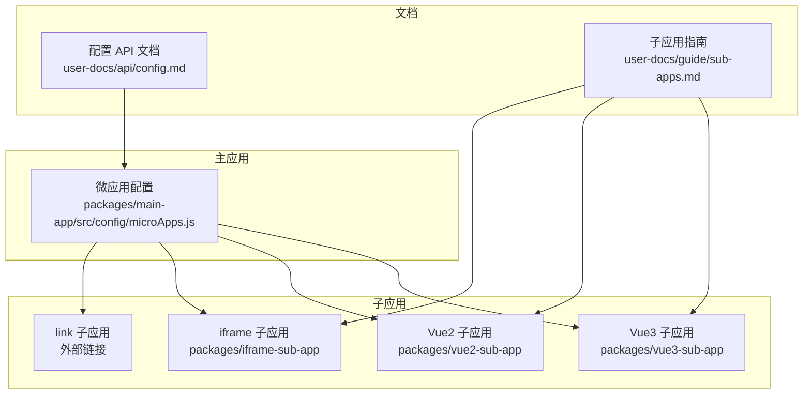
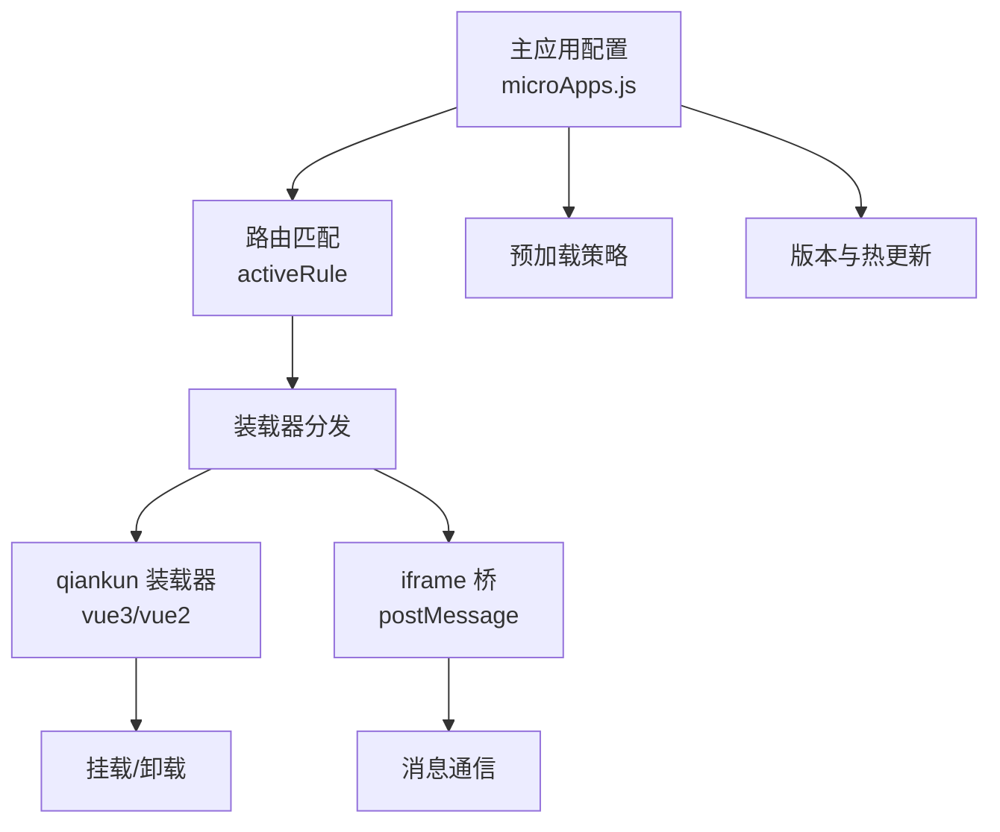
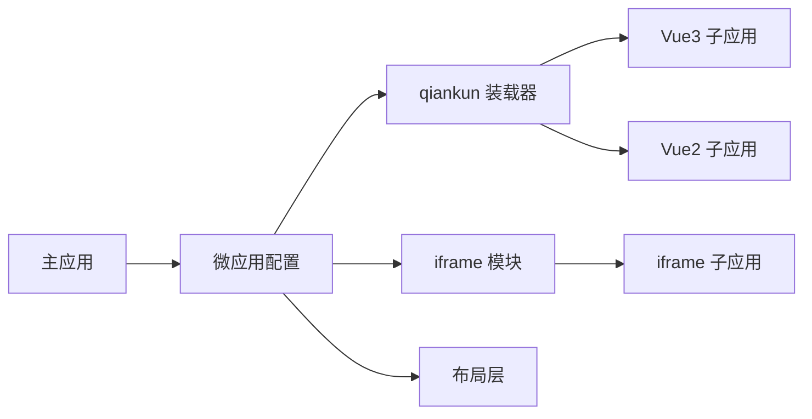

# 微应用配置

<cite>
**本文引用的文件**
- [packages/main-app/src/config/microApps.js](file://packages/main-app/src/config/microApps.js)
- [user-docs/api/config.md](file://user-docs/api/config.md)
- [user-docs/guide/sub-apps.md](file://user-docs/guide/sub-apps.md)
</cite>

## 目录
1. [简介](#简介)
2. [项目结构](#项目结构)
3. [核心组件](#核心组件)
4. [架构总览](#架构总览)
5. [详细组件分析](#详细组件分析)
6. [依赖关系分析](#依赖关系分析)
7. [性能考量](#性能考量)
8. [故障排查指南](#故障排查指南)
9. [结论](#结论)
10. [附录](#附录)

## 简介
本文件系统化梳理微应用配置的结构与参数，覆盖字段语义、使用场景、类型差异、预加载与版本管理、热更新检测、校验规则、错误处理与调试方法，并给出最佳实践与参考路径，帮助开发者正确配置各类微应用。

## 项目结构
- 主应用配置集中于主应用包内的微应用配置文件，统一导出微应用列表与查询/更新工具函数。
- 子应用类型涵盖 Vue3、Vue2、iframe、link 四类，分别在各自包中实现入口与构建配置。
- 文档目录提供配置 API 与子应用指南，明确字段定义、示例与通信规范。

**图表来源**
- [packages/main-app/src/config/microApps.js](file://packages/main-app/src/config/microApps.js#L1-L110)
- [user-docs/api/config.md](file://user-docs/api/config.md#L1-L121)
- [user-docs/guide/sub-apps.md](file://user-docs/guide/sub-apps.md#L1-L170)

**章节来源**
- [packages/main-app/src/config/microApps.js](file://packages/main-app/src/config/microApps.js#L1-L110)
- [user-docs/api/config.md](file://user-docs/api/config.md#L1-L121)
- [user-docs/guide/sub-apps.md](file://user-docs/guide/sub-apps.md#L1-L170)

## 核心组件
- 微应用配置数组：包含各子应用的 id、name、entry、activeRule、container、status、version、lastModified、preload、type、layoutType、layoutOptions、props 等字段。
- 查询与更新工具函数：按 id 获取配置、筛选在线应用、按类型筛选、动态更新配置。

关键能力与职责
- 统一配置入口：集中维护所有微应用元数据，便于主应用调度与渲染。
- 运行期控制：通过 status 控制启停；通过 version/lastModified 支持热更新检测；通过 preload 控制预加载策略。
- 类型分发：根据 type 分派到不同装载器（qiankun 或 iframe 桥）。

**章节来源**
- [packages/main-app/src/config/microApps.js](file://packages/main-app/src/config/microApps.js#L5-L69)
- [packages/main-app/src/config/microApps.js](file://packages/main-app/src/config/microApps.js#L76-L107)

## 架构总览
微应用配置在主应用侧作为“事实来源”，决定子应用的激活、装载、布局与通信方式。不同类型子应用在入口与生命周期上存在差异，但均通过主应用配置进行统一编排。

**图表来源**
- [packages/main-app/src/config/microApps.js](file://packages/main-app/src/config/microApps.js#L1-L110)
- [user-docs/guide/sub-apps.md](file://user-docs/guide/sub-apps.md#L10-L170)

## 详细组件分析

### 配置字段详解
以下为常用字段的语义、作用与使用场景说明（基于配置 API 文档与主应用配置文件）：

- id
  - 类型：字符串
  - 必填：是
  - 说明：唯一标识，用于区分不同应用，支持按 id 查询与更新。
  - 使用场景：主应用路由匹配、装载器定位、日志追踪。
  - 参考路径：[packages/main-app/src/config/microApps.js](file://packages/main-app/src/config/microApps.js#L7-L68)

- name
  - 类型：字符串
  - 必填：是
  - 说明：显示名称，常用于菜单、标题或调试信息。
  - 使用场景：UI 展示、导航、告警提示。
  - 参考路径：[packages/main-app/src/config/microApps.js](file://packages/main-app/src/config/microApps.js#L8-L68)

- entry
  - 类型：字符串
  - 必填：是
  - 说明：入口地址，支持 HTML 入口或 JSON 配置（具体取决于装载器实现）。
  - 使用场景：qiankun 加载远程资源；iframe 加载远端页面。
  - 参考路径：[packages/main-app/src/config/microApps.js](file://packages/main-app/src/config/microApps.js#L9-L68)

- activeRule
  - 类型：字符串
  - 必填：是
  - 说明：路由激活规则，决定何时加载该微应用。
  - 使用场景：与主应用路由体系联动，实现按路径自动激活。
  - 参考路径：[packages/main-app/src/config/microApps.js](file://packages/main-app/src/config/microApps.js#L10-L68)

- container
  - 类型：字符串
  - 必填：是
  - 说明：容器选择器，指定挂载节点。
  - 使用场景：qiankun 渲染到指定容器；iframe 容器隔离。
  - 参考路径：[packages/main-app/src/config/microApps.js](file://packages/main-app/src/config/microApps.js#L11-L68)

- status
  - 类型：'online' | 'offline'
  - 必填：是
  - 说明：状态，控制是否允许激活与装载。
  - 使用场景：灰度发布、紧急停用、运维控制。
  - 参考路径：[packages/main-app/src/config/microApps.js](file://packages/main-app/src/config/microApps.js#L12-L68)

- version
  - 类型：字符串
  - 必填：否
  - 说明：版本号，用于标识资源版本。
  - 使用场景：CDN 缓存控制、热更新检测。
  - 参考路径：[packages/main-app/src/config/microApps.js](file://packages/main-app/src/config/microApps.js#L13-L68)

- lastModified
  - 类型：number
  - 必填：否
  - 说明：最后修改时间戳，用于热更新检测。
  - 使用场景：对比远端资源变更，触发重新拉取或刷新。
  - 参考路径：[packages/main-app/src/config/microApps.js](file://packages/main-app/src/config/microApps.js#L14-L68)

- preload
  - 类型：boolean
  - 必填：否
  - 说明：是否预加载，默认 false。
  - 使用场景：热门应用提前加载以降低首开延迟。
  - 参考路径：[packages/main-app/src/config/microApps.js](file://packages/main-app/src/config/microApps.js#L15-L68)

- type
  - 类型：'vue3' | 'vue2' | 'iframe' | 'link'
  - 必填：是
  - 说明：应用类型，决定装载与通信方式。
  - 使用场景：分发到 qiankun 或 iframe 模式。
  - 参考路径：[packages/main-app/src/config/microApps.js](file://packages/main-app/src/config/microApps.js#L16-L68)

- layoutType
  - 类型：'default' | 'full' | 'tabs' | 'embedded' | 'blank'
  - 必填：否
  - 说明：布局类型，影响容器内布局行为。
  - 使用场景：默认布局、全屏模式、标签页模式、嵌入模式、空白模式。
  - 参考路径：[packages/main-app/src/config/microApps.js](file://packages/main-app/src/config/microApps.js#L17-L68)

- layoutOptions
  - 类型：object
  - 必填：否
  - 说明：布局选项，如是否显示头部、侧边栏、是否缓存、是否多标签等。
  - 使用场景：精细化控制 UI 行为。
  - 参考路径：[packages/main-app/src/config/microApps.js](file://packages/main-app/src/config/microApps.js#L18-L68)

- props
  - 类型：object
  - 必填：否
  - 说明：传递给子应用的额外属性（例如路由基路径）。
  - 使用场景：向子应用注入运行时上下文。
  - 参考路径：[packages/main-app/src/config/microApps.js](file://packages/main-app/src/config/microApps.js#L24-L68)

- 辅助方法
  - getMicroApp(appId)：按 id 获取配置。
  - getOnlineMicroApps()：筛选在线应用。
  - getMicroAppsByType(type)：按类型筛选。
  - updateMicroAppConfig(appId, config)：动态更新配置。
  - 参考路径：[packages/main-app/src/config/microApps.js](file://packages/main-app/src/config/microApps.js#L76-L107)

**章节来源**
- [user-docs/api/config.md](file://user-docs/api/config.md#L104-L121)
- [packages/main-app/src/config/microApps.js](file://packages/main-app/src/config/microApps.js#L5-L107)

### 不同微应用类型的特殊配置与差异
- Vue3 子应用
  - 装载器：qiankun
  - 入口：提供 qiankun 生命周期钩子（bootstrap/mount/unmount/update），支持独立运行与被主应用装载两种模式。
  - 路由基路径：可通过 props 注入 routerBase，避免与主应用路由冲突。
  - 参考路径：
    - [user-docs/guide/sub-apps.md](file://user-docs/guide/sub-apps.md#L10-L63)
    - [packages/main-app/src/config/microApps.js](file://packages/main-app/src/config/microApps.js#L6-L27)

- Vue2 子应用
  - 装载器：qiankun
  - 入口：提供 bootstrap/mount/unmount 生命周期，路由 base 可随装载环境变化。
  - 构建：UMD 输出，便于被主应用加载。
  - 参考路径：
    - [user-docs/guide/sub-apps.md](file://user-docs/guide/sub-apps.md#L65-L115)
    - [packages/main-app/src/config/microApps.js](file://packages/main-app/src/config/microApps.js#L28-L49)

- iframe 子应用
  - 装载器：iframe + postMessage 通信桥
  - 通信：必须进行 origin 校验，禁止直接访问 contentWindow DOM，需上报高度等事件。
  - 安全：建议使用 sandbox 限制权限，卸载时清理监听器。
  - 参考路径：
    - [user-docs/guide/sub-apps.md](file://user-docs/guide/sub-apps.md#L117-L155)

- Link 子应用
  - 装载器：外部链接，新窗口打开
  - 场景：对外部站点或独立页面的跳转集成。
  - 参考路径：[user-docs/api/config.md](file://user-docs/api/config.md#L3-L28)

**章节来源**
- [user-docs/guide/sub-apps.md](file://user-docs/guide/sub-apps.md#L10-L155)
- [user-docs/api/config.md](file://user-docs/api/config.md#L3-L28)

### 预加载机制
- 触发条件：当 preload 为 true 且满足激活条件时，主应用可提前发起资源拉取。
- 目标收益：降低用户切换时的等待时间，提升体验。
- 实施要点：结合 CDN 缓存策略与版本号，避免陈旧资源被缓存。
- 参考路径：[packages/main-app/src/config/microApps.js](file://packages/main-app/src/config/microApps.js#L15-L15)

**章节来源**
- [packages/main-app/src/config/microApps.js](file://packages/main-app/src/config/microApps.js#L15-L15)

### 版本管理与热更新检测
- 版本号：version 字段用于标识资源版本，便于缓存控制与回滚。
- 时间戳：lastModified 字段用于记录最后修改时间，主应用可定期比对远端变更，触发重新拉取或刷新。
- 参考路径：
  - [packages/main-app/src/config/microApps.js](file://packages/main-app/src/config/microApps.js#L13-L14)
  - [user-docs/api/config.md](file://user-docs/api/config.md#L104-L121)

**章节来源**
- [packages/main-app/src/config/microApps.js](file://packages/main-app/src/config/microApps.js#L13-L14)
- [user-docs/api/config.md](file://user-docs/api/config.md#L104-L121)

### 配置验证规则与错误处理
- 必填性：id、name、entry、activeRule、container、status、type 为必填字段。
- 类型约束：status 仅允许 'online' | 'offline'；type 仅允许 'vue3' | 'vue2' | 'iframe' | 'link'；layoutType 限定枚举值。
- 建议的校验流程：
  - 字段存在性检查
  - 类型与枚举值校验
  - URL/路径格式校验（entry、activeRule）
  - 容器选择器有效性（container）
- 错误处理：
  - 对于无效 id 的查询返回 undefined，调用方应兜底处理。
  - 对于不在线的应用，主应用应避免尝试装载。
  - 对于预加载失败的资源，应降级为按需加载并记录日志。
- 参考路径：
  - [packages/main-app/src/config/microApps.js](file://packages/main-app/src/config/microApps.js#L76-L107)

**章节来源**
- [packages/main-app/src/config/microApps.js](file://packages/main-app/src/config/microApps.js#L76-L107)

### 调试方法
- 日志与断点：在主应用装载流程的关键节点打印日志，确认 activeRule 匹配、container 定位、entry 加载成功。
- 网络检查：确认 entry 资源可访问、CORS 设置正确、iframe 的 allowedOrigins 配置无误。
- 环境变量：开发/生产环境下的 entry 地址与端口差异，确保配置与实际服务一致。
- 参考路径：
  - [user-docs/guide/sub-apps.md](file://user-docs/guide/sub-apps.md#L117-L155)

**章节来源**
- [user-docs/guide/sub-apps.md](file://user-docs/guide/sub-apps.md#L117-L155)

### 实际代码示例与最佳实践
- 示例参考路径（不展示具体代码内容）：
  - 主应用微应用配置示例：[packages/main-app/src/config/microApps.js](file://packages/main-app/src/config/microApps.js#L5-L69)
  - Vue3 子应用入口与生命周期示例：[user-docs/guide/sub-apps.md](file://user-docs/guide/sub-apps.md#L10-L45)
  - Vue2 子应用入口与生命周期示例：[user-docs/guide/sub-apps.md](file://user-docs/guide/sub-apps.md#L65-L97)
  - iframe 通信桥示例：[user-docs/guide/sub-apps.md](file://user-docs/guide/sub-apps.md#L119-L146)
- 最佳实践建议：
  - 为每个子应用设置稳定的 id 与清晰的 name，便于运维与监控。
  - 为热更新准备 version 与 lastModified 字段，配合定时检测任务。
  - 对热门应用开启 preload，但注意资源占用与缓存策略。
  - iframe 应用严格进行 origin 校验与沙箱配置，避免安全风险。
  - 通过 props 传递必要的运行时上下文（如 routerBase），减少硬编码。
  - 使用 getOnlineMicroApps 与 getMicroAppsByType 进行分组管理与批量操作。

**章节来源**
- [packages/main-app/src/config/microApps.js](file://packages/main-app/src/config/microApps.js#L5-L69)
- [user-docs/guide/sub-apps.md](file://user-docs/guide/sub-apps.md#L10-L146)

## 依赖关系分析
- 主应用依赖微应用配置数组进行路由匹配与装载决策。
- 不同类型子应用依赖各自的装载器（qiankun 或 iframe 桥）。
- 布局层通过 layoutType/layoutOptions 影响容器内的渲染与交互。

**图表来源**
- [packages/main-app/src/config/microApps.js](file://packages/main-app/src/config/microApps.js#L1-L110)
- [user-docs/guide/sub-apps.md](file://user-docs/guide/sub-apps.md#L10-L155)

**章节来源**
- [packages/main-app/src/config/microApps.js](file://packages/main-app/src/config/microApps.js#L1-L110)
- [user-docs/guide/sub-apps.md](file://user-docs/guide/sub-apps.md#L10-L155)

## 性能考量
- 预加载策略：仅对高热度应用启用 preload，避免带宽与内存浪费。
- 缓存与版本：合理设置 version 与 lastModified，结合 CDN 缓存策略，平衡新鲜度与性能。
- 资源体积：拆分子应用资源，按需加载非关键模块。
- 容器复用：在多标签场景下谨慎使用 keepAlive，避免内存泄漏。
- 参考路径：[packages/main-app/src/config/microApps.js](file://packages/main-app/src/config/microApps.js#L13-L23)

**章节来源**
- [packages/main-app/src/config/microApps.js](file://packages/main-app/src/config/microApps.js#L13-L23)

## 故障排查指南
- 无法激活
  - 检查 activeRule 是否与当前路由匹配。
  - 确认 status 为 online。
  - 参考路径：[packages/main-app/src/config/microApps.js](file://packages/main-app/src/config/microApps.js#L10-L12)
- 装载失败
  - 检查 entry 是否可达、CORS 设置、端口与协议。
  - 对于 iframe，确认 allowedOrigins 与 sandbox 配置。
  - 参考路径：[user-docs/guide/sub-apps.md](file://user-docs/guide/sub-apps.md#L117-L155)
- 卸载异常
  - 确保 qiankun 生命周期中的 unmount 正确执行，iframe 清理 message 监听。
  - 参考路径：[user-docs/guide/sub-apps.md](file://user-docs/guide/sub-apps.md#L38-L44)
- 热更新未生效
  - 检查 lastModified 是否更新，或 version 是否递增。
  - 参考路径：[packages/main-app/src/config/microApps.js](file://packages/main-app/src/config/microApps.js#L13-L14)

**章节来源**
- [packages/main-app/src/config/microApps.js](file://packages/main-app/src/config/microApps.js#L10-L14)
- [user-docs/guide/sub-apps.md](file://user-docs/guide/sub-apps.md#L38-L44)

## 结论
通过统一的微应用配置模型，主应用可以稳定地编排多类型子应用，结合预加载、版本与热更新机制，实现高性能与可维护性的微前端架构。遵循本文的字段语义、类型差异、校验规则与最佳实践，可显著降低集成成本与运行风险。

## 附录
- 配置 API 与示例参考路径：
  - [user-docs/api/config.md](file://user-docs/api/config.md#L1-L121)
- 子应用类型与入口参考路径：
  - [user-docs/guide/sub-apps.md](file://user-docs/guide/sub-apps.md#L1-L170)
- 主应用配置参考路径：
  - [packages/main-app/src/config/microApps.js](file://packages/main-app/src/config/microApps.js#L1-L110)