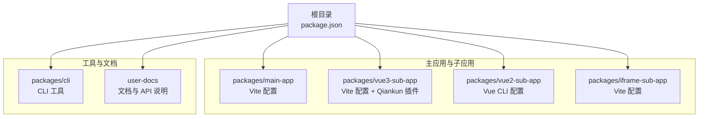
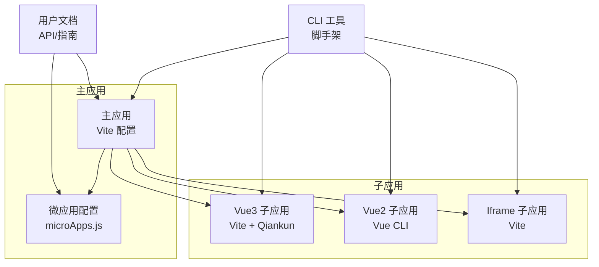
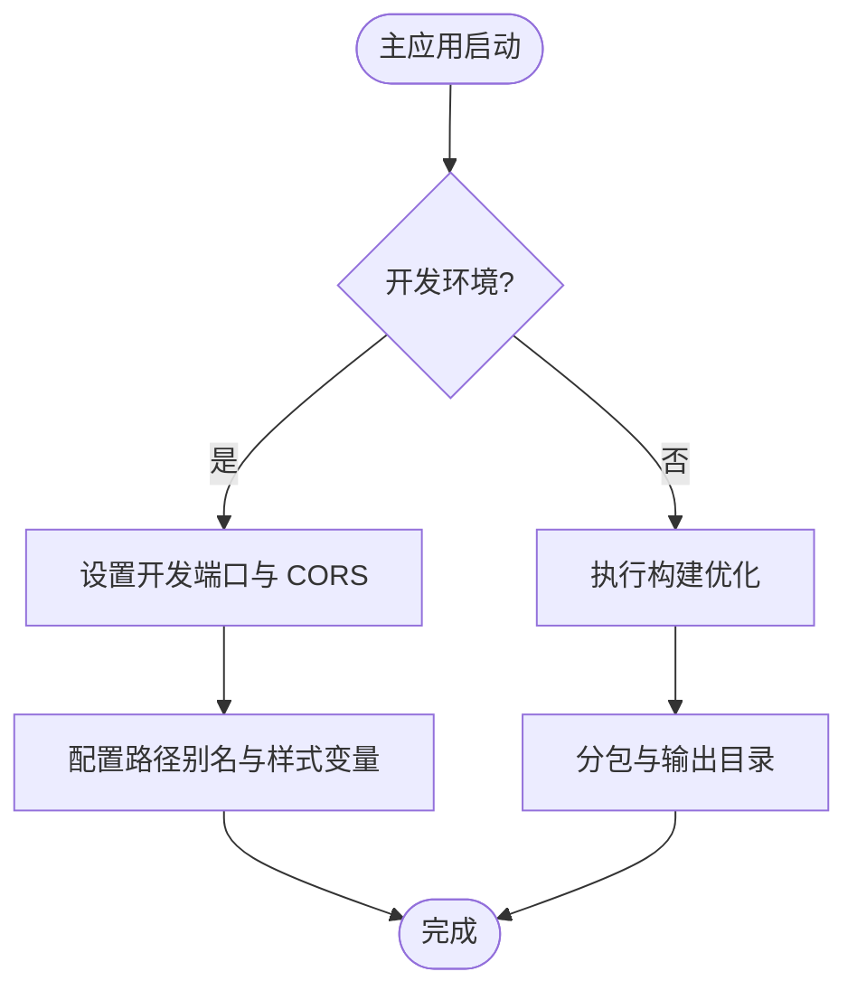
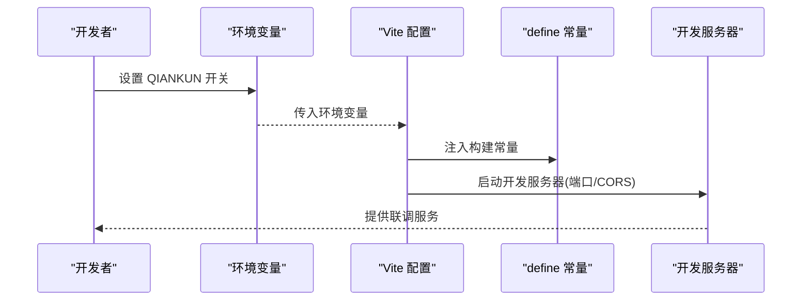
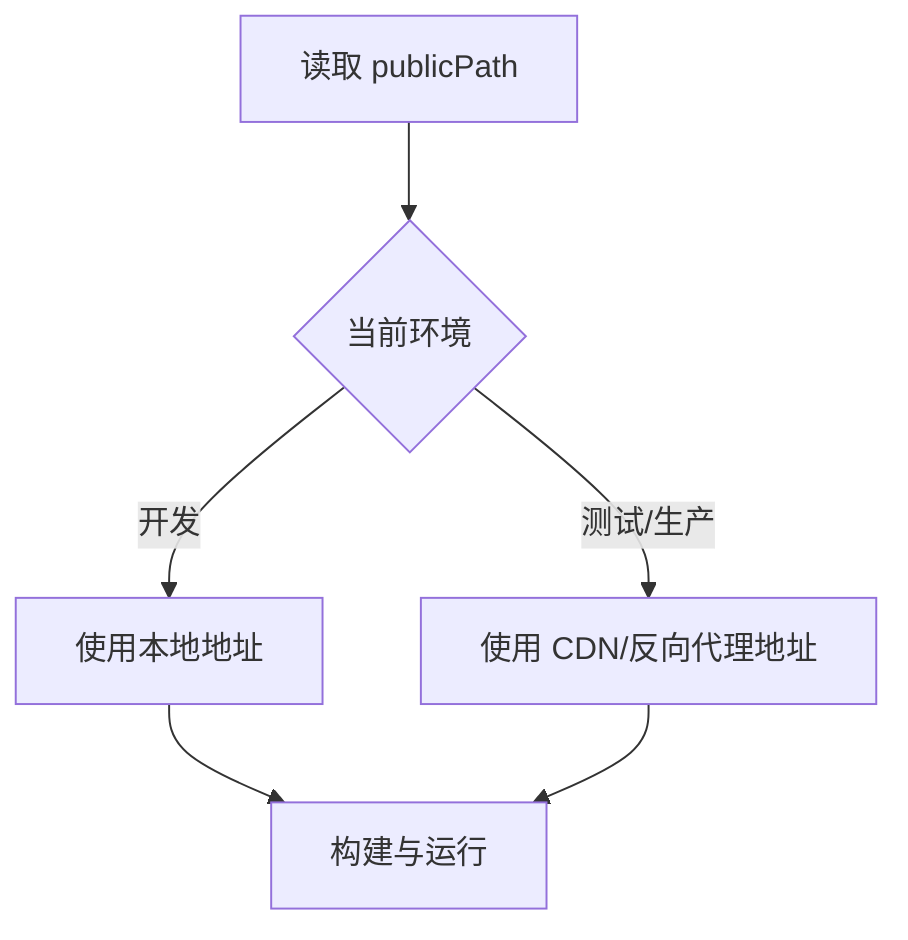
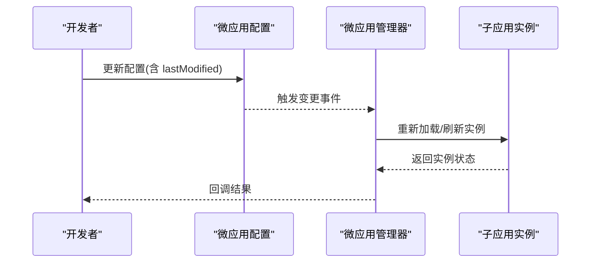
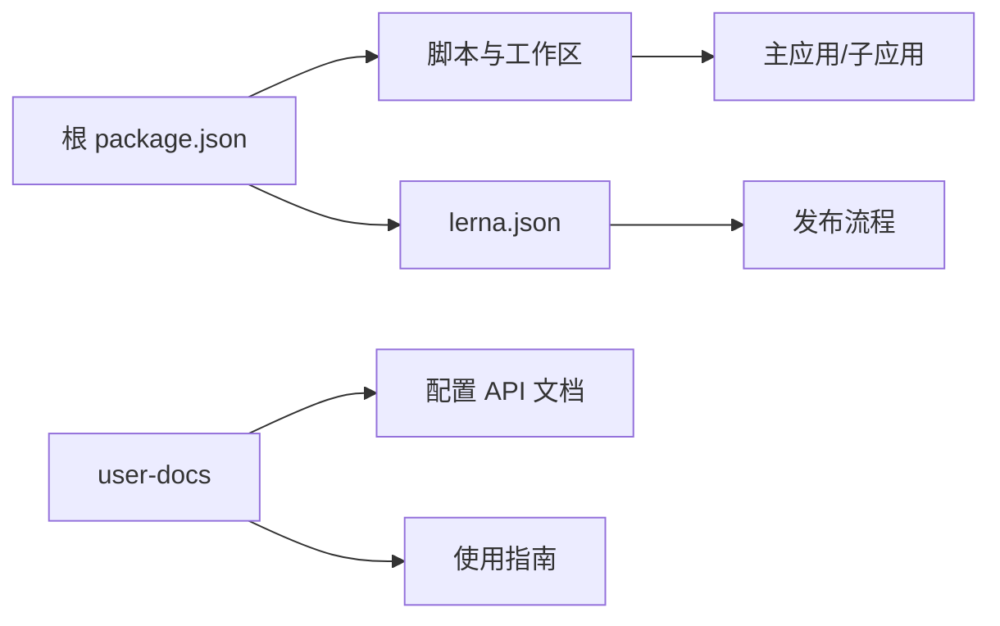

# 环境配置

<cite>
**本文引用的文件**
- [README.md](file://README.md)
- [package.json](file://package.json)
- [lerna.json](file://lerna.json)
- [packages/main-app/vite.config.js](file://packages/main-app/vite.config.js)
- [packages/vue3-sub-app/vite.config.js](file://packages/vue3-sub-app/vite.config.js)
- [packages/vue2-sub-app/vue.config.js](file://packages/vue2-sub-app/vue.config.js)
- [packages/iframe-sub-app/vite.config.js](file://packages/iframe-sub-app/vite.config.js)
- [packages/main-app/src/config/microApps.js](file://packages/main-app/src/config/microApps.js)
- [user-docs/api/config.md](file://user-docs/api/config.md)
- [user-docs/guide/getting-started.md](file://user-docs/guide/getting-started.md)
- [packages/cli/package.json](file://packages/cli/package.json)
</cite>

## 目录
1. [引言](#引言)
2. [项目结构](#项目结构)
3. [核心组件](#核心组件)
4. [架构总览](#架构总览)
5. [详细组件分析](#详细组件分析)
6. [依赖分析](#依赖分析)
7. [性能考虑](#性能考虑)
8. [故障排除指南](#故障排除指南)
9. [结论](#结论)
10. [附录](#附录)

## 引言
本指南围绕微前端平台的“多环境配置管理”展开，结合仓库中的 Vite 与 Vue CLI 配置、微应用清单与运行时行为，系统阐述开发、测试、生产等环境的配置差异与切换方法；解释环境变量的定义、读取与替换机制（如 API 地址、静态资源路径、日志级别等）；梳理配置文件的组织结构、优先级与合并策略；给出安全、敏感信息保护与权限控制建议；并提供配置验证、热更新与回滚思路及部署示例与故障排除要点。

## 项目结构
该仓库采用 Monorepo 架构，通过 Lerna 管理工作区，核心包包括主应用与多种类型子应用，配套 CLI 工具与用户文档。各应用的构建与开发服务器配置位于各自包内，主应用与子应用分别使用 Vite 或 Vue CLI。

图表来源
- [package.json](file://package.json#L1-L50)
- [lerna.json](file://lerna.json#L1-L25)
- [packages/main-app/vite.config.js](file://packages/main-app/vite.config.js#L1-L40)
- [packages/vue3-sub-app/vite.config.js](file://packages/vue3-sub-app/vite.config.js#L1-L41)
- [packages/vue2-sub-app/vue.config.js](file://packages/vue2-sub-app/vue.config.js#L1-L21)
- [packages/iframe-sub-app/vite.config.js](file://packages/iframe-sub-app/vite.config.js#L1-L23)

章节来源
- [README.md](file://README.md#L62-L76)
- [package.json](file://package.json#L1-L50)
- [lerna.json](file://lerna.json#L1-L25)

## 核心组件
- 开发服务器端口与跨域头：主应用与子应用在各自配置中声明开发服务器端口与 CORS 头，便于本地联调与跨域治理。
- 环境变量与构建常量：
  - Vue3 子应用通过环境变量控制是否启用 qiankun 开发模式，并在 define 中注入构建常量以影响打包产物。
  - Vue2 子应用通过 publicPath 指定静态资源前缀，便于在不同环境切换入口地址。
- 微应用配置：主应用维护微应用清单与辅助方法，支持按 ID 查询、按状态过滤、按类型筛选与动态更新配置（含热更新字段 lastModified）。
- CLI 工具：提供创建主应用与多种类型子应用的脚手架能力，便于快速生成符合规范的工程模板。

章节来源
- [packages/main-app/vite.config.js](file://packages/main-app/vite.config.js#L12-L18)
- [packages/vue3-sub-app/vite.config.js](file://packages/vue3-sub-app/vite.config.js#L6-L24)
- [packages/vue2-sub-app/vue.config.js](file://packages/vue2-sub-app/vue.config.js#L6-L12)
- [packages/main-app/src/config/microApps.js](file://packages/main-app/src/config/microApps.js#L71-L109)
- [user-docs/api/config.md](file://user-docs/api/config.md#L1-L121)
- [packages/cli/package.json](file://packages/cli/package.json#L1-L32)

## 架构总览
下图展示微前端平台在不同环境下的配置交互：主应用负责加载子应用，子应用根据自身配置决定入口地址、开发端口与构建产物；CLI 用于生成新应用模板；文档提供 API 与使用说明。

图表来源
- [packages/main-app/vite.config.js](file://packages/main-app/vite.config.js#L1-L40)
- [packages/vue3-sub-app/vite.config.js](file://packages/vue3-sub-app/vite.config.js#L1-L41)
- [packages/vue2-sub-app/vue.config.js](file://packages/vue2-sub-app/vue.config.js#L1-L21)
- [packages/iframe-sub-app/vite.config.js](file://packages/iframe-sub-app/vite.config.js#L1-L23)
- [packages/main-app/src/config/microApps.js](file://packages/main-app/src/config/microApps.js#L71-L109)
- [user-docs/api/config.md](file://user-docs/api/config.md#L1-L121)
- [packages/cli/package.json](file://packages/cli/package.json#L1-L32)

## 详细组件分析

### 组件一：主应用（Vite 配置）
- 关键点
  - 别名与样式预处理：统一路径别名与 SCSS 变量注入，便于主题与样式复用。
  - 开发服务器：端口、CORS 与自定义响应头，确保跨域调试顺畅。
  - 构建优化：分包策略与输出目录，提升首屏与缓存效果。
- 环境配置建议
  - 开发：保持默认端口与 CORS 开放，便于联调。
  - 测试/生产：通过环境变量控制输出目录与资源路径，避免硬编码入口地址。

图表来源
- [packages/main-app/vite.config.js](file://packages/main-app/vite.config.js#L7-L38)

章节来源
- [packages/main-app/vite.config.js](file://packages/main-app/vite.config.js#L1-L40)

### 组件二：Vue3 子应用（Vite + Qiankun）
- 关键点
  - 环境变量开关：通过环境变量控制是否启用 qiankun 开发模式，define 注入构建常量，影响运行时行为。
  - 开发服务器：独立端口与 CORS，便于与主应用联调。
  - 构建输入：明确 HTML 入口，适配微前端产物。
- 环境配置建议
  - 开发：开启 qiankun 开发模式，便于本地调试。
  - 测试/生产：关闭开发模式，使用构建常量进行条件导入与资源路径替换。

图表来源
- [packages/vue3-sub-app/vite.config.js](file://packages/vue3-sub-app/vite.config.js#L6-L24)

章节来源
- [packages/vue3-sub-app/vite.config.js](file://packages/vue3-sub-app/vite.config.js#L1-L41)

### 组件三：Vue2 子应用（Vue CLI）
- 关键点
  - publicPath：通过 publicPath 指定静态资源前缀，便于在不同环境切换入口地址。
  - 开发服务器：独立端口与 CORS。
  - UMD 输出：为微前端加载提供标准输出格式。
- 环境配置建议
  - 开发：publicPath 设为本地地址。
  - 测试/生产：通过构建脚本替换 publicPath，指向 CDN 或反向代理地址。

图表来源
- [packages/vue2-sub-app/vue.config.js](file://packages/vue2-sub-app/vue.config.js#L6-L12)

章节来源
- [packages/vue2-sub-app/vue.config.js](file://packages/vue2-sub-app/vue.config.js#L1-L21)

### 组件四：Iframe 子应用（Vite）
- 关键点
  - 多页面构建：通过 rollup 输入定义多个 HTML 入口，适配多路由场景。
  - 开发服务器：独立端口与 CORS。
- 环境配置建议
  - 开发：保持默认端口与 CORS。
  - 测试/生产：调整输出目录与静态资源路径，确保多页面入口可用。

章节来源
- [packages/iframe-sub-app/vite.config.js](file://packages/iframe-sub-app/vite.config.js#L1-L23)

### 组件五：微应用配置与热更新
- 关键点
  - 配置结构：包含入口地址、激活规则、容器选择器、状态、版本、最后修改时间、预加载、类型、布局类型与选项、传递给子应用的 props 等。
  - 动态更新：支持按 ID 更新配置，lastModified 字段可用于触发热更新。
  - 辅助方法：按 ID 查询、按状态过滤、按类型筛选。
- 环境配置建议
  - 开发：entry 指向本地端口，便于联调。
  - 测试/生产：entry 指向线上域名或 CDN，配合版本号与 lastModified 实现可控热更新。

图表来源
- [packages/main-app/src/config/microApps.js](file://packages/main-app/src/config/microApps.js#L71-L109)
- [user-docs/api/config.md](file://user-docs/api/config.md#L30-L58)

章节来源
- [packages/main-app/src/config/microApps.js](file://packages/main-app/src/config/microApps.js#L71-L109)
- [user-docs/api/config.md](file://user-docs/api/config.md#L1-L121)

### 组件六：CLI 工具（脚手架）
- 关键点
  - 提供创建主应用与多种类型子应用的命令，便于快速生成符合规范的工程模板。
  - 依赖包括命令行解析、交互式问答、模板渲染等。
- 环境配置建议
  - 通过 CLI 生成的应用模板应遵循统一的环境变量与构建配置约定，减少差异化。

章节来源
- [packages/cli/package.json](file://packages/cli/package.json#L1-L32)

## 依赖分析
- 工作区与脚本：根目录 package.json 定义了工作区与常用脚本，便于一键启动/构建主应用与各类子应用。
- 发布与版本：lerna.json 配置发布流程与分支策略，确保多包协同发布。
- 文档与 API：user-docs 提供配置 API 与使用指南，便于理解微应用配置结构与运行时行为。

图表来源
- [package.json](file://package.json#L1-L50)
- [lerna.json](file://lerna.json#L1-L25)
- [user-docs/api/config.md](file://user-docs/api/config.md#L1-L121)
- [user-docs/guide/getting-started.md](file://user-docs/guide/getting-started.md#L1-L87)

章节来源
- [package.json](file://package.json#L1-L50)
- [lerna.json](file://lerna.json#L1-L25)
- [user-docs/guide/getting-started.md](file://user-docs/guide/getting-started.md#L1-L87)

## 性能考虑
- 分包与缓存：主应用与子应用均采用分包策略，减少重复依赖与提升缓存命中率。
- 构建输出：明确输出目录与资源目录，便于 CDN 缓存与版本控制。
- 端口与跨域：合理设置开发服务器端口与 CORS，避免不必要的网络开销与跨域失败重试。

章节来源
- [packages/main-app/vite.config.js](file://packages/main-app/vite.config.js#L26-L38)
- [packages/vue3-sub-app/vite.config.js](file://packages/vue3-sub-app/vite.config.js#L33-L39)
- [packages/vue2-sub-app/vue.config.js](file://packages/vue2-sub-app/vue.config.js#L13-L19)

## 故障排除指南
- 端口冲突
  - 现象：开发服务器启动失败。
  - 排查：确认各应用端口未被占用，必要时调整配置中的端口号。
  - 参考：端口配置与启动脚本。
- 跨域问题
  - 现象：子应用无法加载或接口请求失败。
  - 排查：检查开发服务器 CORS 与响应头设置，确保允许主应用域名访问。
- 入口地址不一致
  - 现象：微应用加载失败或资源 404。
  - 排查：核对微应用配置中的 entry 与子应用构建后的静态资源路径，确保与实际部署地址一致。
- 环境变量未生效
  - 现象：Qiankun 开发模式未按预期开启或关闭。
  - 排查：确认环境变量传递方式与 define 常量注入逻辑，确保构建时已替换。

章节来源
- [packages/main-app/vite.config.js](file://packages/main-app/vite.config.js#L12-L18)
- [packages/vue3-sub-app/vite.config.js](file://packages/vue3-sub-app/vite.config.js#L6-L24)
- [packages/vue2-sub-app/vue.config.js](file://packages/vue2-sub-app/vue.config.js#L6-L12)
- [packages/iframe-sub-app/vite.config.js](file://packages/iframe-sub-app/vite.config.js#L6-L12)
- [packages/main-app/src/config/microApps.js](file://packages/main-app/src/config/microApps.js#L71-L109)

## 结论
本指南基于仓库现有配置，总结了微前端平台在多环境下的配置要点与实践建议。通过明确的端口与跨域策略、环境变量与构建常量的使用、微应用配置的动态更新与热更新机制，以及 CLI 脚手架的规范化模板，可在开发、测试与生产环境中实现稳定、可维护的配置管理。后续可进一步引入 dotenv 等机制以增强环境变量管理与敏感信息保护。

## 附录

### A. 环境变量与替换机制（建议）
- API 地址
  - 开发：使用本地代理或直接域名。
  - 测试/生产：通过环境变量注入，构建时替换常量或通过 publicPath/entry 指向线上地址。
- 静态资源路径
  - 通过 publicPath（Vue2）或 entry（微应用配置）在构建阶段替换。
- 日志级别
  - 通过 define 常量在构建时注入，运行时根据常量决定日志输出。
- 敏感信息
  - 使用 dotenv 管理密钥与令牌，仅在构建阶段注入，避免提交至版本库。

### B. 配置文件组织与优先级
- 组织结构
  - 主应用与子应用分别维护独立配置文件，公共配置尽量收敛至共享模块或模板。
- 优先级与合并
  - 本地覆盖全局：开发环境优先使用本地配置，测试/生产通过 CI 注入环境变量进行覆盖。
  - 微应用配置：以微应用清单为主，运行时可通过管理器更新并触发热更新。

### C. 安全与权限控制
- 跨域治理：统一 CORS 策略，限制允许的源与方法。
- 认证与授权：在主应用集中处理鉴权，子应用通过桥接或 props 接收认证上下文。
- 权限控制：基于角色的路由与功能开关，结合微应用状态（online/offline）进行动态控制。

### D. 配置验证、热更新与回滚
- 验证
  - 构建前校验关键字段（entry、activeRule、container），确保入口与容器存在。
  - 运行前校验环境变量与 define 常量，避免运行时异常。
- 热更新
  - 通过 lastModified 字段触发子应用实例刷新，避免全量重启。
- 回滚
  - 保留上一个版本的配置快照，回滚时恢复配置并刷新实例。

### E. 实际部署示例（步骤示意）
- 开发环境
  - 启动所有应用：使用根脚本一键启动。
  - 端口与跨域：保持默认配置，便于联调。
- 测试环境
  - 替换 publicPath/entry 至测试域名，注入测试 API 地址。
  - 执行构建并上传至测试 CDN。
- 生产环境
  - 替换 publicPath/entry 至生产域名，注入生产 API 地址与日志级别。
  - 执行构建并灰度发布，监控 lastModified 触发的热更新。

章节来源
- [README.md](file://README.md#L17-L60)
- [user-docs/guide/getting-started.md](file://user-docs/guide/getting-started.md#L16-L48)