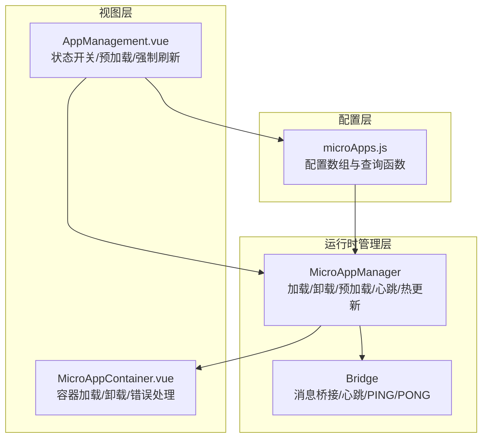
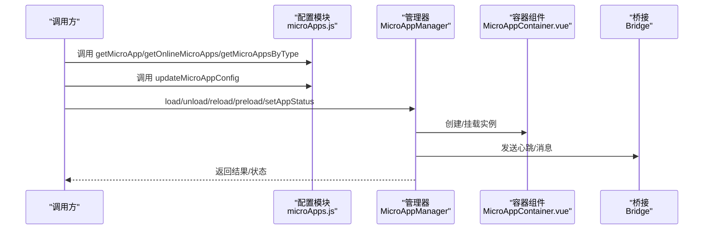
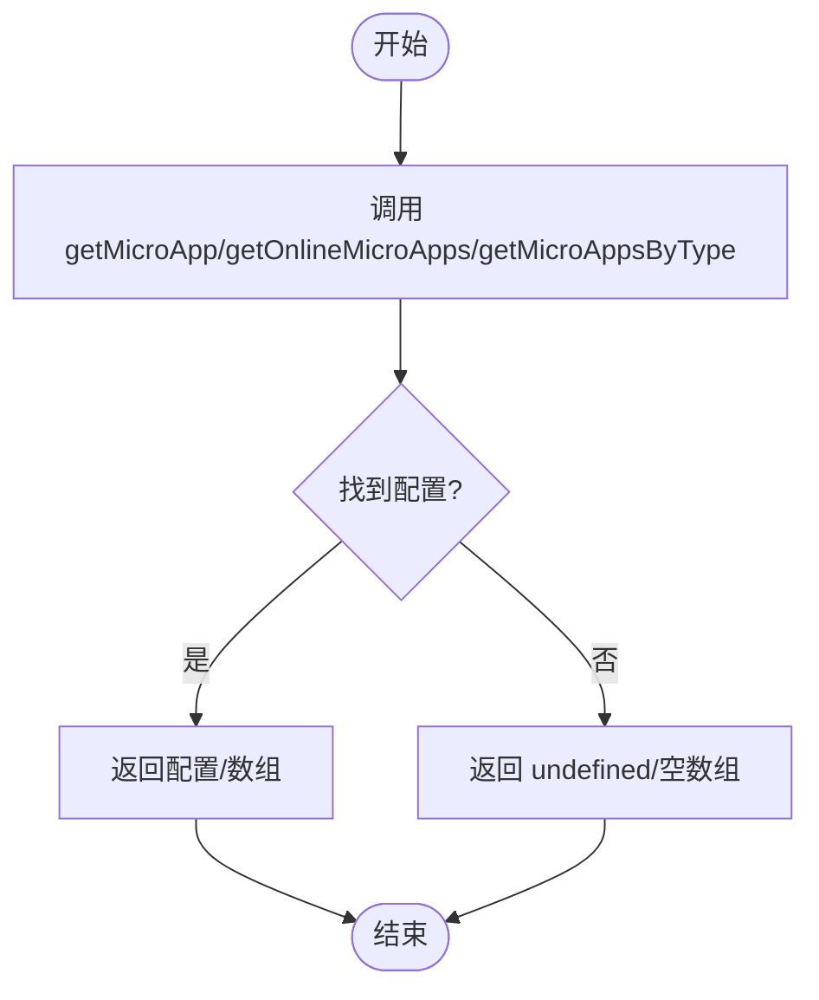
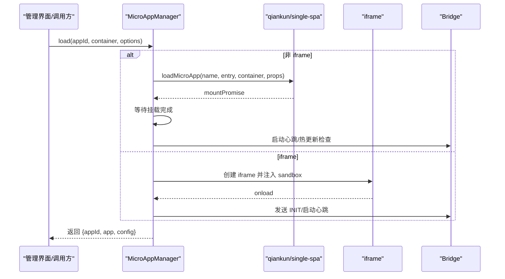
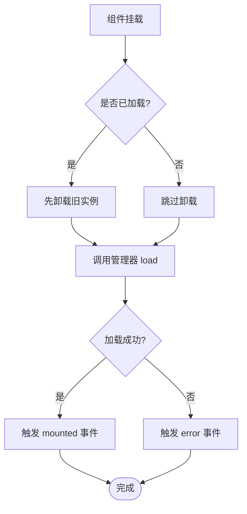
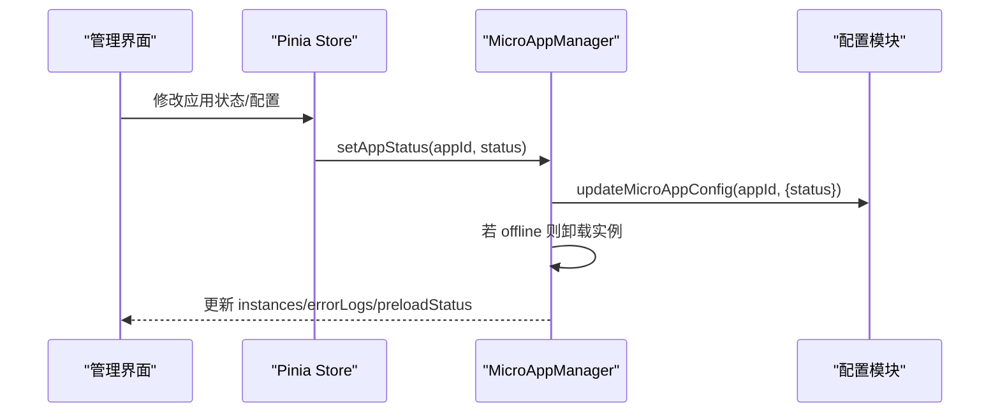
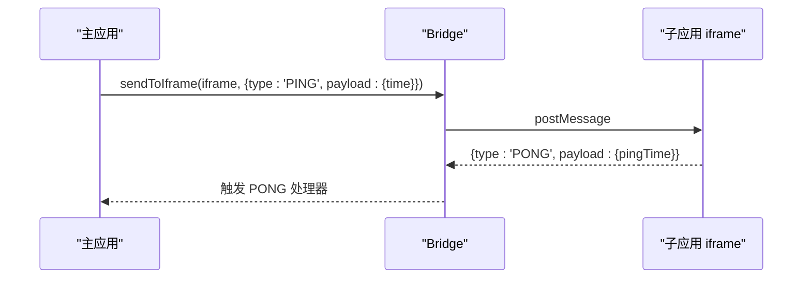
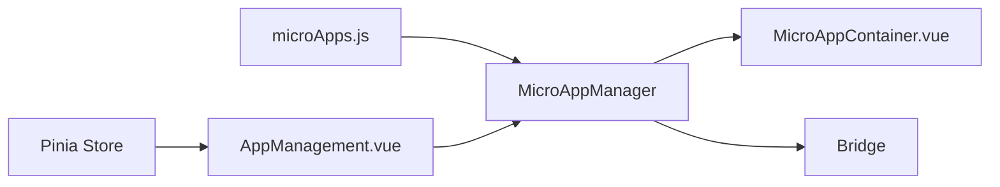

# 配置API

<cite>
**本文引用的文件**
- [配置 API 文档](file://user-docs/api/config.md)
- [微应用管理器 API 文档](file://user-docs/api/micro-app-manager.md)
- [微应用配置源码](file://packages/main-app/src/config/microApps.js)
- [微应用管理器源码](file://packages/main-app/src/core/microAppManager.js)
- [桥接通信源码](file://packages/main-app/src/core/bridge.js)
- [微应用容器组件](file://packages/main-app/src/components/MicroAppContainer.vue)
- [应用管理界面](file://packages/main-app/src/views/AppManagement.vue)
</cite>

## 目录
1. [简介](#简介)
2. [项目结构](#项目结构)
3. [核心组件](#核心组件)
4. [架构总览](#架构总览)
5. [详细组件分析](#详细组件分析)
6. [依赖关系分析](#依赖关系分析)
7. [性能考虑](#性能考虑)
8. [故障排查指南](#故障排查指南)
9. [结论](#结论)
10. [附录](#附录)

## 简介
本文件为微前端平台配置API的权威参考，聚焦于配置查询、过滤与更新能力，以及与之配套的缓存机制、异步加载、错误处理、事件通知与状态同步等工程化特性。重点覆盖以下函数：
- getMicroApp(appId)
- getOnlineMicroApps()
- getMicroAppsByType(type)
- updateMicroAppConfig(appId, config)

并结合微应用管理器（MicroAppManager）的加载、卸载、预加载、心跳检测、热更新检查、错误日志与桥接通信等能力，给出最佳实践、性能优化建议与安全防护要点。

## 项目结构
配置API位于主应用包内，核心文件组织如下：
- 配置定义与查询：packages/main-app/src/config/microApps.js
- 管理与运行时行为：packages/main-app/src/core/microAppManager.js
- 组件级加载容器：packages/main-app/src/components/MicroAppContainer.vue
- 管理界面与交互：packages/main-app/src/views/AppManagement.vue
- 跨应用通信桥：packages/main-app/src/core/bridge.js
- API参考文档：user-docs/api/config.md、user-docs/api/micro-app-manager.md

图表来源
- [微应用配置源码](file://packages/main-app/src/config/microApps.js#L1-L110)
- [微应用管理器源码](file://packages/main-app/src/core/microAppManager.js#L1-L515)
- [桥接通信源码](file://packages/main-app/src/core/bridge.js#L1-L241)
- [微应用容器组件](file://packages/main-app/src/components/MicroAppContainer.vue#L1-L167)
- [应用管理界面](file://packages/main-app/src/views/AppManagement.vue#L1-L370)

章节来源
- [配置 API 文档](file://user-docs/api/config.md#L1-L121)
- [微应用管理器 API 文档](file://user-docs/api/micro-app-manager.md#L1-L143)

## 核心组件
- 配置数据结构与查询函数
  - 配置项字段完整、类型明确，支持在线/离线、预加载、布局类型与选项、附加 props 等。
  - 提供 getMicroApp、getOnlineMicroApps、getMicroAppsByType、updateMicroAppConfig 四类常用查询与更新方法。
- 管理器职责
  - 负责微应用实例的加载、卸载、刷新、预加载、心跳检测、热更新检查、错误日志与样式清理。
  - 提供 setAppStatus 将配置状态变更与运行时卸载联动。
- 桥接通信
  - 提供消息监听、跨窗口/iframe 通信、心跳 PING/PONG、高度上报、广播等能力。
- 视图层
  - 容器组件负责加载/卸载、错误展示与重试、生命周期配合。
  - 管理界面提供状态切换、预加载、强制刷新、错误日志查看与配置编辑。

章节来源
- [配置 API 文档](file://user-docs/api/config.md#L5-L121)
- [微应用管理器 API 文档](file://user-docs/api/micro-app-manager.md#L1-L143)
- [微应用配置源码](file://packages/main-app/src/config/microApps.js#L1-L110)
- [微应用管理器源码](file://packages/main-app/src/core/microAppManager.js#L1-L515)
- [桥接通信源码](file://packages/main-app/src/core/bridge.js#L1-L241)
- [微应用容器组件](file://packages/main-app/src/components/MicroAppContainer.vue#L1-L167)
- [应用管理界面](file://packages/main-app/src/views/AppManagement.vue#L1-L370)

## 架构总览
配置API与运行时管理器协同工作，形成“配置 -> 查询/更新 -> 管理器 -> 实例”的闭环。容器组件与管理界面作为上层调用方，通过管理器统一调度加载、卸载与状态同步。

图表来源
- [微应用配置源码](file://packages/main-app/src/config/microApps.js#L71-L109)
- [微应用管理器源码](file://packages/main-app/src/core/microAppManager.js#L49-L165)
- [微应用容器组件](file://packages/main-app/src/components/MicroAppContainer.vue#L51-L105)
- [桥接通信源码](file://packages/main-app/src/core/bridge.js#L96-L171)

## 详细组件分析

### 配置查询与更新 API
- getMicroApp(appId)
  - 功能：按应用ID精确查找配置。
  - 参数：appId（字符串）。
  - 返回：配置对象或 undefined。
  - 使用场景：渲染、路由激活、加载前校验。
- getOnlineMicroApps()
  - 功能：筛选状态为 online 的应用集合。
  - 返回：数组。
  - 使用场景：仪表盘、预加载策略、可用应用列表。
- getMicroAppsByType(type)
  - 功能：按类型筛选应用集合。
  - 参数：type（'vue3' | 'vue2' | 'iframe' | 'link'）。
  - 返回：数组。
  - 使用场景：按框架类型分组渲染或批量操作。
- updateMicroAppConfig(appId, config)
  - 功能：对现有配置进行浅合并更新。
  - 参数：appId（字符串）、config（对象）。
  - 行为：若存在同ID配置则合并，否则忽略。
  - 使用场景：动态调整状态、布局、入口等。

图表来源
- [微应用配置源码](file://packages/main-app/src/config/microApps.js#L71-L109)

章节来源
- [配置 API 文档](file://user-docs/api/config.md#L62-L102)
- [微应用配置源码](file://packages/main-app/src/config/microApps.js#L71-L109)

### 管理器加载与生命周期
- load(appId, container, options)
  - 校验配置与状态；防重复加载；根据类型选择 qiankun 或 iframe 加载路径；注入 props（token、路由、桥接、appId）；等待挂载完成；启动心跳与热更新检查。
  - 返回：Promise，解析为 { appId, app, config }。
- unload(appId)
  - 停止心跳；卸载实例（qiankun 或 iframe）；清理容器与样式；删除记录。
- reload(appId)
  - 先卸载再加载，实现强制刷新。
- setAppStatus(appId, status)
  - 更新配置状态；若设为 offline，同时卸载已加载实例。
- preload(appIds?)
  - 预加载配置为 online 且 type 非 iframe 的应用；使用 prefetchApps 执行预取；维护预加载状态映射。
- 心跳检测与热更新
  - startHeartbeat/startIframeHeartbeat：周期性 PING/PONG 检测健康度。
  - checkLastModified：对非 iframe 应用 HEAD 请求 last-modified，发现变更则自动 reload。
- 错误日志
  - logError/getErrorLogs/clearErrorLogs：集中记录并限制数量，便于诊断。

图表来源
- [微应用管理器源码](file://packages/main-app/src/core/microAppManager.js#L49-L165)
- [桥接通信源码](file://packages/main-app/src/core/bridge.js#L146-L182)

章节来源
- [微应用管理器 API 文档](file://user-docs/api/micro-app-manager.md#L13-L116)
- [微应用管理器源码](file://packages/main-app/src/core/microAppManager.js#L49-L165)

### 容器组件与错误处理
- MicroAppContainer.vue
  - 负责在容器内加载/卸载应用；处理加载遮罩与错误提示；在 onBeforeUnmount 正确卸载，避免 qiankun 挂载异常。
  - 支持重试与暴露 reload 方法。
- 错误传播
  - 管理器捕获异常并写入 errorLogs；容器组件接收 error 事件并展示。

图表来源
- [微应用容器组件](file://packages/main-app/src/components/MicroAppContainer.vue#L51-L105)
- [微应用管理器源码](file://packages/main-app/src/core/microAppManager.js#L49-L165)

章节来源
- [微应用容器组件](file://packages/main-app/src/components/MicroAppContainer.vue#L1-L167)

### 管理界面与状态同步
- AppManagement.vue
  - 提供状态开关（在线/离线）与 setAppStatus 调用；预加载按钮与强制刷新；错误日志查看与清空；配置编辑并回写至 store 与配置模块。
  - 与管理器的 instances、errorLogs、preloadStatus 响应式绑定，实现状态同步。

图表来源
- [应用管理界面](file://packages/main-app/src/views/AppManagement.vue#L258-L262)
- [微应用管理器源码](file://packages/main-app/src/core/microAppManager.js#L447-L458)
- [微应用配置源码](file://packages/main-app/src/config/microApps.js#L102-L107)

章节来源
- [应用管理界面](file://packages/main-app/src/views/AppManagement.vue#L1-L370)
- [微应用管理器源码](file://packages/main-app/src/core/microAppManager.js#L447-L458)
- [微应用配置源码](file://packages/main-app/src/config/microApps.js#L102-L107)

### 桥接通信与事件通知
- Bridge
  - 监听 message，校验 origin 白名单；注册默认处理器（导航、请求 token、心跳、高度上报等）；支持广播消息与同步 token。
  - 与管理器的心跳检测配合，实现 iframe 与主应用的双向通信。

图表来源
- [桥接通信源码](file://packages/main-app/src/core/bridge.js#L96-L114)
- [微应用管理器源码](file://packages/main-app/src/core/microAppManager.js#L364-L375)

章节来源
- [桥接通信源码](file://packages/main-app/src/core/bridge.js#L1-L241)
- [微应用管理器源码](file://packages/main-app/src/core/microAppManager.js#L364-L375)

## 依赖关系分析
- 配置模块
  - 提供配置数组与查询/更新函数，被管理器与视图层调用。
- 管理器
  - 依赖配置模块（getMicroApp/updateMicroAppConfig）、用户态 store、桥接通信、qiankun 加载库。
  - 维护运行时状态（loadedApps、heartbeatTimers、lastModifiedCache、errorLogs、preloadStatus）。
- 容器组件
  - 依赖管理器执行加载/卸载；向父组件发出事件。
- 管理界面
  - 依赖 Pinia Store 与管理器；驱动状态变更与预加载。

图表来源
- [微应用配置源码](file://packages/main-app/src/config/microApps.js#L1-L110)
- [微应用管理器源码](file://packages/main-app/src/core/microAppManager.js#L1-L515)
- [微应用容器组件](file://packages/main-app/src/components/MicroAppContainer.vue#L1-L167)
- [应用管理界面](file://packages/main-app/src/views/AppManagement.vue#L1-L370)
- [桥接通信源码](file://packages/main-app/src/core/bridge.js#L1-L241)

章节来源
- [微应用配置源码](file://packages/main-app/src/config/microApps.js#L1-L110)
- [微应用管理器源码](file://packages/main-app/src/core/microAppManager.js#L1-L515)

## 性能考虑
- 预加载策略
  - 仅对 status 为 online 且 type 非 iframe 的应用执行预取；通过 prefetchApps 减少首屏等待。
  - 预加载状态映射用于 UI 反馈。
- 心跳检测
  - 默认每 30 秒一次，降低网络与 CPU 开销；对 iframe 使用独立心跳。
- 热更新检查
  - HEAD 请求 last-modified，命中变更才 reload，避免不必要的刷新。
- 样式隔离与清理
  - qiankun 实验性样式隔离 + 精确清理，减少样式污染与内存占用。
- 并发控制
  - 同一 appId 同时只允许一个实例加载，避免重复开销与竞态。
- 错误日志上限
  - 限制最近 100 条错误日志，平衡可观测性与内存占用。

章节来源
- [微应用管理器源码](file://packages/main-app/src/core/microAppManager.js#L421-L440)
- [微应用管理器源码](file://packages/main-app/src/core/microAppManager.js#L340-L375)
- [微应用管理器源码](file://packages/main-app/src/core/microAppManager.js#L392-L415)
- [微应用管理器源码](file://packages/main-app/src/core/microAppManager.js#L286-L313)
- [微应用管理器源码](file://packages/main-app/src/core/microAppManager.js#L64-L69)
- [微应用管理器源码](file://packages/main-app/src/core/microAppManager.js#L473-L489)

## 故障排查指南
- 常见错误与定位
  - 应用未找到：检查 appId 是否存在于配置数组。
  - 应用离线：确认 status 为 online，必要时通过 setAppStatus 切换。
  - 容器不存在：确保传入的容器元素存在或选择器有效。
  - 重复加载：同一 appId 已加载时会抛错，需先卸载再加载。
  - iframe 加载失败：检查 sandbox 与目标站点跨域策略。
- 日志与诊断
  - 使用 getErrorLogs(appId) 查看特定应用错误；clearErrorLogs 清空历史。
  - 关注控制台输出的 [MicroAppManager]/[Bridge] 日志。
- 重试与恢复
  - 容器组件提供重试按钮；管理器 reload 可强制刷新。
  - 管理界面支持强制刷新与预加载。

章节来源
- [微应用管理器源码](file://packages/main-app/src/core/microAppManager.js#L52-L62)
- [微应用管理器源码](file://packages/main-app/src/core/microAppManager.js#L496-L501)
- [微应用容器组件](file://packages/main-app/src/components/MicroAppContainer.vue#L92-L94)
- [应用管理界面](file://packages/main-app/src/views/AppManagement.vue#L268-L272)

## 结论
配置API以简洁的数据结构与四类核心方法为核心，配合管理器的加载/卸载、预加载、心跳与热更新检查、错误日志与桥接通信，构建了稳定、可观测、可扩展的微前端配置与运行时体系。通过预加载、并发控制与样式隔离等工程化手段，兼顾性能与可靠性；通过状态同步与事件通知，实现配置变更与实例状态的一致性。

## 附录

### API 速查表
- getMicroApp(appId)
  - 输入：应用ID（字符串）
  - 输出：配置对象或 undefined
  - 适用场景：按ID获取配置
- getOnlineMicroApps()
  - 输入：无
  - 输出：在线应用数组
  - 适用场景：仪表盘、预加载、可用列表
- getMicroAppsByType(type)
  - 输入：类型（'vue3' | 'vue2' | 'iframe' | 'link'）
  - 输出：该类型应用数组
  - 适用场景：按类型分组渲染或批量操作
- updateMicroAppConfig(appId, config)
  - 输入：应用ID（字符串）、配置对象（部分字段）
  - 输出：无（副作用：合并配置）
  - 适用场景：动态更新状态、布局、入口等

章节来源
- [配置 API 文档](file://user-docs/api/config.md#L62-L102)
- [微应用配置源码](file://packages/main-app/src/config/microApps.js#L71-L109)

### 最佳实践清单
- 查询与过滤
  - 优先使用 getOnlineMicroApps 与 getMicroAppsByType 进行批量筛选，减少循环遍历。
  - 对高频查询可自行缓存结果，避免重复计算。
- 更新策略
  - 使用 updateMicroAppConfig 进行增量更新，避免全量替换。
  - 更新状态后，及时调用 setAppStatus 以同步运行时状态。
- 加载与卸载
  - 同一 appId 同时只允许一个实例；切换页面或路由时在 onBeforeUnmount 正确卸载。
  - 预加载仅针对 online 且非 iframe 应用，避免无效资源消耗。
- 错误处理
  - 使用 getErrorLogs 与 clearErrorLogs 管理错误日志；在 UI 中提供重试与刷新按钮。
- 性能优化
  - 合理设置 preload；利用热更新检查避免手动刷新。
  - 控制心跳频率与日志数量，避免过度 IO。
- 安全防护
  - 桥接通信严格校验 origin 白名单；iframe sandbox 限制权限。
  - 禁止在配置中硬编码敏感信息，通过 props 或 store 注入。

章节来源
- [微应用管理器源码](file://packages/main-app/src/core/microAppManager.js#L421-L440)
- [微应用管理器源码](file://packages/main-app/src/core/microAppManager.js#L340-L375)
- [微应用管理器源码](file://packages/main-app/src/core/microAppManager.js#L473-L489)
- [桥接通信源码](file://packages/main-app/src/core/bridge.js#L96-L101)
- [微应用容器组件](file://packages/main-app/src/components/MicroAppContainer.vue#L107-L116)