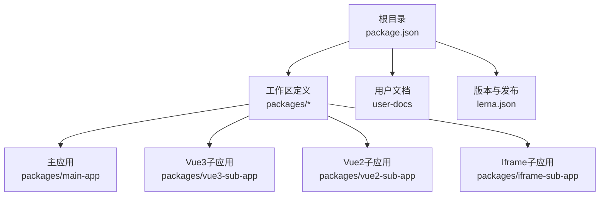
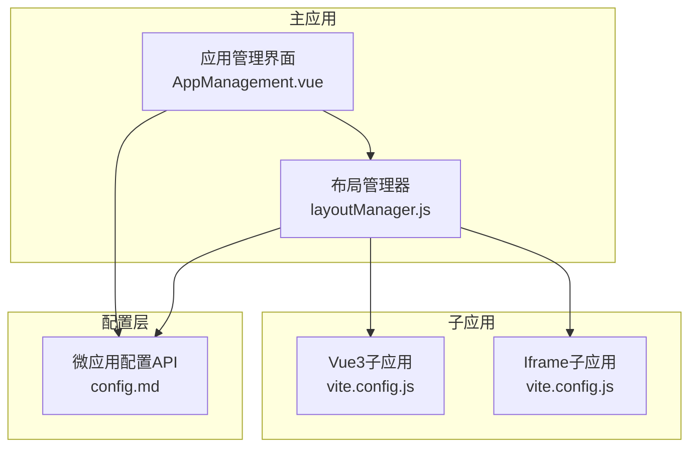
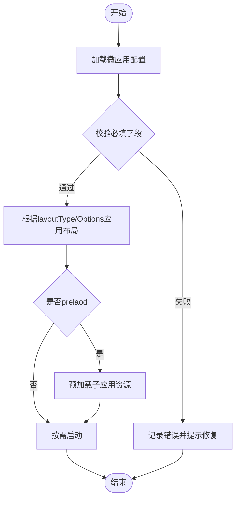
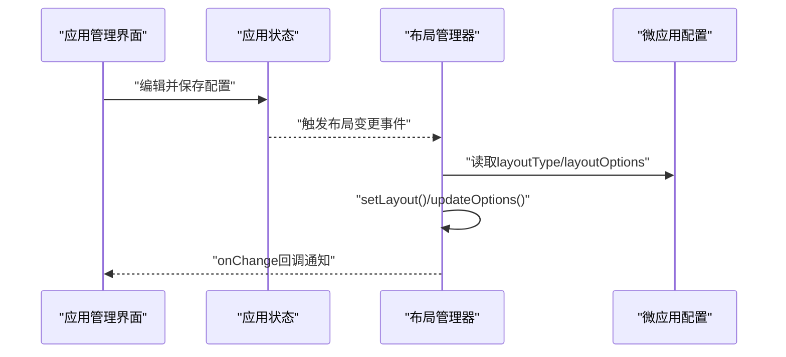
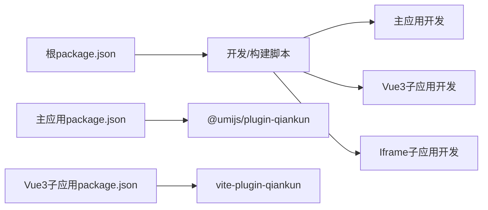

# 配置管理

<cite>
**本文引用的文件**
- [package.json](file://package.json)
- [lerna.json](file://lerna.json)
- [packages/main-app/package.json](file://packages/main-app/package.json)
- [packages/main-app/vite.config.js](file://packages/main-app/vite.config.js)
- [packages/vue3-sub-app/vite.config.js](file://packages/vue3-sub-app/vite.config.js)
- [packages/iframe-sub-app/vite.config.js](file://packages/iframe-sub-app/vite.config.js)
- [user-docs/api/config.md](file://user-docs/api/config.md)
- [user-docs/guide/layout-system.md](file://user-docs/guide/layout-system.md)
- [packages/main-app/src/core/layoutManager.js](file://packages/main-app/src/core/layoutManager.js)
- [packages/main-app/src/views/AppManagement.vue](file://packages/main-app/src/views/AppManagement.vue)
</cite>

## 目录
1. [简介](#简介)
2. [项目结构](#项目结构)
3. [核心组件](#核心组件)
4. [架构总览](#架构总览)
5. [详细组件分析](#详细组件分析)
6. [依赖分析](#依赖分析)
7. [性能考虑](#性能考虑)
8. [故障排查指南](#故障排查指南)
9. [结论](#结论)
10. [附录](#附录)

## 简介
本指南面向Artisan微前端平台的配置管理，围绕以下目标展开：
- 微应用配置文件的结构、参数与规则
- 布局配置的选项、动态调整与主题定制
- 环境配置的管理、变量替换与多环境部署
- 配置验证、错误处理与调试技巧
- 最佳实践、性能优化与安全要点

通过本文，开发者可以系统掌握配置系统的使用与扩展，以满足多样化的业务需求。

## 项目结构
Artisan采用Monorepo组织，核心工作区包括主应用与多个子应用（Vue2/Vue3/Iframe），并通过统一的脚手架CLI与构建工具链支撑开发与发布流程。

图示来源
- [package.json](file://package.json#L6-L26)
- [lerna.json](file://lerna.json#L5-L8)

章节来源
- [package.json](file://package.json#L6-L26)
- [lerna.json](file://lerna.json#L1-L25)

## 核心组件
- 微应用配置API：定义微应用清单、查询与更新能力，支撑运行时动态控制。
- 布局管理器：集中管理布局类型与选项，支持从微应用配置推导布局并动态切换。
- Vite构建配置：主应用与各子应用的构建、开发服务器与打包策略。
- 文档规范：配置结构、布局类型与使用方式的官方说明。

章节来源
- [user-docs/api/config.md](file://user-docs/api/config.md#L1-L121)
- [user-docs/guide/layout-system.md](file://user-docs/guide/layout-system.md#L1-L125)
- [packages/main-app/vite.config.js](file://packages/main-app/vite.config.js#L1-L40)
- [packages/vue3-sub-app/vite.config.js](file://packages/vue3-sub-app/vite.config.js#L1-L41)
- [packages/iframe-sub-app/vite.config.js](file://packages/iframe-sub-app/vite.config.js#L1-L23)

## 架构总览
下图展示配置在系统中的角色与交互关系：主应用通过布局管理器根据微应用配置动态渲染；微应用清单由配置API提供；构建配置影响资源加载与开发体验。

图示来源
- [packages/main-app/src/core/layoutManager.js](file://packages/main-app/src/core/layoutManager.js#L128-L174)
- [packages/main-app/src/views/AppManagement.vue](file://packages/main-app/src/views/AppManagement.vue#L308-L334)
- [user-docs/api/config.md](file://user-docs/api/config.md#L1-L121)
- [packages/vue3-sub-app/vite.config.js](file://packages/vue3-sub-app/vite.config.js#L1-L41)
- [packages/iframe-sub-app/vite.config.js](file://packages/iframe-sub-app/vite.config.js#L1-L23)

## 详细组件分析

### 微应用配置结构与规则
- 结构字段
  - 基础信息：id、name、entry、activeRule、container、status、version、lastModified、preload
  - 运行类型：type（vue3、vue2、iframe、link）
  - 布局相关：layoutType（default/full/tabs/embedded/blank）、layoutOptions（showHeader、showSidebar、keepAlive、multiTab）
  - 透传属性：props（如routerBase）
- 配置来源与访问
  - 通过配置API提供的辅助方法进行查询与更新，支持按类型筛选与批量在线应用获取
- 配置示例与字段说明见文档

图示来源
- [user-docs/api/config.md](file://user-docs/api/config.md#L5-L28)
- [user-docs/api/config.md](file://user-docs/api/config.md#L60-L121)

章节来源
- [user-docs/api/config.md](file://user-docs/api/config.md#L1-L121)

### 布局系统与动态调整
- 布局类型
  - default：完整头部与侧边栏
  - full：全屏无头部/侧边栏
  - tabs：多标签页与页面缓存
  - embedded：嵌入页面不替换主路由
  - blank：空白布局
- 布局选项
  - showHeader、showSidebar、keepAlive、multiTab
- 动态切换
  - 可通过布局管理器按微应用配置设置布局，或直接调用set/reset接口
  - 支持监听布局变化回调

图示来源
- [packages/main-app/src/views/AppManagement.vue](file://packages/main-app/src/views/AppManagement.vue#L308-L334)
- [packages/main-app/src/core/layoutManager.js](file://packages/main-app/src/core/layoutManager.js#L128-L174)
- [user-docs/guide/layout-system.md](file://user-docs/guide/layout-system.md#L68-L115)

章节来源
- [user-docs/guide/layout-system.md](file://user-docs/guide/layout-system.md#L1-L125)
- [packages/main-app/src/core/layoutManager.js](file://packages/main-app/src/core/layoutManager.js#L128-L174)
- [packages/main-app/src/views/AppManagement.vue](file://packages/main-app/src/views/AppManagement.vue#L308-L334)

### 环境配置与多环境部署
- 开发服务器端口与跨域
  - 主应用与子应用均开启CORS并允许任意源头，便于本地联调
- 构建输出与分包
  - 主应用启用CSS预处理器全局变量注入与手动分包策略
  - Vue3子应用通过插件注入构建常量，支持开发/生产模式差异
- 多环境变量
  - 推荐使用dotenv系列库在本地与CI中注入环境变量，结合构建define进行编译期替换

章节来源
- [packages/main-app/vite.config.js](file://packages/main-app/vite.config.js#L12-L38)
- [packages/vue3-sub-app/vite.config.js](file://packages/vue3-sub-app/vite.config.js#L21-L24)
- [packages/iframe-sub-app/vite.config.js](file://packages/iframe-sub-app/vite.config.js#L6-L21)

### 配置验证、错误处理与调试
- 配置验证
  - 必填字段校验：id、name、entry、activeRule、container、status、type
  - 布局选项校验：layoutType与layoutOptions组合有效性
- 错误处理
  - 布局管理器提供onChange/ offChange回调，便于订阅布局变更
  - 应用管理界面在保存配置后给出成功提示，异常时应补充错误提示
- 调试技巧
  - 通过浏览器网络面板检查子应用入口与静态资源加载
  - 在布局管理器中打印当前布局状态，定位切换问题

章节来源
- [user-docs/api/config.md](file://user-docs/api/config.md#L104-L121)
- [packages/main-app/src/core/layoutManager.js](file://packages/main-app/src/core/layoutManager.js#L128-L174)
- [packages/main-app/src/views/AppManagement.vue](file://packages/main-app/src/views/AppManagement.vue#L308-L334)

## 依赖分析
- 工作区与脚本
  - 通过根脚本统一启动主应用与各子应用的开发/构建任务
- 包依赖
  - 主应用依赖Vue生态与qiankun微前端框架
  - 子应用按类型引入对应构建插件与运行时依赖

图示来源
- [package.json](file://package.json#L10-L26)
- [packages/main-app/package.json](file://packages/main-app/package.json#L12-L22)
- [packages/vue3-sub-app/vite.config.js](file://packages/vue3-sub-app/vite.config.js#L10-L15)

章节来源
- [package.json](file://package.json#L10-L26)
- [packages/main-app/package.json](file://packages/main-app/package.json#L12-L22)

## 性能考虑
- 分包与缓存
  - 主应用对element-plus与通用Vue依赖进行手动分包，减少重复打包
  - 布局选项中的keepAlive可减少页面重建开销
- 预加载策略
  - 对高频应用启用preload，缩短首次进入延迟
- 构建优化
  - 关闭SourceMap以减小产物体积
  - 子应用按需输入，避免多余页面打包

章节来源
- [packages/main-app/vite.config.js](file://packages/main-app/vite.config.js#L26-L38)
- [user-docs/guide/layout-system.md](file://user-docs/guide/layout-system.md#L117-L125)
- [packages/vue3-sub-app/vite.config.js](file://packages/vue3-sub-app/vite.config.js#L33-L39)

## 故障排查指南
- 子应用无法加载
  - 检查entry与activeRule是否正确，确认开发服务器端口与CORS配置
  - 核对容器选择器与挂载节点是否存在
- 布局异常
  - 确认layoutType与layoutOptions组合是否符合预期
  - 使用onChange回调监听布局变化，定位切换时机
- 配置更新无效
  - 确认更新方法调用与存储状态同步
  - 在应用管理界面保存后刷新页面，确保生效

章节来源
- [packages/iframe-sub-app/vite.config.js](file://packages/iframe-sub-app/vite.config.js#L6-L21)
- [packages/main-app/src/core/layoutManager.js](file://packages/main-app/src/core/layoutManager.js#L128-L174)
- [packages/main-app/src/views/AppManagement.vue](file://packages/main-app/src/views/AppManagement.vue#L308-L334)

## 结论
Artisan微前端平台提供了完善的配置体系：清晰的微应用配置结构、灵活的布局管理与动态切换、可扩展的构建与环境配置。遵循本文的最佳实践与排错建议，可在保证性能与安全的前提下快速实现复杂业务场景下的配置需求。

## 附录
- 配置字段速查
  - 必填项：id、name、entry、activeRule、container、status、type
  - 布局项：layoutType、layoutOptions（showHeader、showSidebar、keepAlive、multiTab）
  - 运行项：preload、version、lastModified、props
- 布局类型速查
  - default/full/tabs/embedded/blank
- 常用脚本
  - 开发：dev:main、dev:vue3、dev:vue2、dev:iframe、dev:all
  - 构建：build:main、build:vue3、build:vue2、build:iframe、build:all

章节来源
- [user-docs/api/config.md](file://user-docs/api/config.md#L104-L121)
- [user-docs/guide/layout-system.md](file://user-docs/guide/layout-system.md#L1-L125)
- [package.json](file://package.json#L10-L26)