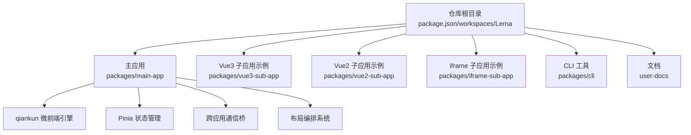
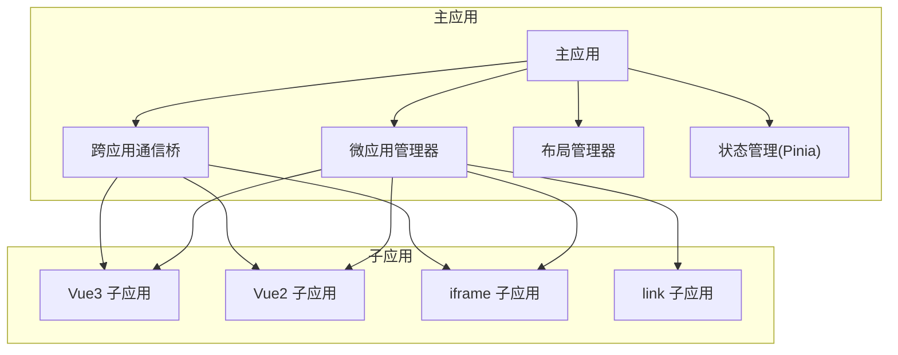
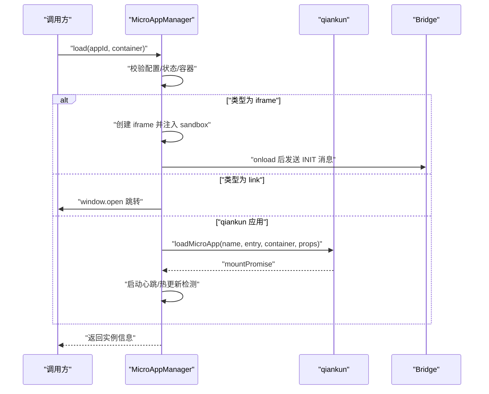
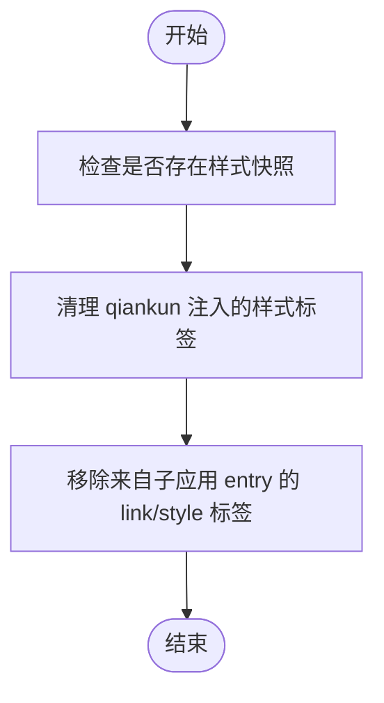
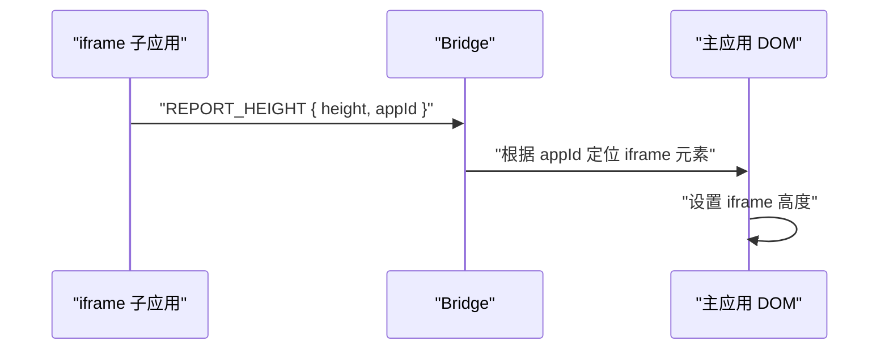
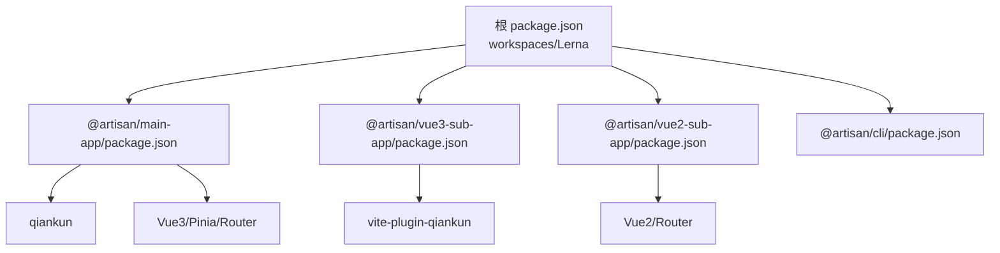

# 项目概述

<cite>
**本文引用的文件**
- [README.md](file://README.md)
- [package.json](file://package.json)
- [lerna.json](file://lerna.json)
- [packages/main-app/package.json](file://packages/main-app/package.json)
- [packages/vue2-sub-app/package.json](file://packages/vue2-sub-app/package.json)
- [packages/vue3-sub-app/package.json](file://packages/vue3-sub-app/package.json)
- [packages/cli/package.json](file://packages/cli/package.json)
- [user-docs/guide/getting-started.md](file://user-docs/guide/getting-started.md)
- [user-docs/guide/sub-apps.md](file://user-docs/guide/sub-apps.md)
- [user-docs/guide/main-app.md](file://user-docs/guide/main-app.md)
- [packages/main-app/src/core/microAppManager.js](file://packages/main-app/src/core/microAppManager.js)
- [packages/main-app/src/core/bridge.js](file://packages/main-app/src/core/bridge.js)
</cite>

## 目录
1. [引言](#引言)
2. [项目结构](#项目结构)
3. [核心组件](#核心组件)
4. [架构总览](#架构总览)
5. [详细组件分析](#详细组件分析)
6. [依赖关系分析](#依赖关系分析)
7. [性能考虑](#性能考虑)
8. [故障排查指南](#故障排查指南)
9. [结论](#结论)
10. [附录](#附录)

## 引言
Artisan 微前端基础平台是一个面向企业级场景的脚手架型微前端基础设施，旨在以 Monorepo 架构统一管理主应用与多类子应用，提供稳定、可扩展且易于上手的微前端解决方案。项目围绕 qiankun 微前端引擎构建，支持 Vue3/Vue2、iframe、link 等多种子应用形态，并配套完善的布局编排系统、跨应用通信桥、状态管理与 iframe 跨域治理能力，帮助团队在复杂业务场景下实现“多应用共存、独立演进、统一治理”。

项目特性涵盖：
- Monorepo 架构：使用 Lerna + npm workspaces 统一管理多包
- 微前端支持：基于 qiankun（loadMicroApp 模式）与 postMessage
- 多类型子应用：vue3 / vue2 / iframe / link
- 布局编排系统：5 种布局类型
- 跨应用通信：完整的 bridge 通信机制
- 状态管理：Pinia + 持久化
- iframe 跨域治理：安全策略与沙箱约束
- 多应用实例支持：同屏加载多个子应用实例
- CLI 工具：快速创建子应用

**章节来源**
- file://README.md#L3-L16

## 项目结构
仓库采用 Monorepo 结构，根目录通过 npm workspaces 和 Lerna 管理多包，核心目录如下：
- packages/main-app：Vue3 主应用，承载微应用管理、布局编排、跨应用通信与状态管理
- packages/vue3-sub-app：Vue3 子应用示例，演示 qiankun 注册与生命周期
- packages/vue2-sub-app：Vue2 子应用示例，演示 qiankun 注册与生命周期
- packages/iframe-sub-app：iframe 子应用示例，演示 postMessage 通信与跨域治理
- packages/cli：CLI 脚手架工具，用于快速生成主应用与各类子应用模板
- user-docs：VitePress 文档，提供使用指南、架构说明与最佳实践

**图表来源**
- [package.json](file://package.json#L6-L9)
- [lerna.json](file://lerna.json#L5-L8)
- [packages/main-app/package.json](file://packages/main-app/package.json#L12-L22)
- [packages/vue3-sub-app/package.json](file://packages/vue3-sub-app/package.json#L12-L16)
- [packages/vue2-sub-app/package.json](file://packages/vue2-sub-app/package.json#L11-L16)
- [packages/cli/package.json](file://packages/cli/package.json#L1-L32)

**章节来源**
- file://README.md#L62-L76
- file://package.json#L6-L9
- file://lerna.json#L5-L8

## 核心组件
- 微应用管理器（MicroAppManager）
  - 职责：统一加载、卸载、刷新子应用；多应用实例管理；心跳健康监测；lastModified 热更新检测；预加载；样式隔离清理；错误日志记录
  - 关键能力：支持 qiankun 应用与 iframe 应用差异化加载；sandbox 隔离；按 appId 唯一实例控制
- 跨应用通信桥（Bridge）
  - 职责：postMessage 通信；origin 校验；token 同步；消息广播；跨应用跳转；iframe 高度上报
  - 关键能力：注册/移除消息处理器；对 iframe 与 qiankun 应用分别适配；暴露 window.__ARTISAN_BRIDGE__ 供子应用调用
- 布局管理器（LayoutManager）
  - 职责：根据配置切换布局类型（default/full/tabs/embedded/blank），支持多标签页、嵌入式等场景
- 状态管理（Pinia + 持久化）
  - 职责：集中管理用户 token、当前激活应用、标签页等状态，并持久化关键数据

**章节来源**
- file://user-docs/guide/main-app.md#L16-L80
- file://packages/main-app/src/core/microAppManager.js#L11-L31
- file://packages/main-app/src/core/bridge.js#L9-L27

## 架构总览
整体架构由“主应用 + 多类型子应用 + 通信与治理层”构成。主应用通过 qiankun 加载 Vue3/Vue2 子应用，通过 postMessage 与 iframe 子应用通信；同时通过 Bridge 提供统一的跨应用跳转、消息广播与 token 同步能力；布局编排系统提供灵活的页面组织方式。

**图表来源**
- [packages/main-app/src/core/microAppManager.js](file://packages/main-app/src/core/microAppManager.js#L49-L158)
- [packages/main-app/src/core/bridge.js](file://packages/main-app/src/core/bridge.js#L139-L171)
- [user-docs/guide/sub-apps.md](file://user-docs/guide/sub-apps.md#L10-L116)

## 详细组件分析

### 微应用管理器（MicroAppManager）
- 设计要点
  - 单例模式，集中管理所有已加载子应用实例
  - 对 qiankun 与 iframe 子应用采用差异化加载策略，确保容器元素与 sandbox 隔离生效
  - 提供心跳检测与 lastModified 热更新检测，保障运行稳定性
  - 预加载与动态上下线，提升用户体验与运维灵活性
- 关键流程（加载流程）

**图表来源**
- [packages/main-app/src/core/microAppManager.js](file://packages/main-app/src/core/microAppManager.js#L49-L158)
- [packages/main-app/src/core/microAppManager.js](file://packages/main-app/src/core/microAppManager.js#L166-L225)

- 关键流程（样式隔离清理）

**图表来源**
- [packages/main-app/src/core/microAppManager.js](file://packages/main-app/src/core/microAppManager.js#L285-L306)

**章节来源**
- file://packages/main-app/src/core/microAppManager.js#L11-L508

### 跨应用通信桥（Bridge）
- 设计要点
  - 统一的消息协议与处理器注册机制，支持 NAVIGATE_TO、TOKEN_SYNC、REPORT_HEIGHT 等常用消息类型
  - 对 iframe 与 qiankun 应用分别封装 send/sendToIframe，确保 origin 校验与安全
  - 广播机制支持向所有 iframe 子应用推送消息，同时通过自定义事件向 qiankun 应用传递
- 关键流程（iframe 高度上报）

**图表来源**
- [packages/main-app/src/core/bridge.js](file://packages/main-app/src/core/bridge.js#L65-L72)

**章节来源**
- file://packages/main-app/src/core/bridge.js#L9-L241

### 布局编排系统
- 设计要点
  - 支持 default/full/tabs/embedded/blank 五种布局类型，满足不同业务页面需求
  - tabs 布局支持多标签页与多应用实例组合，提升复杂场景下的页面组织能力
- 使用建议
  - 在主应用中根据路由或页面需求动态切换布局类型
  - 对需要独立渲染区域的场景优先考虑 embedded 布局

**章节来源**
- file://user-docs/guide/main-app.md#L62-L80

### 状态管理（Pinia + 持久化）
- 设计要点
  - 使用持久化插件保存关键状态（如 token、当前激活应用、标签页）
  - 通过 Bridge 将 token 同步至各子应用，保证鉴权一致性
- 使用建议
  - 将跨应用共享的状态放入 Pinia，避免通过 DOM 或全局变量传递
  - 对大体量状态进行拆分与按需持久化，降低存储压力

**章节来源**
- file://user-docs/guide/main-app.md#L111-L138

## 依赖关系分析
- 包依赖
  - 主应用依赖 qiankun、Vue3、Vue Router、Pinia、Element Plus 等
  - Vue3/Vue2 子应用分别依赖对应版本的框架与 qiankun 插件
  - CLI 工具依赖 commander、inquirer、fs-extra、ejs 等
- Monorepo 管理
  - workspaces 统一声明各包路径，Lerna 负责发布与版本管理
  - npm scripts 提供一键启动/构建/发布命令

**图表来源**
- [package.json](file://package.json#L6-L27)
- [lerna.json](file://lerna.json#L1-L25)
- [packages/main-app/package.json](file://packages/main-app/package.json#L12-L22)
- [packages/vue3-sub-app/package.json](file://packages/vue3-sub-app/package.json#L12-L21)
- [packages/vue2-sub-app/package.json](file://packages/vue2-sub-app/package.json#L11-L16)
- [packages/cli/package.json](file://packages/cli/package.json#L12-L19)

**章节来源**
- file://package.json#L6-L27
- file://lerna.json#L1-L25

## 性能考虑
- 预加载与热更新
  - 通过预加载减少首屏等待；lastModified HEAD 请求检测热更新，自动刷新子应用
- 心跳与健康监控
  - 定期心跳检测 qiankun 应用状态，异常时及时标记 unhealthy 并记录日志
- 样式隔离与清理
  - 卸载时清理 qiankun 注入的样式标签，避免样式污染与内存泄漏
- 多应用实例管理
  - 同屏多应用实例时建议合理分配容器与布局，避免过度渲染导致卡顿

**章节来源**
- file://packages/main-app/src/core/microAppManager.js#L414-L433
- file://packages/main-app/src/core/microAppManager.js#L385-L408
- file://packages/main-app/src/core/microAppManager.js#L333-L350
- file://packages/main-app/src/core/microAppManager.js#L285-L306

## 故障排查指南
- 子应用无法加载
  - 检查微应用配置 status 是否为 online，entry 地址是否可达
  - 确认容器元素存在且未被提前卸载
  - 查看错误日志，定位具体失败阶段（网络/挂载/卸载）
- iframe 通信异常
  - 确认 postMessage 的 targetOrigin 与 iframe 源匹配
  - 检查 Bridge 的 allowedOrigins 白名单
  - 确保 iframe onload 后才发送 INIT 消息
- 心跳检测失效
  - 检查定时器是否被清理，确认应用状态未被外部修改
- 样式污染
  - 卸载后检查是否清理了 qiankun 注入的样式标签与来自 entry 的 link/style 标签

**章节来源**
- file://packages/main-app/src/core/microAppManager.js#L49-L158
- file://packages/main-app/src/core/microAppManager.js#L166-L225
- file://packages/main-app/src/core/bridge.js#L96-L114
- file://packages/main-app/src/core/bridge.js#L139-L155

## 结论
Artisan 微前端基础平台以 Monorepo 为骨架，以 qiankun 为核心引擎，结合完善的通信与治理能力，为企业级微前端落地提供了高内聚、低耦合、易扩展的基础设施。通过多类型子应用与布局编排系统的配合，既能满足快速迭代的敏捷需求，也能兼顾复杂业务的稳定性与安全性。对于初学者，平台提供了清晰的文档与 CLI 工具；对于资深开发者，平台在架构设计、错误处理与性能优化方面均具备深入的技术细节可供参考。

## 附录
- 快速开始与端口配置
  - 主应用：8080
  - Vue3 子应用：7080
  - Vue2 子应用：3000
  - iframe 子应用：4000
- CLI 使用
  - 全局安装后可通过 artisan create 命令快速生成主应用与各类子应用模板
- 文档服务
  - 通过 npm run docs:dev 启动 VitePress 文档服务

**章节来源**
- file://README.md#L17-L25
- file://README.md#L78-L96
- file://user-docs/guide/getting-started.md#L16-L38
- file://user-docs/guide/getting-started.md#L65-L80