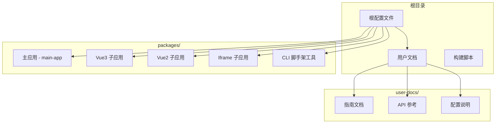
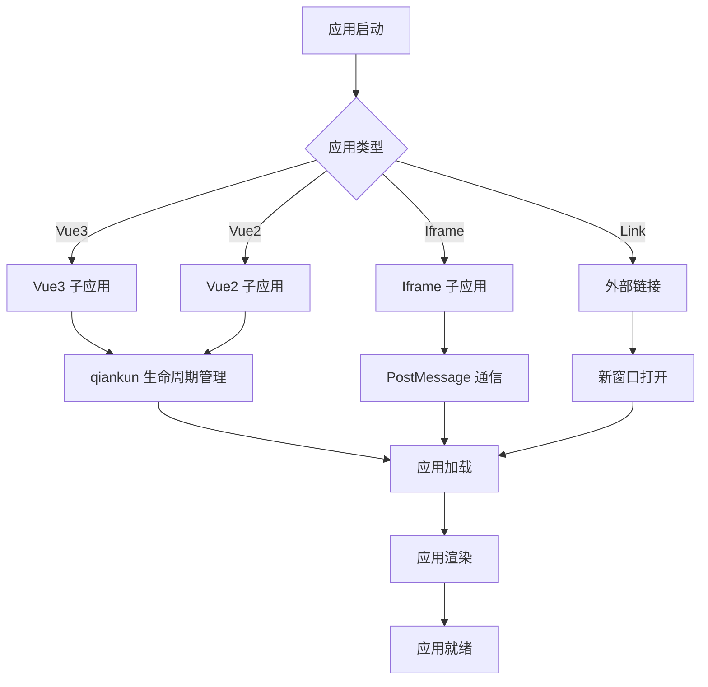
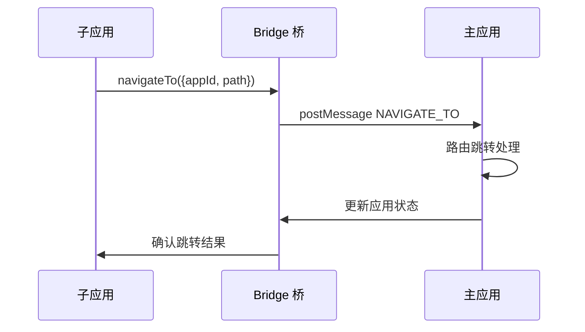
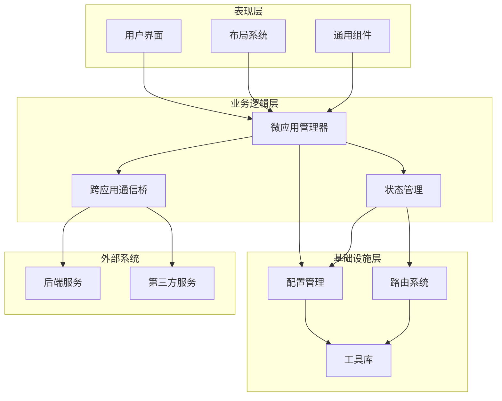
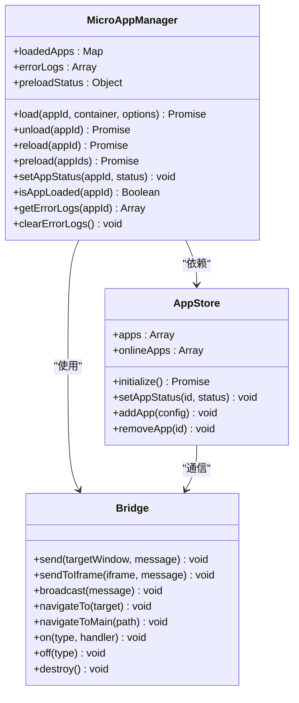
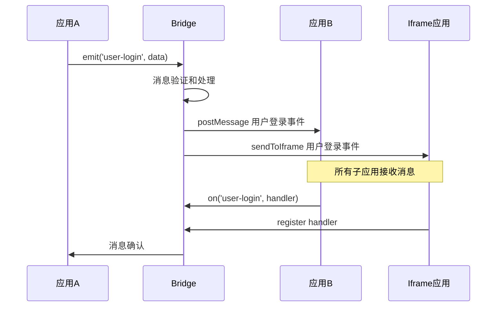
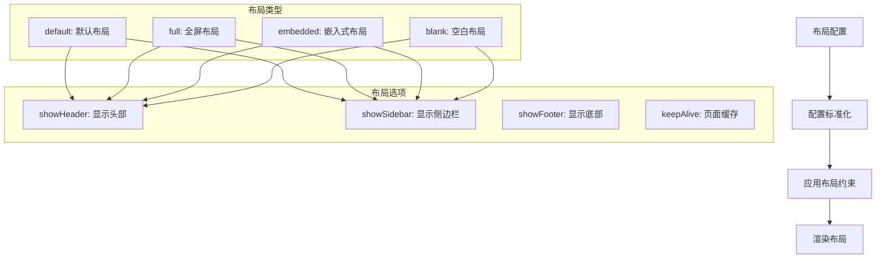
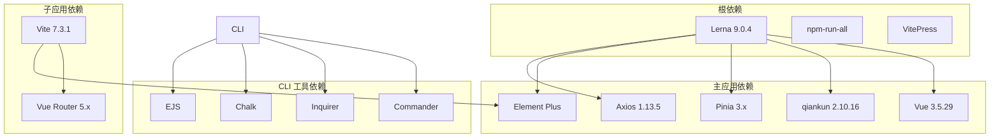
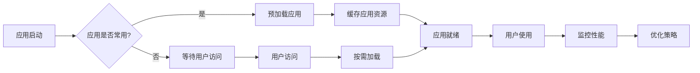

# 项目概述

<cite>
**本文档引用的文件**
- [README.md](file://README.md)
- [package.json](file://package.json)
- [lerna.json](file://lerna.json)
- [QUICK_START.md](file://QUICK_START.md)
- [SUB_APP_INTEGRATION.md](file://SUB_APP_INTEGRATION.md)
- [packages/main-app/package.json](file://packages/main-app/package.json)
- [packages/vue3-sub-app/package.json](file://packages/vue3-sub-app/package.json)
- [packages/vue2-sub-app/package.json](file://packages/vue2-sub-app/package.json)
- [packages/iframe-sub-app/package.json](file://packages/iframe-sub-app/package.json)
- [packages/cli/package.json](file://packages/cli/package.json)
- [user-docs/guide/getting-started.md](file://user-docs/guide/getting-started.md)
- [user-docs/guide/main-app.md](file://user-docs/guide/main-app.md)
- [user-docs/guide/sub-apps.md](file://user-docs/guide/sub-apps.md)
- [user-docs/guide/layout-system.md](file://user-docs/guide/layout-system.md)
- [user-docs/guide/iframe-governance.md](file://user-docs/guide/iframe-governance.md)
</cite>

## 目录
1. [简介](#简介)
2. [项目结构](#项目结构)
3. [核心特性](#核心特性)
4. [架构概览](#架构概览)
5. [详细组件分析](#详细组件分析)
6. [依赖关系分析](#依赖关系分析)
7. [性能考量](#性能考量)
8. [故障排查指南](#故障排查指南)
9. [结论](#结论)
10. [附录](#附录)

## 简介

Artisan 是一个企业级微前端基础平台脚手架，采用 Monorepo 架构，基于 qiankun 的 loadMicroApp 模式实现主应用对多类型子应用的统一加载与管理。该项目提供了完整的微前端解决方案，支持 Vue3/Vue2/iframe/link 四种应用类型，具备现代化技术栈和完善的工程化能力。

该项目的核心目标是为企业提供开箱即用的微前端基础设施，通过统一的管理平台实现多应用协同开发和部署，降低微前端架构的实施成本和技术门槛。

## 项目结构

项目采用 Lerna + npm workspace 的 Monorepo 架构，整体结构清晰，职责分明：


```mermaid
graph TB
subgraph "根目录"
Root[根配置文件]
Docs[用户文档]
Scripts[构建脚本]
end
subgraph "packages/"
MainApp[主应用 - main-app]
Vue3App[Vue3 子应用]
Vue2App[Vue2 子应用]
IframeApp[Iframe 子应用]
CLI[CLI 脚手架工具]
end
subgraph "user-docs/"
Guide[指南文档]
API[API 参考]
Config[配置说明]
end
Root --> MainApp
Root --> Vue3App
Root --> Vue2App
Root --> IframeApp
Root --> CLI
Root --> Docs
Docs --> Guide
Docs --> API
Docs --> Config
```

**图表来源**
- [package.json:1-52](file://package.json#L1-L52)
- [lerna.json:1-25](file://lerna.json#L1-L25)

### 核心应用模块

项目包含五个主要应用模块，每个模块都有明确的职责分工：

| 应用模块 | 技术栈 | 端口 | 主要功能 |
|---------|--------|------|----------|
| **主应用** | Vue3 + qiankun | 8080 | 微前端管理中枢，应用编排 |
| **Vue3 子应用** | Vue3 + Vite | 7080 | 现代化微应用示例 |
| **Vue2 子应用** | Vue2 + Vue CLI | 3000 | 传统微应用示例 |
| **Iframe 子应用** | 任意技术栈 | 9080 | 第三方系统集成 |
| **CLI 工具** | Node.js + Commander | - | 应用生成器 |

**章节来源**
- [README.md:159-181](file://README.md#L159-L181)
- [QUICK_START.md:54-78](file://QUICK_START.md#L54-L78)

## 核心特性

### 微前端集成架构

项目基于 qiankun 2.10.16 实现，支持四种应用类型：


```mermaid
flowchart TD
Start[应用启动] --> Type{应用类型}
Type --> |Vue3| Vue3[Vue3 子应用]
Type --> |Vue2| Vue2[Vue2 子应用]
Type --> |Iframe| Iframe[Iframe 子应用]
Type --> |Link| Link[外部链接]
Vue3 --> Qiankun[qiankun 生命周期管理]
Vue2 --> Qiankun
Iframe --> PostMessage[PostMessage 通信]
Link --> WindowOpen[新窗口打开]
Qiankun --> Load[应用加载]
PostMessage --> Load
WindowOpen --> Load
Load --> Render[应用渲染]
Render --> Ready[应用就绪]
```

**图表来源**
- [README.md:39-44](file://README.md#L39-L44)
- [SUB_APP_INTEGRATION.md:44-444](file://SUB_APP_INTEGRATION.md#L44-L444)

### 布局编排系统

提供四种布局类型，支持动态切换和智能约束：

| 布局类型 | 特点 | 适用场景 |
|---------|------|----------|
| **default** | 默认布局（含头部和侧边栏） | 后台管理系统、企业应用 |
| **full** | 全屏布局（无导航元素） | 数据大屏、沉浸式展示 |
| **embedded** | 嵌入式布局（轻量级） | 嵌入第三方应用、轻量化展示 |
| **blank** | 空白布局（仅内容） | 登录页、欢迎页、极简页面 |

### 跨应用通信机制

基于 postMessage 的 Bridge 机制，支持主应用与子应用双向通信：


```mermaid
sequenceDiagram
participant SubApp as 子应用
participant Bridge as Bridge 桥
participant MainApp as 主应用
SubApp->>Bridge : navigateTo({appId, path})
Bridge->>MainApp : postMessage NAVIGATE_TO
MainApp->>MainApp : 路由跳转处理
MainApp->>Bridge : 更新应用状态
Bridge->>SubApp : 确认跳转结果
```

**图表来源**
- [README.md:56-61](file://README.md#L56-L61)
- [user-docs/guide/main-app.md:139-235](file://user-docs/guide/main-app.md#L139-L235)

**章节来源**
- [README.md:37-85](file://README.md#L37-L85)
- [user-docs/guide/layout-system.md:7-15](file://user-docs/guide/layout-system.md#L7-L15)

## 架构概览

项目采用分层架构设计，各层职责清晰，耦合度低：


```mermaid
graph TB
subgraph "表现层"
UI[用户界面]
Layout[布局系统]
Components[通用组件]
end
subgraph "业务逻辑层"
Manager[微应用管理器]
Bridge[跨应用通信桥]
Store[状态管理]
end
subgraph "基础设施层"
Config[配置管理]
Router[路由系统]
Utils[工具库]
end
subgraph "外部系统"
Backend[后端服务]
ThirdParty[第三方服务]
end
UI --> Manager
Layout --> Manager
Components --> Manager
Manager --> Bridge
Manager --> Store
Manager --> Config
Bridge --> Backend
Bridge --> ThirdParty
Store --> Config
Store --> Router
Config --> Utils
Router --> Utils
```

**图表来源**
- [user-docs/guide/main-app.md:59-314](file://user-docs/guide/main-app.md#L59-L314)
- [user-docs/guide/sub-apps.md:1-827](file://user-docs/guide/sub-apps.md#L1-L827)

### 技术栈选择

项目采用现代化技术栈组合：

- **前端框架**: Vue 3.5.29 + Vue Router 5.x
- **构建工具**: Vite 7.3.1 + Lerna 9.0.4
- **微前端**: qiankun 2.10.16
- **状态管理**: Pinia 3.x + 持久化插件
- **UI 组件库**: Element Plus 2.13.2
- **开发工具**: TypeScript 5.9.3 + ESLint

**章节来源**
- [user-docs/guide/main-app.md:5-18](file://user-docs/guide/main-app.md#L5-L18)
- [packages/main-app/package.json:15-35](file://packages/main-app/package.json#L15-L35)

## 详细组件分析

### 微应用管理器

微应用管理器是主应用的核心组件，负责子应用的全生命周期管理：


```mermaid
classDiagram
class MicroAppManager {
+loadedApps : Map
+errorLogs : Array
+preloadStatus : Object
+load(appId, container, options) Promise
+unload(appId) Promise
+reload(appId) Promise
+preload(appIds) Promise
+setAppStatus(appId, status) void
+isAppLoaded(appId) Boolean
+getErrorLogs(appId) Array
+clearErrorLogs() void
}
class AppStore {
+apps : Array
+onlineApps : Array
+initialize() Promise
+setAppStatus(id, status) void
+addApp(config) void
+removeApp(id) void
}
class Bridge {
+send(targetWindow, message) void
+sendToIframe(iframe, message) void
+broadcast(message) void
+navigateTo(target) void
+navigateToMain(path) void
+on(type, handler) void
+off(type) void
+destroy() void
}
MicroAppManager --> AppStore : "依赖"
MicroAppManager --> Bridge : "使用"
AppStore --> Bridge : "通信"
```

**图表来源**
- [user-docs/guide/main-app.md:61-130](file://user-docs/guide/main-app.md#L61-L130)
- [user-docs/guide/main-app.md:139-235](file://user-docs/guide/main-app.md#L139-L235)

#### 核心功能特性

1. **多类型应用支持**: 统一管理 Vue3/Vue2/Iframe/Link 四种类型
2. **实例管理**: 防止重复加载，确保应用实例唯一性
3. **热更新检测**: 基于 lastModified 自动检测应用更新
4. **预加载系统**: 使用 qiankun prefetch API 提升访问速度
5. **错误收集**: 自动记录运行时错误，最多保留 100 条

### 跨应用通信桥

Bridge 机制实现了主应用与子应用之间的安全通信：


```mermaid
sequenceDiagram
participant AppA as 应用A
participant Bridge as Bridge
participant AppB as 应用B
participant Iframe as Iframe应用
AppA->>Bridge : emit('user-login', data)
Bridge->>Bridge : 消息验证和处理
Bridge->>AppB : postMessage 用户登录事件
Bridge->>Iframe : sendToIframe 用户登录事件
Note over AppB,Iframe : 所有子应用接收消息
AppB->>Bridge : on('user-login', handler)
Iframe->>Bridge : register handler
Bridge->>AppA : 消息确认
```

**图表来源**
- [user-docs/guide/main-app.md:139-235](file://user-docs/guide/main-app.md#L139-L235)
- [user-docs/guide/iframe-governance.md:56-79](file://user-docs/guide/iframe-governance.md#L56-L79)

#### 安全治理机制

1. **Origin 校验**: 支持静态白名单 + 动态正则匹配
2. **消息格式**: 标准化的 `{type, payload}` 结构
3. **权限限制**: Iframe 应用的 sandbox 权限控制
4. **心跳检测**: 30秒定时检测应用健康状态

### 布局管理器

布局管理器提供了灵活的页面布局控制能力：


```mermaid
flowchart TD
Config[布局配置] --> Normalize[配置标准化]
Normalize --> Apply[应用布局约束]
Apply --> Render[渲染布局]
subgraph "布局类型"
Default[default: 默认布局]
Full[full: 全屏布局]
Embedded[embedded: 嵌入式布局]
Blank[blank: 空白布局]
end
subgraph "布局选项"
Header[showHeader: 显示头部]
Sidebar[showSidebar: 显示侧边栏]
Footer[showFooter: 显示底部]
KeepAlive[keepAlive: 页面缓存]
end
Default --> Header
Default --> Sidebar
Full --> Header
Full --> Sidebar
Embedded --> Header
Embedded --> Sidebar
Blank --> Header
Blank --> Sidebar
```

**图表来源**
- [user-docs/guide/layout-system.md:16-74](file://user-docs/guide/layout-system.md#L16-L74)
- [user-docs/guide/main-app.md:236-297](file://user-docs/guide/main-app.md#L236-L297)

#### 布局约束规则

| 布局类型 | 约束说明 |
|---------|---------|
| **default** | 无强制约束，推荐显示头部和侧边栏 |
| **full** | 强制隐藏头部和侧边栏 |
| **embedded** | 强制隐藏侧边栏（showSidebar 始终为 false） |
| **blank** | 强制隐藏头部和侧边栏 |

**章节来源**
- [user-docs/guide/main-app.md:61-314](file://user-docs/guide/main-app.md#L61-L314)
- [user-docs/guide/layout-system.md:62-74](file://user-docs/guide/layout-system.md#L62-L74)

## 依赖关系分析

项目采用 Lerna 管理的 Monorepo 架构，依赖关系清晰：


```mermaid
graph TB
subgraph "根依赖"
Lerna[Lerna 9.0.4]
NpmRunAll[npm-run-all]
VitePress[VitePress]
end
subgraph "主应用依赖"
Vue[Vue 3.5.29]
Qiankun[qiankun 2.10.16]
Pinia[Pinia 3.x]
ElementPlus[Element Plus 2.13.2]
Axios[Axios 1.13.5]
end
subgraph "CLI 工具依赖"
Commander[Commander]
Inquirer[Inquirer]
Chalk[Chalk]
EJS[EJS]
end
subgraph "子应用依赖"
Vite[Vite 7.3.1]
VueRouter[Vue Router 5.x]
ElementPlus[Element Plus]
end
Lerna --> Vue
Lerna --> Qiankun
Lerna --> Pinia
Lerna --> ElementPlus
Lerna --> Axios
CLI --> Commander
CLI --> Inquirer
CLI --> Chalk
CLI --> EJS
Vite --> VueRouter
Vite --> ElementPlus
```

**图表来源**
- [package.json:6-28](file://package.json#L6-L28)
- [packages/main-app/package.json:15-35](file://packages/main-app/package.json#L15-L35)
- [packages/cli/package.json:16-24](file://packages/cli/package.json#L16-L24)

### 开发环境配置

项目提供了灵活的开发环境配置选项：

| 环境模式 | 配置文件 | 特点 | 使用场景 |
|---------|---------|------|----------|
| **Mock 模式** | `.env.mock` | 使用本地 mock 数据 | 快速开发、演示 |
| **API 模式** | `.env.development` | 从后端 API 加载配置 | 集成测试、联调 |
| **生产模式** | `.env.production` | 线上环境配置 | 正式部署 |

**章节来源**
- [package.json:10-28](file://package.json#L10-L28)
- [user-docs/guide/getting-started.md:91-121](file://user-docs/guide/getting-started.md#L91-L121)

## 性能考量

项目在性能优化方面采用了多项策略：

### 预加载机制


```mermaid
flowchart LR
Start[应用启动] --> Check{应用是否常用?}
Check --> |是| Preload[预加载应用]
Check --> |否| Wait[等待用户访问]
Preload --> Cache[缓存应用资源]
Cache --> Ready[应用就绪]
Wait --> Access[用户访问]
Access --> Load[按需加载]
Load --> Ready
Ready --> Use[用户使用]
Use --> Monitor[监控性能]
Monitor --> Optimize[优化策略]
```

**图表来源**
- [user-docs/guide/main-app.md:71-73](file://user-docs/guide/main-app.md#L71-L73)
- [QUICK_START.md:260-271](file://QUICK_START.md#L260-L271)

### 样式隔离优化

1. **qiankun 实验性样式隔离**: 使用 `experimentalStyleIsolation` 防止样式污染
2. **Element Plus 样式复用**: qiankun 环境下复用主应用样式，避免重复加载
3. **CSS Modules**: 推荐使用 CSS Modules 避免命名冲突

### 内存管理

1. **响应式系统清理**: Vue3 子应用卸载时停止响应式系统而非直接卸载
2. **DOM 清理**: 卸载时清理容器内容，防止内存泄漏
3. **监听器移除**: Iframe 应用卸载时移除 message 监听器

## 故障排查指南

### 常见问题及解决方案

#### 端口冲突问题

**问题症状**: 启动应用时报端口被占用错误

**解决方案**:
1. 检查端口占用情况：`lsof -i :端口号`
2. 修改应用配置文件中的端口号
3. 关闭占用端口的进程

#### CORS 跨域问题

**问题症状**: 控制台出现跨域错误

**解决方案**:
1. 确保子应用配置了正确的 CORS 响应头
2. 开发环境设置 `host: '0.0.0.0'` 和 `cors: true`
3. 配置正确的 `Access-Control-Allow-Origin` 值

#### 样式冲突问题

**问题症状**: 主应用样式被子应用覆盖

**解决方案**:
1. 使用 CSS Modules 或 Scoped CSS
2. 避免使用全局样式重置
3. 使用命名空间隔离样式

#### 路由跳转失败

**问题症状**: 点击链接后 URL 变化但页面不刷新

**解决方案**:
1. 确保 qiankun 环境使用 Memory/Abstract 路由模式
2. 独立运行使用 History 路由模式
3. 设置正确的 base 路径

**章节来源**
- [README.md:345-368](file://README.md#L345-L368)
- [QUICK_START.md:274-363](file://QUICK_START.md#L274-L363)
- [SUB_APP_INTEGRATION.md:651-780](file://SUB_APP_INTEGRATION.md#L651-L780)

## 结论

Artisan 微前端平台是一个功能完善、架构清晰的企业级解决方案。项目通过 Monorepo 架构实现了代码复用和统一管理，通过 qiankun 微前端框架提供了强大的应用集成能力。

### 主要优势

1. **开箱即用**: 提供完整的微前端解决方案，无需从零搭建
2. **多类型支持**: 支持 Vue3/Vue2/iframe/link 四种应用类型
3. **现代化技术栈**: 基于最新的前端技术，开发体验优秀
4. **完善的工程化**: 包含 CLI 工具、文档体系、质量保证
5. **企业级特性**: 跨应用通信、安全治理、性能优化等

### 适用场景

- 企业级后台管理系统
- 多产品线协同开发
- 第三方系统集成
- 微服务前端架构
- 大型复杂应用拆分

该项目为微前端架构的实施提供了良好的基础设施，降低了技术门槛，提高了开发效率，是企业数字化转型的理想选择。

## 附录

### 快速启动指南

```bash
# 克隆项目
git clone https://github.com/your-org/artisan-base-frontend.git
cd artisan-base-frontend

# 安装依赖
npm install

# 启动所有应用（推荐新手）
npm run dev:all:mock

# 访问主应用
http://localhost:8080
```

### CLI 工具使用

```bash
# 全局安装 CLI
cd packages/cli
npm link

# 创建 Vue3 子应用
artisan create sub-app my-vue3-app --type vue3

# 创建 Vue2 子应用
artisan create sub-app my-vue2-app --type vue2

# 创建 Iframe 子应用
artisan create sub-app my-iframe-app --type iframe

# 查看支持的模板
artisan list
```

### 构建和部署

```bash
# 构建所有应用
npm run build:all

# 单独构建
npm run build:main    # 主应用
npm run build:vue3    # Vue3 子应用
npm run build:vue2    # Vue2 子应用
npm run build:iframe  # Iframe 子应用
```

**章节来源**
- [README.md:99-156](file://README.md#L99-L156)
- [packages/cli/package.json:6-24](file://packages/cli/package.json#L6-L24)