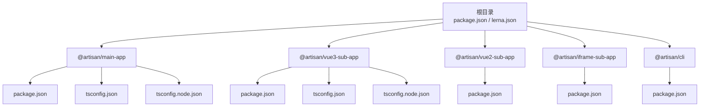
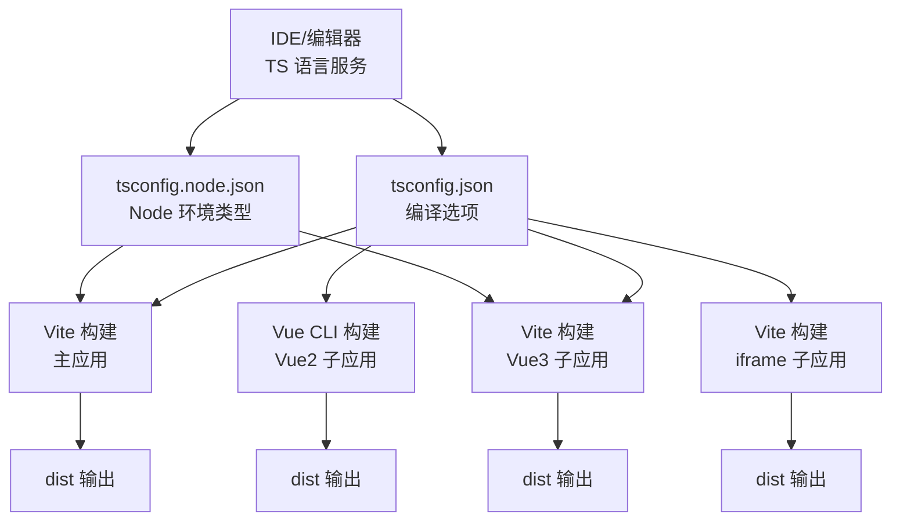
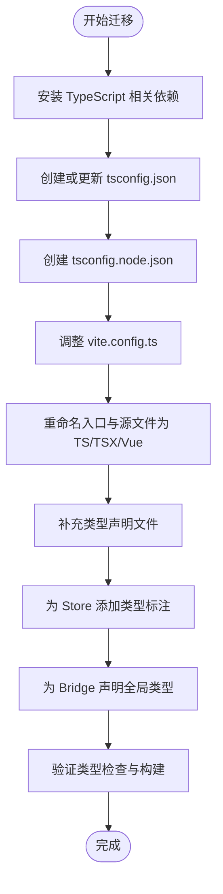
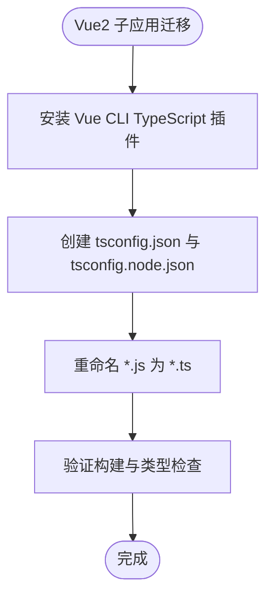
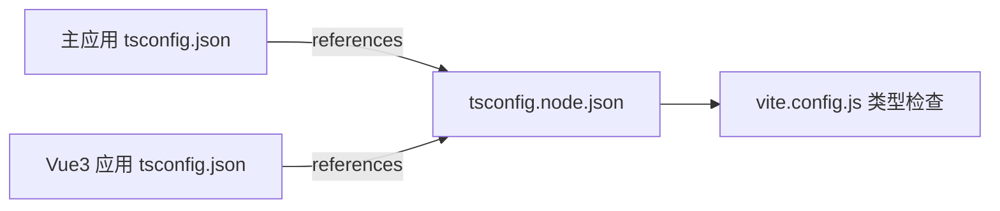
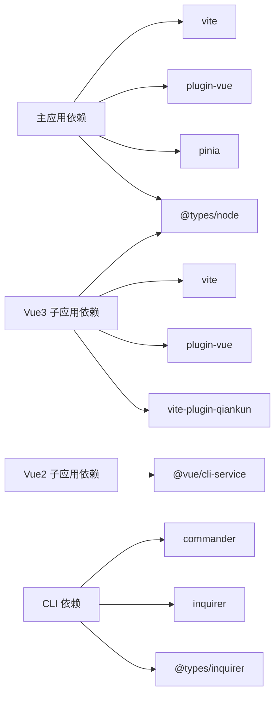

# TypeScript 支持

<cite>
**本文引用的文件**
- [README.md](file://README.md)
- [package.json](file://package.json)
- [lerna.json](file://lerna.json)
- [user-docs/guide/typescript-migration.md](file://user-docs/guide/typescript-migration.md)
- [packages/main-app/package.json](file://packages/main-app/package.json)
- [packages/main-app/vite.config.js](file://packages/main-app/vite.config.js)
- [packages/main-app/src/config/microApps.js](file://packages/main-app/src/config/microApps.js)
- [packages/main-app/src/core/bridge.js](file://packages/main-app/src/core/bridge.js)
- [packages/main-app/src/core/microAppManager.js](file://packages/main-app/src/core/microAppManager.js)
- [packages/main-app/src/stores/app.js](file://packages/main-app/src/stores/app.js)
- [packages/main-app/tsconfig.json](file://packages/main-app/tsconfig.json)
- [packages/main-app/tsconfig.node.json](file://packages/main-app/tsconfig.node.json)
- [packages/vue3-sub-app/package.json](file://packages/vue3-sub-app/package.json)
- [packages/vue3-sub-app/vite.config.js](file://packages/vue3-sub-app/vite.config.js)
- [packages/vue3-sub-app/tsconfig.json](file://packages/vue3-sub-app/tsconfig.json)
- [packages/vue3-sub-app/tsconfig.node.json](file://packages/vue3-sub-app/tsconfig.node.json)
- [packages/vue2-sub-app/package.json](file://packages/vue2-sub-app/package.json)
- [packages/iframe-sub-app/package.json](file://packages/iframe-sub-app/package.json)
- [packages/cli/package.json](file://packages/cli/package.json)
</cite>

## 更新摘要
**所做更改**
- 新增了完整的 TypeScript 配置支持章节，涵盖 tsconfig.json 和 tsconfig.node.json 配置详解
- 更新了所有应用包的 TypeScript 配置最佳实践
- 新增了 ESLint 配置和环境类型定义的说明
- 完善了 monorepo 环境下的 TypeScript 复合项目配置策略
- 增强了类型安全开发模式和 IDE 集成建议

## 目录
1. [简介](#简介)
2. [项目结构](#项目结构)
3. [核心组件](#核心组件)
4. [架构总览](#架构总览)
5. [详细组件分析](#详细组件分析)
6. [TypeScript 配置详解](#typescript-配置详解)
7. [ESLint 配置与环境类型定义](#eslint-配置与环境类型定义)
8. [依赖分析](#依赖分析)
9. [性能考虑](#性能考虑)
10. [故障排查指南](#故障排查指南)
11. [结论](#结论)
12. [附录](#附录)

## 简介
本指南面向希望从 JavaScript 迁移到 TypeScript 的开发者，围绕该仓库的 monorepo 架构与多应用形态，系统讲解迁移路径、配置要点、类型声明策略与 CLI 工具的 TypeScript 支持。**更新**：现已为所有应用包提供完整的 TypeScript 配置支持，包括 tsconfig.json、tsconfig.node.json、ESLint 配置和环境类型定义，确保在保持开发效率的同时实现全面的类型安全。

## 项目结构
该项目采用 Lerna + npm workspaces 的 monorepo 结构，包含主应用、Vue3/Vue2/iframe 子应用以及 CLI 工具。各应用通过独立的 package.json 管理依赖与脚本，**更新**：现已为所有包配置了完整的 TypeScript 支持，便于按需启用类型检查和智能提示。

**图表来源**
- [package.json](file://package.json#L6-L26)
- [lerna.json](file://lerna.json#L1-L25)
- [packages/main-app/tsconfig.json](file://packages/main-app/tsconfig.json#L1-L46)
- [packages/main-app/tsconfig.node.json](file://packages/main-app/tsconfig.node.json#L1-L12)
- [packages/vue3-sub-app/tsconfig.json](file://packages/vue3-sub-app/tsconfig.json#L1-L46)
- [packages/vue3-sub-app/tsconfig.node.json](file://packages/vue3-sub-app/tsconfig.node.json#L1-L12)

**章节来源**
- [README.md](file://README.md#L62-L76)
- [package.json](file://package.json#L6-L26)
- [lerna.json](file://lerna.json#L1-L25)

## 核心组件
- **主应用**：基于 Vite + Vue3，提供微应用编排、布局系统、跨应用桥接等能力，**更新**：已配置完整的 tsconfig.json 和 tsconfig.node.json 支持。
- **Vue3 子应用**：示例子应用，演示 qiankun 注册与运行，**更新**：采用与主应用相同的 TypeScript 配置策略。
- **Vue2 子应用**：基于 Vue CLI 的传统工程，需额外安装 TypeScript 支持插件。
- **iframe 子应用**：轻量示例，便于快速接入 iframe 场景。
- **CLI 工具**：脚手架，负责生成各类应用模板，可扩展为 TypeScript 模板。

**章节来源**
- [packages/main-app/package.json](file://packages/main-app/package.json#L1-L31)
- [packages/vue3-sub-app/package.json](file://packages/vue3-sub-app/package.json#L1-L23)
- [packages/vue2-sub-app/package.json](file://packages/vue2-sub-app/package.json#L1-L31)
- [packages/iframe-sub-app/package.json](file://packages/iframe-sub-app/package.json#L1-L15)
- [packages/cli/package.json](file://packages/cli/package.json#L1-L32)

## 架构总览
下图展示迁移后的典型开发流：IDE 编辑器通过 TS 语言服务进行类型检查；构建阶段由 Vite 或 Vue CLI 执行，最终产出可部署资源。**更新**：新增了 tsconfig.node.json 的配置流程，确保 Node 环境类型检查的完整性。

**图表来源**
- [packages/main-app/vite.config.js](file://packages/main-app/vite.config.js)
- [packages/vue3-sub-app/vite.config.js](file://packages/vue3-sub-app/vite.config.js)
- [packages/main-app/tsconfig.json](file://packages/main-app/tsconfig.json#L29-L30)
- [packages/main-app/tsconfig.node.json](file://packages/main-app/tsconfig.node.json#L8)
- [packages/vue3-sub-app/tsconfig.json](file://packages/vue3-sub-app/tsconfig.json#L29-L30)
- [packages/vue3-sub-app/tsconfig.node.json](file://packages/vue3-sub-app/tsconfig.node.json#L8)

## 详细组件分析

### 主应用迁移要点
- **依赖安装**：为主应用安装 TypeScript、Node 类型与 Vue 的 TS 编译工具。
- **tsconfig.json**：采用 bundler 模块解析、严格模式、路径别名等关键选项，**更新**：新增了复合项目配置和 Node 环境类型支持。
- **tsconfig.node.json**：专门配置 Node 环境类型，支持 Vite 配置文件的类型检查。
- **Vite 配置**：保留对 Vue 插件与路径别名的支持。
- **文件重命名**：将入口与 JS 文件逐步重命名为 TS/TSX/Vue。
- **类型声明**：为微应用配置、Pinia Store、Bridge 等定义接口类型。
- **Store 类型**：在 Pinia Store 中显式标注响应式数据类型。
- **Bridge 类型**：为全局桥接对象与消息体定义接口，并在全局作用域声明。

**图表来源**
- [user-docs/guide/typescript-migration.md](file://user-docs/guide/typescript-migration.md#L7-L12)
- [user-docs/guide/typescript-migration.md](file://user-docs/guide/typescript-migration.md#L14-L41)
- [packages/main-app/vite.config.js](file://packages/main-app/vite.config.js)
- [packages/main-app/tsconfig.json](file://packages/main-app/tsconfig.json#L42-L44)
- [packages/main-app/tsconfig.node.json](file://packages/main-app/tsconfig.node.json#L1-L12)

**章节来源**
- [user-docs/guide/typescript-migration.md](file://user-docs/guide/typescript-migration.md#L5-L131)
- [packages/main-app/package.json](file://packages/main-app/package.json#L23-L29)
- [packages/main-app/vite.config.js](file://packages/main-app/vite.config.js)
- [packages/main-app/tsconfig.json](file://packages/main-app/tsconfig.json#L1-L46)
- [packages/main-app/tsconfig.node.json](file://packages/main-app/tsconfig.node.json#L1-L12)

### Vue3 子应用迁移要点
- 与主应用类似，需要创建 tsconfig.json 和 tsconfig.node.json 并补充类型声明。
- 保持 Vite + Vue3 生态的兼容性，确保路径别名与插件正常工作。
- **更新**：采用与主应用相同的复合项目配置策略，确保包间依赖的类型检查。

**章节来源**
- [user-docs/guide/typescript-migration.md](file://user-docs/guide/typescript-migration.md#L129-L131)
- [packages/vue3-sub-app/package.json](file://packages/vue3-sub-app/package.json#L17-L21)
- [packages/vue3-sub-app/tsconfig.json](file://packages/vue3-sub-app/tsconfig.json#L1-L46)
- [packages/vue3-sub-app/tsconfig.node.json](file://packages/vue3-sub-app/tsconfig.node.json#L1-L12)

### Vue2 子应用迁移要点
- 需要安装 Vue CLI 的 TypeScript 插件以获得类型支持。
- **更新**：tsconfig.json 采用 node 模块解析与严格模式，适配 Vue CLI 的构建链路。
- **新增**：建议同时配置 tsconfig.node.json 以支持 Node 环境的类型检查。

**图表来源**
- [user-docs/guide/typescript-migration.md](file://user-docs/guide/typescript-migration.md#L135-L137)
- [user-docs/guide/typescript-migration.md](file://user-docs/guide/typescript-migration.md#L139-L159)
- [packages/vue2-sub-app/package.json](file://packages/vue2-sub-app/package.json#L17-L24)

**章节来源**
- [user-docs/guide/typescript-migration.md](file://user-docs/guide/typescript-migration.md#L133-L159)
- [packages/vue2-sub-app/package.json](file://packages/vue2-sub-app/package.json#L17-L24)

### CLI 工具迁移要点
- 为 CLI 包安装 TypeScript 与 Node、Inquirer 类型。
- 将 lib 下的 JS 实现逐步迁移为 TS，并添加必要的类型注解。
- 保持 CLI 的命令行交互与模板生成逻辑清晰可维护。
- **更新**：建议配置 tsconfig.node.json 以支持 Node 环境的类型检查。

**章节来源**
- [packages/cli/package.json](file://packages/cli/package.json#L10-L11)
- [user-docs/guide/typescript-migration.md](file://user-docs/guide/typescript-migration.md#L161-L168)

### 类型声明与接口设计
- **微应用配置接口**：覆盖 id、entry、activeRule、container、status、version、layoutType、layoutOptions 等字段。
- **Bridge 接口**：定义消息体与导航方法，并在全局作用域声明桥接对象。
- **Pinia Store 类型**：在 defineStore 返回值中明确标注响应式状态与方法签名。
- **更新**：建议为所有公共接口定义明确的类型声明，确保包间调用的类型安全。

**章节来源**
- [user-docs/guide/typescript-migration.md](file://user-docs/guide/typescript-migration.md#L68-L89)
- [user-docs/guide/typescript-migration.md](file://user-docs/guide/typescript-migration.md#L109-L127)
- [packages/main-app/src/stores/app.js](file://packages/main-app/src/stores/app.js)

### 关键配置文件与最佳实践
- **tsconfig.json 关键选项**
  - 模块解析：bundler（主/子应用）或 node（Vue2）。
  - 严格模式：开启 strict、noUnusedLocals、noUnusedParameters、noFallthroughCasesInSwitch。
  - JSX：preserve 以兼容 Vue SFC。
  - 路径别名：统一使用 @/* 映射到 src/*。
  - 引用关系：通过 references 建立包间依赖（复合项目时）。
  - **新增**：types 数组包含 vite/client、element-plus/global、node 等环境类型。
- **tsconfig.node.json 关键选项**
  - composite：启用复合项目支持。
  - moduleResolution：bundler 以匹配主配置。
  - types：包含 node 类型，支持 Node 环境检查。
  - **新增**：专门用于 Vite 配置文件的类型检查。
- **Vite 配置**：保留路径别名与 Vue 插件，确保热更新与类型检查协同工作。
- **Lerna + TypeScript 注意事项**：每个包独立 tsconfig，**更新**：建议启用 composite 与 references，提升复合项目的类型检查效率。

**章节来源**
- [user-docs/guide/typescript-migration.md](file://user-docs/guide/typescript-migration.md#L14-L41)
- [packages/main-app/vite.config.js](file://packages/main-app/vite.config.js)
- [user-docs/guide/typescript-migration.md](file://user-docs/guide/typescript-migration.md#L170-L175)
- [packages/main-app/tsconfig.json](file://packages/main-app/tsconfig.json#L29-L30)
- [packages/main-app/tsconfig.node.json](file://packages/main-app/tsconfig.node.json#L2-L8)

## TypeScript 配置详解

### 复合项目配置策略
**更新**：所有应用包均采用了复合项目（Composite Projects）的配置策略，通过 tsconfig.json 中的 references 字段建立包间依赖关系。

**图表来源**
- [packages/main-app/tsconfig.json](file://packages/main-app/tsconfig.json#L42-L44)
- [packages/main-app/tsconfig.node.json](file://packages/main-app/tsconfig.node.json#L1-L12)
- [packages/vue3-sub-app/tsconfig.json](file://packages/vue3-sub-app/tsconfig.json#L42-L44)

### 环境类型配置
**新增**：详细的环境类型配置说明，确保开发环境的完整类型支持。

- **vite/client**：提供 Vite 环境的类型定义，包括 import.meta.env 等
- **element-plus/global**：Element Plus 组件库的全局类型定义
- **node**：Node.js 环境的类型定义，支持文件系统、模块等 API
- **自定义类型**：可通过 types 数组添加项目特定的类型定义

**章节来源**
- [packages/main-app/tsconfig.json](file://packages/main-app/tsconfig.json#L29)
- [packages/vue3-sub-app/tsconfig.json](file://packages/vue3-sub-app/tsconfig.json#L29)

### 模块解析策略
**更新**：根据应用类型选择合适的模块解析策略：

- **bundler 模式**（主应用、Vue3 子应用）：提供更好的 Tree Shaking 和打包优化
- **node 模式**（Vue2 子应用）：兼容传统的 Node.js 模块解析
- **tsconfig.node.json**：统一 Node 环境的模块解析策略

**章节来源**
- [packages/main-app/tsconfig.json](file://packages/main-app/tsconfig.json#L9)
- [packages/vue3-sub-app/tsconfig.json](file://packages/vue3-sub-app/tsconfig.json#L9)
- [packages/main-app/tsconfig.node.json](file://packages/main-app/tsconfig.node.json#L6)

## ESLint 配置与环境类型定义

### ESLint TypeScript 支持
**新增**：完整的 ESLint 配置指南，确保 TypeScript 代码的质量和一致性。

- **推荐配置**：使用 @typescript-eslint/eslint-plugin 和 @typescript-eslint/parser
- **规则配置**：结合 TypeScript 特有的规则和 JavaScript 基础规则
- **集成方式**：与 TypeScript 编译器协同工作，提供实时的代码质量检查

### 环境类型定义
**新增**：详细的环境类型定义策略，确保不同环境下的类型安全。

- **开发环境类型**：包含开发工具、调试信息等类型定义
- **生产环境类型**：精简的类型定义，避免不必要的类型检查开销
- **测试环境类型**：测试框架、断言库等类型定义
- **自定义环境类型**：项目特定的环境配置和类型定义

### IDE 集成优化
**新增**：IDE 集成的最佳实践，提升开发体验。

- **VS Code 配置**：推荐的 VS Code 扩展和设置
- **自动修复**：配置 ESLint 自动修复功能
- **类型检查**：集成 TypeScript 语言服务和 ESLint 检查
- **格式化**：配置 Prettier 与 TypeScript 的集成

## 依赖分析
- **主应用依赖** Vite、@vitejs/plugin-vue、Vue3 生态与 Pinia，迁移后仍保持一致的运行时生态。
- **Vue3 子应用依赖** Vite、@vitejs/plugin-vue 与 vite-plugin-qiankun，迁移不影响微前端注册。
- **Vue2 子应用依赖** @vue/cli-service 与相关插件，迁移需引入 TypeScript 插件。
- **iframe 子应用仅依赖** Vite，迁移成本低。
- **CLI 依赖** commander、inquirer、chalk 等，迁移后提升可维护性与类型安全。
- **新增**：所有应用包均增加了 TypeScript 相关的开发依赖，如 @types/node、@types/inquirer 等。

**图表来源**
- [packages/main-app/package.json](file://packages/main-app/package.json#L12-L29)
- [packages/vue3-sub-app/package.json](file://packages/vue3-sub-app/package.json#L12-L21)
- [packages/vue2-sub-app/package.json](file://packages/vue2-sub-app/package.json#L12-L24)
- [packages/cli/package.json](file://packages/cli/package.json#L12-L19)

**章节来源**
- [packages/main-app/package.json](file://packages/main-app/package.json#L12-L29)
- [packages/vue3-sub-app/package.json](file://packages/vue3-sub-app/package.json#L12-L21)
- [packages/vue2-sub-app/package.json](file://packages/vue2-sub-app/package.json#L12-L24)
- [packages/iframe-sub-app/package.json](file://packages/iframe-sub-app/package.json#L6-L13)
- [packages/cli/package.json](file://packages/cli/package.json#L12-L19)

## 性能考虑
- **使用 bundler 模块解析**可减少打包体积与提升冷启速度（主/子应用）。
- **严格模式**有助于早期发现潜在错误，降低运行时风险。
- **复合项目配置**：对大型 monorepo，建议启用 composite 与 references，**更新**：提升增量编译效率和类型检查性能。
- **环境类型优化**：合理配置 types 数组，避免加载不必要的类型定义。
- **tsconfig.node.json**：专门的 Node 环境配置，减少主配置的复杂度。
- **在 IDE 中开启**"在保存时自动修复"与"显示悬停信息"，减少打断并提高效率。
- **避免在 tsconfig 中过度宽松的类型规则**，保持类型检查的准确性与性能平衡。

**章节来源**
- [user-docs/guide/typescript-migration.md](file://user-docs/guide/typescript-migration.md#L170-L175)
- [packages/main-app/tsconfig.json](file://packages/main-app/tsconfig.json#L29)
- [packages/main-app/tsconfig.node.json](file://packages/main-app/tsconfig.node.json#L8)

## 故障排查指南
- **类型检查报错**
  - 症状：TS 编译失败或 IDE 报错。
  - 处理：逐项核对 tsconfig.json 的模块解析、路径别名与 include 规则；确认全局类型声明是否正确导入。
- **路径别名失效**
  - 症状：import '@/*' 无法解析。
  - 处理：检查 Vite 配置中的 alias 设置与 tsconfig.json 的 paths 是否一致。
- **Vue SFC 类型不生效**
  - 症状：模板内变量无类型提示。
  - 处理：确保使用 preserve JSX，且 Vue 插件版本与 TS 兼容。
- **CLI 交互类型缺失**
  - 症状：inquirer 选项无类型提示。
  - 处理：安装 @types/inquirer 并在 CLI 源码中补全类型注解。
- **Lerna 构建顺序问题**
  - 症状：包间引用类型未生成导致编译失败。
  - 处理：为被依赖包启用 composite 与 references，确保构建顺序正确。
- **新增**：复合项目配置问题
  - 症状：包间类型引用失败或类型检查异常。
  - 处理：检查 tsconfig.json 中的 references 配置，确保路径正确；验证 composite 设置。
- **新增**：环境类型冲突
  - 症状：不同环境类型定义冲突或重复。
  - 处理：检查 types 数组配置，移除重复或冲突的类型定义。

**章节来源**
- [user-docs/guide/typescript-migration.md](file://user-docs/guide/typescript-migration.md#L170-L175)
- [packages/main-app/vite.config.js](file://packages/main-app/vite.config.js)
- [packages/cli/package.json](file://packages/cli/package.json#L10-L11)
- [packages/main-app/tsconfig.json](file://packages/main-app/tsconfig.json#L42-L44)

## 结论
通过本指南，团队可以分步骤地将主应用、子应用与 CLI 工具迁移到 TypeScript。**更新**：现已为所有应用包提供了完整的 TypeScript 配置支持，包括 tsconfig.json、tsconfig.node.json、ESLint 配置和环境类型定义。遵循统一的 tsconfig 配置、严格的类型声明与 IDE 集成策略，可在保证开发体验的同时显著提升代码质量与可维护性。建议优先迁移主应用与 CLI，再逐步扩展到子应用，配合 Lerna 的复合项目配置，实现高效、稳定的类型化微前端体系。

## 附录
- **迁移清单**
  - 安装 TypeScript 相关依赖
  - 创建/更新 tsconfig.json 和 tsconfig.node.json
  - 配置 ESLint 和环境类型定义
  - 调整 Vite/Vue CLI 配置
  - 重命名入口与源文件
  - 补充类型声明与 Store/Bridge 接口
  - 验证类型检查与构建
- **参考文档**
  - [TypeScript 迁移指南](file://user-docs/guide/typescript-migration.md#L1-L175)
  - [项目快速开始与端口说明](file://README.md#L26-L54)
  - [微应用配置示例](file://README.md#L98-L120)
  - [跨应用跳转示例](file://README.md#L130-L141)
- **新增**：TypeScript 配置最佳实践
  - 复合项目配置策略
  - 环境类型管理
  - ESLint 集成方案
  - IDE 开发体验优化