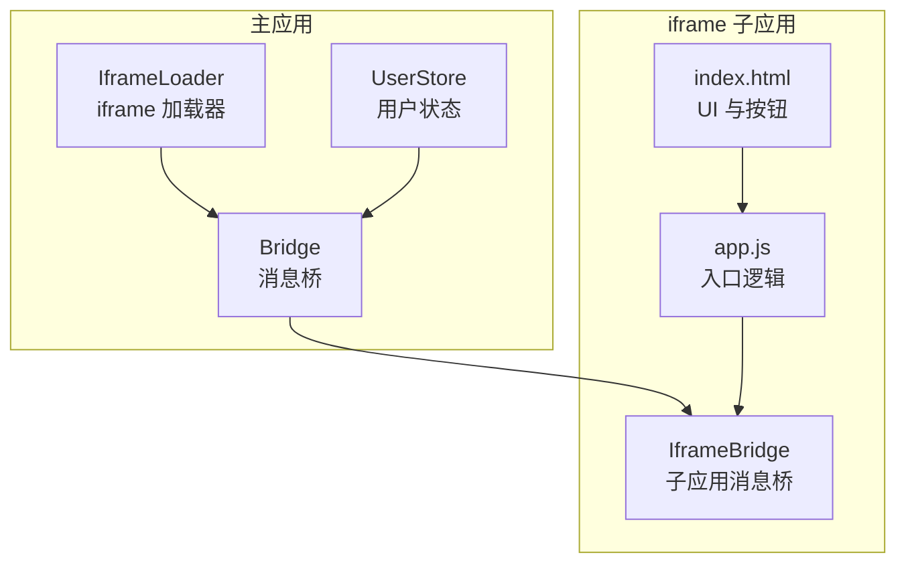
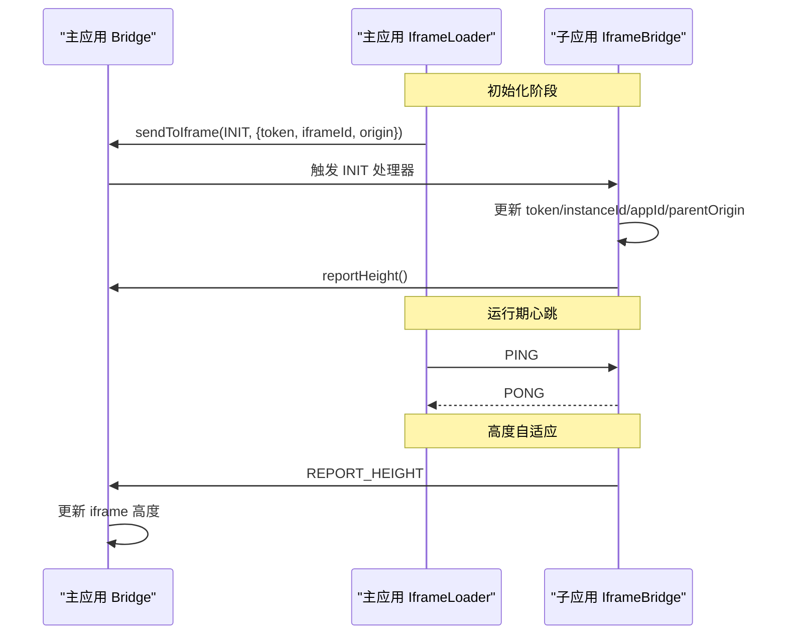
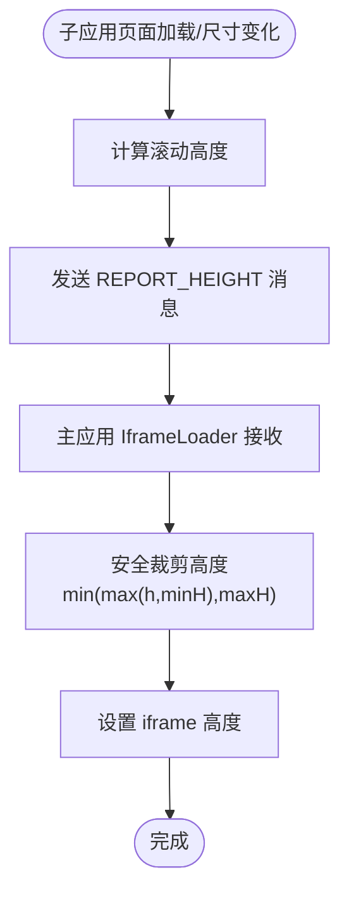
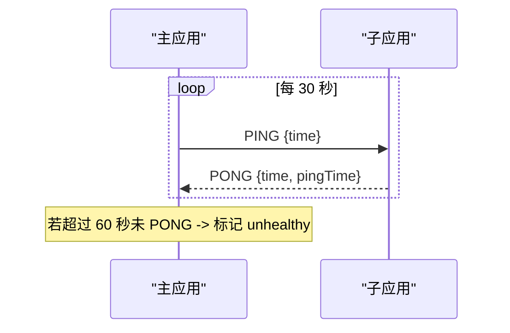
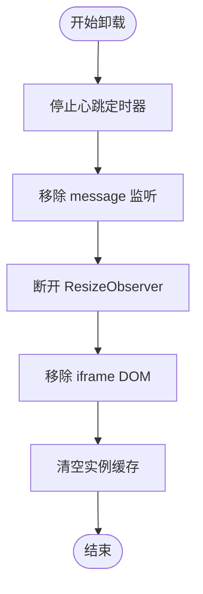
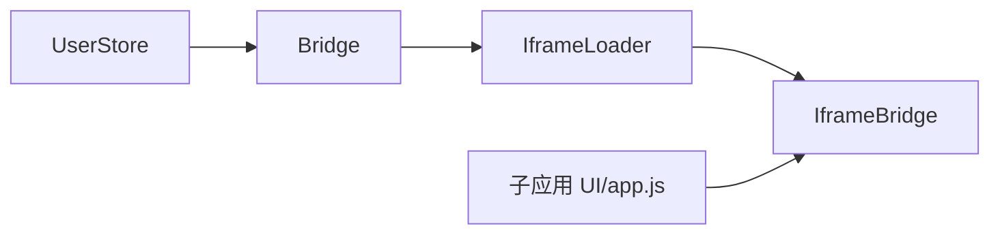

# iframe 跨域治理

<cite>
**本文引用的文件**
- [packages/iframe-sub-app/src/bridge.js](file://packages/iframe-sub-app/src/bridge.js)
- [packages/main-app/src/core/bridge.js](file://packages/main-app/src/core/bridge.js)
- [packages/main-app/src/core/iframeLoader.js](file://packages/main-app/src/core/iframeLoader.js)
- [packages/iframe-sub-app/index.html](file://packages/iframe-sub-app/index.html)
- [packages/iframe-sub-app/src/app.js](file://packages/iframe-sub-app/src/app.js)
- [packages/main-app/src/stores/user.js](file://packages/main-app/src/stores/user.js)
- [user-docs/guide/iframe-governance.md](file://user-docs/guide/iframe-governance.md)
</cite>

## 目录
1. [简介](#简介)
2. [项目结构](#项目结构)
3. [核心组件](#核心组件)
4. [架构总览](#架构总览)
5. [详细组件分析](#详细组件分析)
6. [依赖关系分析](#依赖关系分析)
7. [性能考量](#性能考量)
8. [故障排查指南](#故障排查指南)
9. [结论](#结论)
10. [附录](#附录)

## 简介
本技术文档围绕 iframe 跨域治理展开，系统性阐述以下主题：
- 安全策略：禁止直接访问 DOM、postMessage 通信机制、Origin 校验与 allowedOrigins 配置
- sandbox 限制：可配置项及其安全效果
- 内置消息类型：INIT、TOKEN_SYNC、REPORT_HEIGHT、PING/PONG 等的使用场景与交互流程
- 高度自适应：子应用上报与主应用处理的完整流程
- 心跳检测：实现方式、超时判定与故障处理
- 卸载清理：事件监听器移除与内存泄漏防护

## 项目结构
本仓库采用多包结构，核心与 iframe 子应用分别位于不同包中，便于主应用统一治理与子应用独立开发。

图表来源
- [packages/main-app/src/core/bridge.js](file://packages/main-app/src/core/bridge.js#L1-L241)
- [packages/main-app/src/core/iframeLoader.js](file://packages/main-app/src/core/iframeLoader.js#L1-L334)
- [packages/iframe-sub-app/src/bridge.js](file://packages/iframe-sub-app/src/bridge.js#L1-L216)
- [packages/iframe-sub-app/src/app.js](file://packages/iframe-sub-app/src/app.js#L1-L72)
- [packages/iframe-sub-app/index.html](file://packages/iframe-sub-app/index.html#L1-L68)
- [packages/main-app/src/stores/user.js](file://packages/main-app/src/stores/user.js#L1-L73)

章节来源
- [packages/main-app/src/core/bridge.js](file://packages/main-app/src/core/bridge.js#L1-L241)
- [packages/main-app/src/core/iframeLoader.js](file://packages/main-app/src/core/iframeLoader.js#L1-L334)
- [packages/iframe-sub-app/src/bridge.js](file://packages/iframe-sub-app/src/bridge.js#L1-L216)
- [packages/iframe-sub-app/src/app.js](file://packages/iframe-sub-app/src/app.js#L1-L72)
- [packages/iframe-sub-app/index.html](file://packages/iframe-sub-app/index.html#L1-L68)
- [packages/main-app/src/stores/user.js](file://packages/main-app/src/stores/user.js#L1-L73)

## 核心组件
- Bridge（主应用）：负责消息监听、Origin 校验、消息分发、广播、导航、token 同步、销毁等。
- IframeBridge（子应用）：负责消息监听、Origin 校验、默认处理器注册、上报高度、请求/发送消息、跨应用跳转等。
- IframeLoader（主应用）：负责 iframe 创建/销毁、sandbox 配置、消息监听、高度自适应、心跳检测、错误处理。
- UserStore（主应用）：维护 token 并在变更时触发广播或 logout 通知。

章节来源
- [packages/main-app/src/core/bridge.js](file://packages/main-app/src/core/bridge.js#L1-L241)
- [packages/iframe-sub-app/src/bridge.js](file://packages/iframe-sub-app/src/bridge.js#L1-L216)
- [packages/main-app/src/core/iframeLoader.js](file://packages/main-app/src/core/iframeLoader.js#L1-L334)
- [packages/main-app/src/stores/user.js](file://packages/main-app/src/stores/user.js#L1-L73)

## 架构总览
下图展示主应用与 iframe 子应用之间的消息流与职责边界。

图表来源
- [packages/main-app/src/core/bridge.js](file://packages/main-app/src/core/bridge.js#L101-L114)
- [packages/main-app/src/core/iframeLoader.js](file://packages/main-app/src/core/iframeLoader.js#L94-L118)
- [packages/iframe-sub-app/src/bridge.js](file://packages/iframe-sub-app/src/bridge.js#L37-L53)
- [packages/iframe-sub-app/src/bridge.js](file://packages/iframe-sub-app/src/bridge.js#L180-L198)

## 详细组件分析

### 安全策略与 Origin 校验
- 禁止直接访问 DOM：主应用与子应用之间仅通过 postMessage 通信，避免跨域 DOM 直接操作带来的安全风险。
- Origin 校验：双方均维护 allowedOrigins 列表，在接收消息时校验 event.origin，拒绝不在白名单中的来源。
  - 主应用：允许同源 window.location.origin 作为例外。
  - 子应用：严格限定 parentOrigin 白名单。
- allowedOrigins 配置：
  - 主应用：包含本地开发端口与生产域名。
  - 子应用：包含主应用与其它子应用的开发端口。
- 目标 origin 设置：sendToIframe 会从 iframe.src 解析目标 origin，避免使用通配符。

章节来源
- [packages/main-app/src/core/bridge.js](file://packages/main-app/src/core/bridge.js#L96-L101)
- [packages/iframe-sub-app/src/bridge.js](file://packages/iframe-sub-app/src/bridge.js#L95-L99)
- [packages/main-app/src/core/bridge.js](file://packages/main-app/src/core/bridge.js#L150-L155)

### sandbox 限制
- 默认 sandbox 配置包含 allow-scripts、allow-same-origin、allow-forms、allow-popups，确保：
  - 子应用可在 iframe 中执行脚本
  - 与主应用同源策略一致
  - 表单提交与弹窗能力可用
- 可根据业务需求进一步收紧权限，例如移除 allow-scripts 或 allow-popups 以降低风险。

章节来源
- [packages/main-app/src/core/iframeLoader.js](file://packages/main-app/src/core/iframeLoader.js#L36-L51)

### 内置消息类型与协议
- 消息格式：包含 type 与 payload 字段。
- 内置类型与方向：
  - INIT：主→子，用于传递 token、iframeId、origin 等初始化信息
  - TOKEN_SYNC：主→子，同步 token
  - TOKEN_RESPONSE：主→子，响应 REQUEST_TOKEN
  - REQUEST_TOKEN：子→主，请求 token
  - REPORT_HEIGHT：子→主，上报高度
  - NAVIGATE_TO：子→主，跨应用跳转
  - NAVIGATE_TO_MAIN：子→主，跳回主应用
  - PING/PONG：双向，心跳检测
- 子应用侧默认处理器：
  - INIT：保存 token/instanceId/appId/parentOrigin，触发上报高度
  - TOKEN_SYNC/TOKEN_RESPONSE：更新本地 token
  - PING：返回 PONG
  - RESIZE：日志记录
- 主应用侧默认处理器：
  - NAVIGATE_TO/NAVIGATE_TO_MAIN：路由跳转
  - REQUEST_TOKEN：返回 TOKEN_RESPONSE
  - PONG：日志记录
  - REPORT_HEIGHT：设置 iframe 高度

章节来源
- [packages/iframe-sub-app/src/bridge.js](file://packages/iframe-sub-app/src/bridge.js#L36-L89)
- [packages/main-app/src/core/bridge.js](file://packages/main-app/src/core/bridge.js#L32-L78)
- [packages/main-app/src/core/iframeLoader.js](file://packages/main-app/src/core/iframeLoader.js#L144-L171)

### 高度自适应实现
- 子应用上报：
  - 在 load 与 resize 时计算 documentElement.scrollHeight 或 body.scrollHeight，并通过 reportHeight 发送 REPORT_HEIGHT
  - 子应用页面实时显示当前高度
- 主应用处理：
  - IframeLoader 监听 REPORT_HEIGHT，按最小/最大阈值与窗口高度进行安全裁剪后设置 iframe 高度
  - 若 autoHeight 关闭，则不自动调整高度

图表来源
- [packages/iframe-sub-app/src/bridge.js](file://packages/iframe-sub-app/src/bridge.js#L180-L198)
- [packages/main-app/src/core/iframeLoader.js](file://packages/main-app/src/core/iframeLoader.js#L182-L191)

章节来源
- [packages/iframe-sub-app/src/bridge.js](file://packages/iframe-sub-app/src/bridge.js#L180-L198)
- [packages/main-app/src/core/iframeLoader.js](file://packages/main-app/src/core/iframeLoader.js#L182-L191)
- [packages/iframe-sub-app/src/app.js](file://packages/iframe-sub-app/src/app.js#L52-L70)
- [packages/iframe-sub-app/index.html](file://packages/iframe-sub-app/index.html#L45-L49)

### 心跳检测与故障处理
- 主应用周期性发送 PING，子应用收到后立即返回 PING 对应的 PONG
- IframeLoader 维护 lastPong 时间戳，若超过 60 秒未收到 PONG，标记为不健康（unhealthy）
- 心跳周期：30 秒；超时阈值：60 秒

图表来源
- [packages/main-app/src/core/bridge.js](file://packages/main-app/src/core/bridge.js#L60-L63)
- [packages/main-app/src/core/iframeLoader.js](file://packages/main-app/src/core/iframeLoader.js#L215-L231)

章节来源
- [packages/main-app/src/core/bridge.js](file://packages/main-app/src/core/bridge.js#L60-L63)
- [packages/main-app/src/core/iframeLoader.js](file://packages/main-app/src/core/iframeLoader.js#L215-L231)

### 卸载清理策略
- 停止心跳定时器
- 移除 message 监听器
- 断开 ResizeObserver（如存在）
- 从 DOM 移除 iframe
- 清空缓存实例

图表来源
- [packages/main-app/src/core/iframeLoader.js](file://packages/main-app/src/core/iframeLoader.js#L261-L289)

章节来源
- [packages/main-app/src/core/iframeLoader.js](file://packages/main-app/src/core/iframeLoader.js#L261-L289)

### 令牌同步与跨应用跳转
- 令牌同步：UserStore 登录成功后调用 bridge.syncToken 广播 TOKEN_SYNC；子应用收到后更新本地 token
- 跨应用跳转：子应用发送 NAVIGATE_TO/NAVIGATE_TO_MAIN，主应用通过路由跳转；同时支持子应用间通过全局事件桥接（参考文档）

章节来源
- [packages/main-app/src/stores/user.js](file://packages/main-app/src/stores/user.js#L16-L23)
- [packages/main-app/src/core/bridge.js](file://packages/main-app/src/core/bridge.js#L177-L182)
- [packages/iframe-sub-app/src/bridge.js](file://packages/iframe-sub-app/src/bridge.js#L160-L175)
- [user-docs/guide/iframe-governance.md](file://user-docs/guide/iframe-governance.md#L156-L169)

## 依赖关系分析
- IframeLoader 依赖 Bridge 进行消息发送与广播，依赖 UserStore 获取 token
- IframeBridge 依赖主应用的 allowedOrigins 与 Bridge 的 sendToIframe 目标 origin
- 子应用 UI 通过 app.js 触发上报与跳转动作，IframeBridge 提供统一消息通道

图表来源
- [packages/main-app/src/core/bridge.js](file://packages/main-app/src/core/bridge.js#L1-L241)
- [packages/main-app/src/core/iframeLoader.js](file://packages/main-app/src/core/iframeLoader.js#L1-L334)
- [packages/iframe-sub-app/src/bridge.js](file://packages/iframe-sub-app/src/bridge.js#L1-L216)
- [packages/iframe-sub-app/src/app.js](file://packages/iframe-sub-app/src/app.js#L1-L72)

章节来源
- [packages/main-app/src/core/bridge.js](file://packages/main-app/src/core/bridge.js#L1-L241)
- [packages/main-app/src/core/iframeLoader.js](file://packages/main-app/src/core/iframeLoader.js#L1-L334)
- [packages/iframe-sub-app/src/bridge.js](file://packages/iframe-sub-app/src/bridge.js#L1-L216)
- [packages/iframe-sub-app/src/app.js](file://packages/iframe-sub-app/src/app.js#L1-L72)

## 性能考量
- 防抖与节流：主应用对容器尺寸变化进行防抖处理，减少 RESIZE 消息频率
- 心跳周期：30 秒一次 PING，60 秒超时阈值平衡连通性检测与网络开销
- 高度裁剪：在最小/最大阈值范围内设置高度，避免极端值导致布局抖动
- 目标 origin：sendToIframe 使用具体 origin，避免通配符带来的潜在安全与性能问题

章节来源
- [packages/main-app/src/core/iframeLoader.js](file://packages/main-app/src/core/iframeLoader.js#L18-L19)
- [packages/main-app/src/core/bridge.js](file://packages/main-app/src/core/bridge.js#L150-L155)

## 故障排查指南
- 无法接收消息
  - 检查 allowedOrigins 是否包含对方 origin
  - 确认消息类型与 payload 结构正确
- 心跳异常
  - 查看控制台是否有 PING/PONG 日志
  - 检查 IframeLoader 是否标记为 unhealthy
- 高度不更新
  - 确认子应用是否在 load/resize 时调用 reportHeight
  - 检查主应用是否开启 autoHeight
- 卸载后内存泄漏
  - 确认是否调用了 unload，移除了定时器与监听器

章节来源
- [packages/main-app/src/core/bridge.js](file://packages/main-app/src/core/bridge.js#L96-L101)
- [packages/main-app/src/core/iframeLoader.js](file://packages/main-app/src/core/iframeLoader.js#L225-L229)
- [packages/iframe-sub-app/src/bridge.js](file://packages/iframe-sub-app/src/bridge.js#L180-L198)
- [packages/main-app/src/core/iframeLoader.js](file://packages/main-app/src/core/iframeLoader.js#L261-L289)

## 结论
该 iframe 跨域治理方案通过严格的 Origin 校验、明确的 postMessage 协议与 sandbox 限制，构建了安全可控的跨域通信框架。结合心跳检测与高度自适应，实现了稳健的运行期治理能力；完善的卸载清理策略有效避免资源泄漏。建议在生产环境进一步细化 allowedOrigins 与 sandbox 权限，持续监控心跳与高度上报指标，确保跨域子应用的稳定性与安全性。

## 附录
- 示例与文档参考：iframe 跨域治理指南文档提供了消息格式、内置类型与最佳实践说明。

章节来源
- [user-docs/guide/iframe-governance.md](file://user-docs/guide/iframe-governance.md#L1-L138)