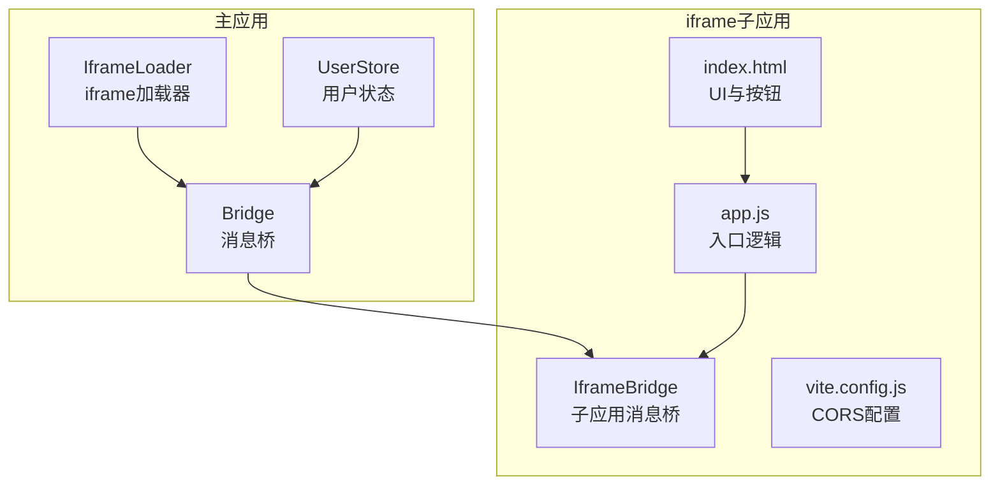
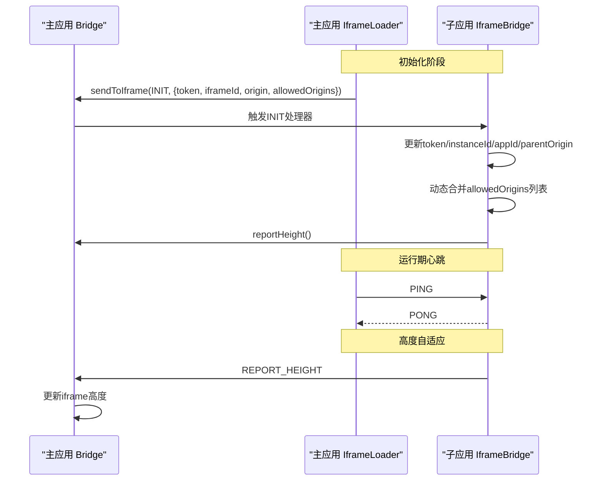
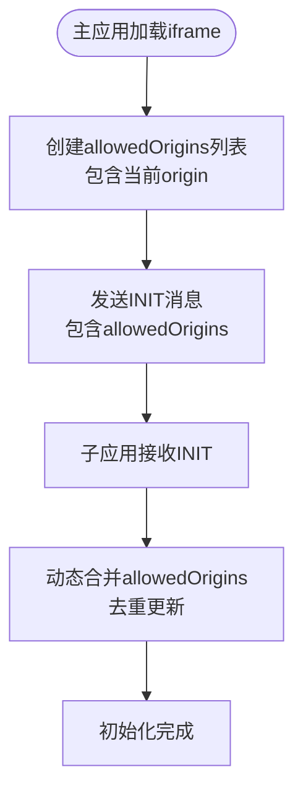
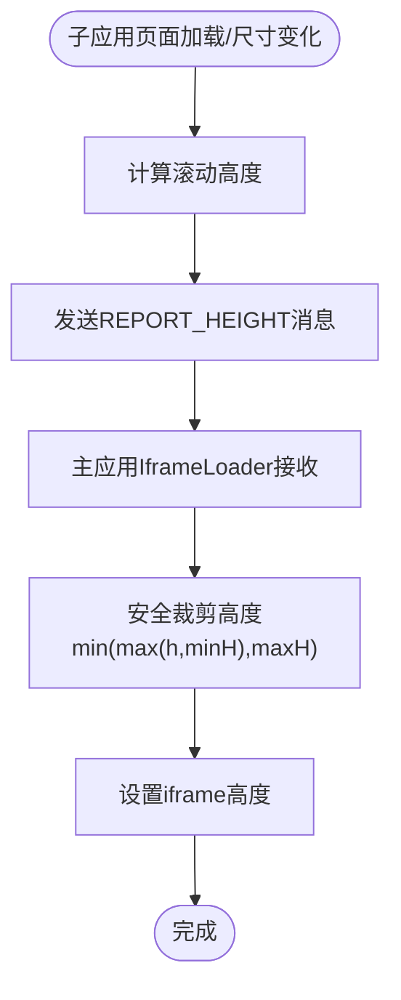
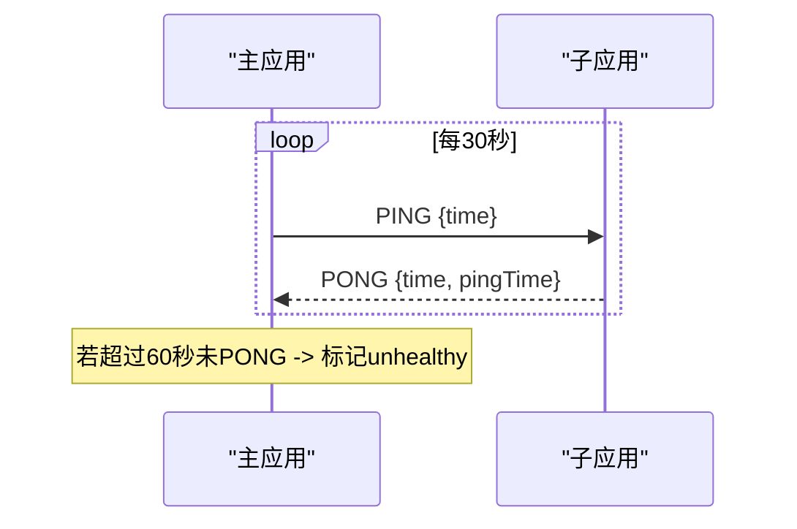
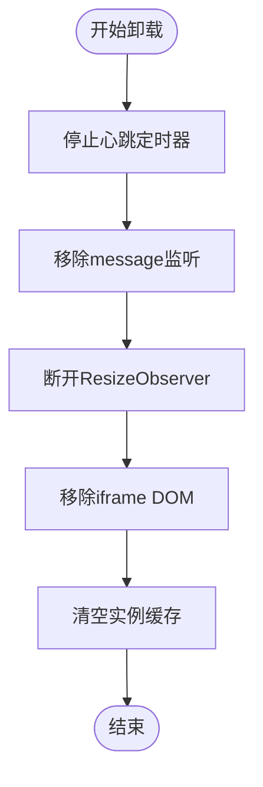
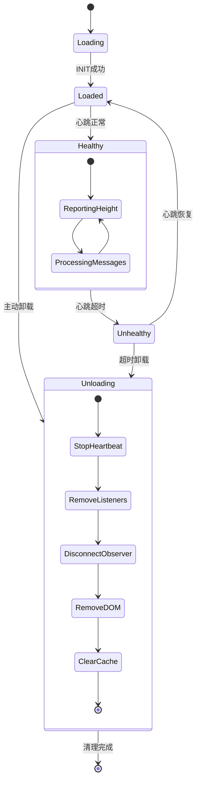
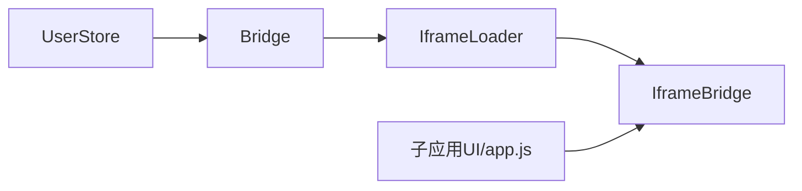

# iframe 跨域治理

<cite>
**本文引用的文件**
- [packages/iframe-sub-app/src/bridge.js](file://packages/iframe-sub-app/src/bridge.js)
- [packages/main-app/src/core/bridge.js](file://packages/main-app/src/core/bridge.js)
- [packages/main-app/src/core/iframeLoader.js](file://packages/main-app/src/core/iframeLoader.js)
- [packages/iframe-sub-app/index.html](file://packages/iframe-sub-app/index.html)
- [packages/iframe-sub-app/src/app.js](file://packages/iframe-sub-app/src/app.js)
- [packages/main-app/src/stores/user.js](file://packages/main-app/src/stores/user.js)
- [user-docs/guide/iframe-governance.md](file://user-docs/guide/iframe-governance.md)
- [packages/iframe-sub-app/vite.config.js](file://packages/iframe-sub-app/vite.config.js)
- [user-docs/guide/deployment.md](file://user-docs/guide/deployment.md)
- [package.json](file://package.json)
</cite>

## 更新摘要
**变更内容**
- 移除了静态 origin 管理逻辑，改为集中式动态 origin 处理
- 在 main-app 的 iframeLoader 中实现动态 origin 添加
- 改进跨应用通信的安全性
- 新增 LOGOUT 消息类型和令牌同步机制
- 更新相关示例和最佳实践
- 增强了动态原点管理功能，支持运行时动态添加允许的源

## 目录
1. [简介](#简介)
2. [项目结构](#项目结构)
3. [核心组件](#核心组件)
4. [架构总览](#架构总览)
5. [详细组件分析](#详细组件分析)
6. [依赖关系分析](#依赖关系分析)
7. [性能考量](#性能考量)
8. [故障排查指南](#故障排查指南)
9. [结论](#结论)
10. [附录](#附录)

## 简介
本技术文档围绕iframe跨域治理展开，系统性阐述以下主题：
- 安全策略：禁止直接访问DOM、postMessage通信机制、Origin校验与allowedOrigins配置
- 动态原点管理：运行时动态添加允许的源，增强系统的适应性和扩展性
- 集中式origin处理：移除静态origin配置，改为在主应用中集中管理
- 扩展CORS配置：支持更多HTTP方法和头部字段，提升跨域请求灵活性
- sandbox限制：可配置项及其安全效果
- 内置消息类型：INIT、TOKEN_SYNC、REPORT_HEIGHT、PING/PONG、LOGOUT等的使用场景与交互流程
- 高度自适应：子应用上报与主应用处理的完整流程
- 心跳检测：实现方式、超时判定与故障处理
- 卸载清理：事件监听器移除与内存泄漏防护
- 令牌同步：用户状态管理和安全令牌传递机制

## 项目结构
本仓库采用多包结构，核心与iframe子应用分别位于不同包中，便于主应用统一治理与子应用独立开发。

```mermaid
graph TB
subgraph "主应用"
MA_Bridge["Bridge<br/>消息桥"]
MA_IfLoader["IframeLoader<br/>iframe加载器"]
MA_UserStore["UserStore<br/>用户状态"]
end
subgraph "iframe子应用"
IA_Bridge["IframeBridge<br/>子应用消息桥"]
IA_App["app.js<br/>入口逻辑"]
IA_HTML["index.html<br/>UI与按钮"]
IA_Vite["vite.config.js<br/>CORS配置"]
end
MA_IfLoader --> MA_Bridge
MA_Bridge --> IA_Bridge
IA_App --> IA_Bridge
IA_HTML --> IA_App
MA_UserStore --> MA_Bridge
```

**图表来源**
- [packages/main-app/src/core/bridge.js](file://packages/main-app/src/core/bridge.js#L1-L246)
- [packages/main-app/src/core/iframeLoader.js](file://packages/main-app/src/core/iframeLoader.js#L1-L340)
- [packages/iframe-sub-app/src/bridge.js](file://packages/iframe-sub-app/src/bridge.js#L1-L224)
- [packages/iframe-sub-app/src/app.js](file://packages/iframe-sub-app/src/app.js#L1-L73)
- [packages/iframe-sub-app/index.html](file://packages/iframe-sub-app/index.html#L1-L68)
- [packages/iframe-sub-app/vite.config.js](file://packages/iframe-sub-app/vite.config.js#L1-L28)

**章节来源**
- [packages/main-app/src/core/bridge.js](file://packages/main-app/src/core/bridge.js#L1-L246)
- [packages/main-app/src/core/iframeLoader.js](file://packages/main-app/src/core/iframeLoader.js#L1-L340)
- [packages/iframe-sub-app/src/bridge.js](file://packages/iframe-sub-app/src/bridge.js#L1-L224)
- [packages/iframe-sub-app/src/app.js](file://packages/iframe-sub-app/src/app.js#L1-L73)
- [packages/iframe-sub-app/index.html](file://packages/iframe-sub-app/index.html#L1-L68)
- [packages/iframe-sub-app/vite.config.js](file://packages/iframe-sub-app/vite.config.js#L1-L28)

## 核心组件
- Bridge（主应用）：负责消息监听、Origin校验、消息分发、广播、导航、token同步、销毁等。
- IframeBridge（子应用）：负责消息监听、Origin校验、默认处理器注册、上报高度、请求/发送消息等。
- IframeLoader（主应用）：负责iframe创建/销毁、sandbox配置、消息监听、高度自适应、心跳检测、错误处理。
- UserStore（主应用）：维护token并在变更时触发广播或logout通知。

**章节来源**
- [packages/main-app/src/core/bridge.js](file://packages/main-app/src/core/bridge.js#L1-L246)
- [packages/iframe-sub-app/src/bridge.js](file://packages/iframe-sub-app/src/bridge.js#L1-L224)
- [packages/main-app/src/core/iframeLoader.js](file://packages/main-app/src/core/iframeLoader.js#L1-L340)
- [packages/main-app/src/stores/user.js](file://packages/main-app/src/stores/user.js#L1-L73)

## 架构总览
下图展示主应用与iframe子应用之间的消息流与职责边界。

```mermaid
sequenceDiagram
participant Main as "主应用 Bridge"
participant Loader as "主应用 IframeLoader"
participant Sub as "子应用 IframeBridge"
Note over Loader,Sub : 初始化阶段
Loader->>Main : sendToIframe(INIT, {token, iframeId, origin, allowedOrigins})
Main->>Sub : 触发INIT处理器
Sub->>Sub : 更新token/instanceId/appId/parentOrigin
Sub->>Sub : 动态合并allowedOrigins列表
Sub->>Main : reportHeight()
Note over Loader,Sub : 运行期心跳
Loader->>Sub : PING
Sub-->>Loader : PONG
Note over Loader,Sub : 高度自适应
Sub->>Main : REPORT_HEIGHT
Main->>Main : 更新iframe高度
```

**图表来源**
- [packages/main-app/src/core/bridge.js](file://packages/main-app/src/core/bridge.js#L101-L119)
- [packages/main-app/src/core/iframeLoader.js](file://packages/main-app/src/core/iframeLoader.js#L102-L124)
- [packages/iframe-sub-app/src/bridge.js](file://packages/iframe-sub-app/src/bridge.js#L39-L61)

## 详细组件分析

### 安全策略与动态原点管理

**更新** 移除了静态 origin 管理逻辑，改为集中式动态 origin 处理

- 禁止直接访问DOM：主应用与子应用之间仅通过postMessage通信，避免跨域DOM直接操作带来的安全风险。
- Origin校验：双方均维护allowedOrigins列表，在接收消息时校验event.origin，拒绝不在白名单中的来源。
  - 主应用：允许同源window.location.origin作为例外。
  - 子应用：严格限定parentOrigin白名单。
- **移除** 静态origin配置：iframe子应用不再维护固定的allowedOrigins数组，改为在INIT消息中接收主应用传入的动态列表。
- **新增** 集中式动态origin处理：
  - 主应用在iframe加载时动态添加当前origin到allowedOrigins列表
  - 通过INIT消息将完整的allowedOrigins传递给子应用
  - 子应用收到INIT后动态合并并去重更新allowedOrigins
  - 支持运行时动态添加新的允许源

```mermaid
flowchart TD
Start(["主应用加载iframe"]) --> CreateList["创建allowedOrigins列表<br/>包含当前origin"]
CreateList --> SendInit["发送INIT消息<br/>包含allowedOrigins"]
SendInit --> SubReceive["子应用接收INIT"]
SubReceive --> MergeList["动态合并allowedOrigins<br/>去重更新"]
MergeList --> Ready["初始化完成"]
```

**图表来源**
- [packages/main-app/src/core/iframeLoader.js](file://packages/main-app/src/core/iframeLoader.js#L104-L115)
- [packages/iframe-sub-app/src/bridge.js](file://packages/iframe-sub-app/src/bridge.js#L45-L48)

**章节来源**
- [packages/main-app/src/core/bridge.js](file://packages/main-app/src/core/bridge.js#L11-L32)
- [packages/main-app/src/core/iframeLoader.js](file://packages/main-app/src/core/iframeLoader.js#L104-L115)
- [packages/iframe-sub-app/src/bridge.js](file://packages/iframe-sub-app/src/bridge.js#L7-L24)
- [packages/iframe-sub-app/src/bridge.js](file://packages/iframe-sub-app/src/bridge.js#L45-L48)

### 云IDE环境支持与扩展CORS配置

**更新** 增强云IDE环境检测与CORS配置支持

- **新增** 云IDE环境检测：
  - 支持GitHub Codespaces新旧域名：app.github.dev、github.dev、githubpreview.dev、codespaces
  - 支持Gitpod：gitpod.io、gitpod.space
  - 支持VSCode Dev Containers：vscode
  - 支持隧道服务：ngrok、localtunnel
  - 支持托管平台：Render、Railway、Vercel、Cloudflare Pages、Firebase Hosting
- **新增** 扩展CORS配置：
  - 支持的HTTP方法：GET、POST、PUT、DELETE、PATCH、OPTIONS
  - 支持的头部字段：X-Requested-With、Content-Type、Authorization
  - 开发环境支持通配符"*"，生产环境建议指定具体源
- **新增** 动态云IDE原点管理：
  - 主应用在云IDE环境中自动添加可能的域名变体
  - 支持GitHub Codespaces的子域名变体检测
  - 支持Gitpod的端口域名变体检测

**章节来源**
- [packages/main-app/src/core/bridge.js](file://packages/main-app/src/core/bridge.js#L19-L22)
- [packages/iframe-sub-app/vite.config.js](file://packages/iframe-sub-app/vite.config.js#L12-L16)

### sandbox限制
- 默认sandbox配置包含allow-scripts、allow-same-origin、allow-forms、allow-popups，确保：
  - 子应用可在iframe中执行脚本
  - 与主应用同源策略一致
  - 表单提交与弹窗能力可用
- 可根据业务需求进一步收紧权限，例如移除allow-scripts或allow-popups以降低风险。

**章节来源**
- [packages/main-app/src/core/iframeLoader.js](file://packages/main-app/src/core/iframeLoader.js#L37-L52)

### 内置消息类型与协议
- 消息格式：包含type与payload字段。
- 内置类型与方向：
  - INIT：主→子，用于传递token、iframeId、origin等初始化信息，**新增** allowedOrigins参数
  - TOKEN_SYNC：主→子，同步token
  - TOKEN_RESPONSE：主→子，响应REQUEST_TOKEN
  - REQUEST_TOKEN：子→主，请求token
  - REPORT_HEIGHT：子→主，上报高度
  - NAVIGATE_TO：子→主，跨应用跳转
  - NAVIGATE_TO_MAIN：子→主，跳回主应用
  - PING/PONG：双向，心跳检测
  - **新增** LOGOUT：主→子，用户登出通知
- 子应用侧默认处理器：
  - INIT：保存token/instanceId/appId/parentOrigin，**更新** 合并allowedOrigins列表，触发上报高度
  - TOKEN_SYNC/TOKEN_RESPONSE：更新本地token
  - PING：返回PONG
  - RESIZE：日志记录
- 主应用侧默认处理器：
  - NAVIGATE_TO/NAVIGATE_TO_MAIN：路由跳转
  - REQUEST_TOKEN：返回TOKEN_RESPONSE
  - PONG：日志记录
  - REPORT_HEIGHT：设置iframe高度

**章节来源**
- [packages/iframe-sub-app/src/bridge.js](file://packages/iframe-sub-app/src/bridge.js#L39-L96)
- [packages/main-app/src/core/bridge.js](file://packages/main-app/src/core/bridge.js#L37-L83)
- [packages/main-app/src/core/iframeLoader.js](file://packages/main-app/src/core/iframeLoader.js#L156-L177)
- [packages/main-app/src/stores/user.js](file://packages/main-app/src/stores/user.js#L36-L45)

### 高度自适应实现
- 子应用上报：
  - 在load与resize时计算documentElement.scrollHeight或body.scrollHeight，并通过reportHeight发送REPORT_HEIGHT
  - 子应用页面实时显示当前高度
- 主应用处理：
  - IframeLoader监听REPORT_HEIGHT，按最小/最大阈值与窗口高度进行安全裁剪后设置iframe高度
  - 若autoHeight关闭，则不自动调整高度

```mermaid
flowchart TD
Start(["子应用页面加载/尺寸变化"]) --> Calc["计算滚动高度"]
Calc --> SendMsg["发送REPORT_HEIGHT消息"]
SendMsg --> MainRecv["主应用IframeLoader接收"]
MainRecv --> Clamp["安全裁剪高度<br/>min(max(h,minH),maxH)"]
Clamp --> Apply["设置iframe高度"]
Apply --> End(["完成"])
```

**图表来源**
- [packages/iframe-sub-app/src/bridge.js](file://packages/iframe-sub-app/src/bridge.js#L188-L206)
- [packages/main-app/src/core/iframeLoader.js](file://packages/main-app/src/core/iframeLoader.js#L188-L197)

**章节来源**
- [packages/iframe-sub-app/src/bridge.js](file://packages/iframe-sub-app/src/bridge.js#L188-L206)
- [packages/main-app/src/core/iframeLoader.js](file://packages/main-app/src/core/iframeLoader.js#L188-L197)
- [packages/iframe-sub-app/src/app.js](file://packages/iframe-sub-app/src/app.js#L52-L70)
- [packages/iframe-sub-app/index.html](file://packages/iframe-sub-app/index.html#L45-L49)

### 心跳检测与故障处理
- 主应用周期性发送PING，子应用收到后立即返回PING对应的PONG
- IframeLoader维护lastPong时间戳，若超过60秒未收到PONG，标记为不健康（unhealthy）
- 心跳周期：30秒；超时阈值：60秒

```mermaid
sequenceDiagram
participant Main as "主应用"
participant Sub as "子应用"
loop 每30秒
Main->>Sub : PING {time}
Sub-->>Main : PONG {time, pingTime}
end
Note over Main : 若超过60秒未PONG -> 标记unhealthy
```

**图表来源**
- [packages/main-app/src/core/bridge.js](file://packages/main-app/src/core/bridge.js#L161-L167)
- [packages/main-app/src/core/iframeLoader.js](file://packages/main-app/src/core/iframeLoader.js#L225-L237)

**章节来源**
- [packages/main-app/src/core/bridge.js](file://packages/main-app/src/core/bridge.js#L161-L167)
- [packages/main-app/src/core/iframeLoader.js](file://packages/main-app/src/core/iframeLoader.js#L225-L237)

### 卸载清理策略
- 停止心跳定时器
- 移除message监听器
- 断开ResizeObserver（如存在）
- 从DOM移除iframe
- 清空缓存实例

```mermaid
flowchart TD
UStart(["开始卸载"]) --> StopHB["停止心跳定时器"]
StopHB --> RemoveMsg["移除message监听"]
RemoveMsg --> DisconnectRO["断开ResizeObserver"]
DisconnectRO --> RemoveDOM["移除iframe DOM"]
RemoveDOM --> ClearCache["清空实例缓存"]
ClearCache --> UEnd(["结束"])
```

**图表来源**
- [packages/main-app/src/core/iframeLoader.js](file://packages/main-app/src/core/iframeLoader.js#L267-L295)

**章节来源**
- [packages/main-app/src/core/iframeLoader.js](file://packages/main-app/src/core/iframeLoader.js#L267-L295)

### 令牌同步与跨应用跳转
- 令牌同步：UserStore登录成功后调用bridge.syncToken广播TOKEN_SYNC；子应用收到后更新本地token
- 跨应用跳转：子应用发送NAVIGATE_TO/NAVIGATE_TO_MAIN，主应用通过路由跳转；同时支持子应用间通过全局事件桥接（参考文档）
- **新增** LOGOUT消息：用户登出时广播LOGOUT消息，子应用清除本地token

**章节来源**
- [packages/main-app/src/stores/user.js](file://packages/main-app/src/stores/user.js#L19-L23)
- [packages/main-app/src/core/bridge.js](file://packages/main-app/src/core/bridge.js#L182-L187)
- [packages/iframe-sub-app/src/bridge.js](file://packages/iframe-sub-app/src/bridge.js#L64-L73)
- [packages/main-app/src/stores/user.js](file://packages/main-app/src/stores/user.js#L36-L45)

### 完整的iframe生命周期管理

**新增** 详细的iframe生命周期管理指南

- **加载阶段**：
  - IframeLoader创建iframe元素，设置sandbox属性和默认样式
  - 发送INIT消息，包含token、iframeId、origin和allowedOrigins
  - 注册消息监听器和心跳检测
- **运行阶段**：
  - 子应用初始化完成后上报高度
  - 周期性心跳检测，保持连接活跃
  - 处理各种业务消息，如导航、令牌同步等
- **卸载阶段**：
  - 停止心跳定时器
  - 移除消息监听器
  - 断开ResizeObserver
  - 从DOM移除iframe
  - 清空缓存实例

```mermaid
stateDiagram-v2
[*] --> Loading
Loading --> Loaded : INIT成功
Loaded --> Healthy : 心跳正常
Healthy --> Unhealthy : 心跳超时
Unhealthy --> Loaded : 心跳恢复
Loaded --> Unloading : 主动卸载
Unhealthy --> Unloading : 超时卸载
Unloading --> [*] : 清理完成
state Healthy {
[*] --> ReportingHeight
ReportingHeight --> ProcessingMessages
ProcessingMessages --> ReportingHeight
}
state Unloading {
[*] --> StopHeartbeat
StopHeartbeat --> RemoveListeners
RemoveListeners --> DisconnectObserver
DisconnectObserver --> RemoveDOM
RemoveDOM --> ClearCache
ClearCache --> [*]
}
```

**图表来源**
- [packages/main-app/src/core/iframeLoader.js](file://packages/main-app/src/core/iframeLoader.js#L32-L88)
- [packages/main-app/src/core/iframeLoader.js](file://packages/main-app/src/core/iframeLoader.js#L95-L124)
- [packages/main-app/src/core/iframeLoader.js](file://packages/main-app/src/core/iframeLoader.js#L267-L295)

**章节来源**
- [packages/main-app/src/core/iframeLoader.js](file://packages/main-app/src/core/iframeLoader.js#L32-L88)
- [packages/main-app/src/core/iframeLoader.js](file://packages/main-app/src/core/iframeLoader.js#L95-L124)
- [packages/main-app/src/core/iframeLoader.js](file://packages/main-app/src/core/iframeLoader.js#L267-L295)

## 依赖关系分析
- IframeLoader依赖Bridge进行消息发送与广播，依赖UserStore获取token
- IframeBridge依赖主应用的allowedOrigins与Bridge的sendToIframe目标origin
- 子应用UI通过app.js触发上报与跳转动作，IframeBridge提供统一消息通道

```mermaid
graph LR
UserStore["UserStore"] --> Bridge["Bridge"]
Bridge --> IframeLoader["IframeLoader"]
IframeLoader --> IframeBridge["IframeBridge"]
IframeApp["子应用UI/app.js"] --> IframeBridge
```

**图表来源**
- [packages/main-app/src/core/bridge.js](file://packages/main-app/src/core/bridge.js#L1-L246)
- [packages/main-app/src/core/iframeLoader.js](file://packages/main-app/src/core/iframeLoader.js#L1-L340)
- [packages/iframe-sub-app/src/bridge.js](file://packages/iframe-sub-app/src/bridge.js#L1-L224)
- [packages/iframe-sub-app/src/app.js](file://packages/iframe-sub-app/src/app.js#L1-L73)

**章节来源**
- [packages/main-app/src/core/bridge.js](file://packages/main-app/src/core/bridge.js#L1-L246)
- [packages/main-app/src/core/iframeLoader.js](file://packages/main-app/src/core/iframeLoader.js#L1-L340)
- [packages/iframe-sub-app/src/bridge.js](file://packages/iframe-sub-app/src/bridge.js#L1-L224)
- [packages/iframe-sub-app/src/app.js](file://packages/iframe-sub-app/src/app.js#L1-L73)

## 性能考量
- 防抖与节流：主应用对容器尺寸变化进行防抖处理，减少RESIZE消息频率
- 心跳周期：30秒一次PING，60秒超时阈值平衡连通性检测与网络开销
- 高度裁剪：在最小/最大阈值范围内设置高度，避免极端值导致布局抖动
- 目标origin：sendToIframe使用具体origin，避免通配符带来的潜在安全与性能问题
- **新增** CORS预检缓存：合理配置Access-Control-Max-Age减少预检请求次数
- **新增** 动态原点缓存：主应用动态添加的origin会被缓存，避免重复计算
- **新增** 消息处理优化：使用Map数据结构存储消息处理器，提高查找效率
- **新增** 云IDE原点检测优化：通过环境检测减少不必要的origin验证

**章节来源**
- [packages/main-app/src/core/iframeLoader.js](file://packages/main-app/src/core/iframeLoader.js#L18-L18)
- [packages/main-app/src/core/bridge.js](file://packages/main-app/src/core/bridge.js#L161-L167)
- [packages/iframe-sub-app/vite.config.js](file://packages/iframe-sub-app/vite.config.js#L12-L16)

## 故障排查指南
- 无法接收消息
  - 检查allowedOrigins是否包含对方origin
  - 确认消息类型与payload结构正确
  - **新增** 检查CORS配置是否支持相应的HTTP方法和头部
  - **新增** 验证云IDE环境下是否正确检测到父窗口origin
- 心跳异常
  - 查看控制台是否有PING/PONG日志
  - 检查IframeLoader是否标记为unhealthy
- 高度不更新
  - 确认子应用是否在load/resize时调用reportHeight
  - 检查主应用是否开启autoHeight
- 卸载后内存泄漏
  - 确认是否调用了unload，移除了定时器与监听器
- **新增** CORS相关问题
  - 检查浏览器开发者工具Network标签页中的预检请求
  - 确认服务器响应头包含正确的Access-Control-Allow-*字段
  - 验证HTTP方法和自定义头部是否在允许列表中
- **新增** 动态原点问题
  - 检查子应用是否正确接收并合并allowedOrigins
  - 确认INIT消息中的allowedOrigins参数是否正确传递
  - **新增** 验证主应用是否正确动态添加当前origin
- **新增** 令牌同步问题
  - 检查UserStore的token变更是否触发广播
  - 确认子应用是否正确接收TOKEN_SYNC消息
  - **新增** 验证LOGOUT消息的正确传播

**章节来源**
- [packages/iframe-sub-app/src/bridge.js](file://packages/iframe-sub-app/src/bridge.js#L102-L107)
- [packages/main-app/src/core/iframeLoader.js](file://packages/main-app/src/core/iframeLoader.js#L231-L236)
- [packages/iframe-sub-app/src/bridge.js](file://packages/iframe-sub-app/src/bridge.js#L188-L206)
- [packages/main-app/src/core/iframeLoader.js](file://packages/main-app/src/core/iframeLoader.js#L267-L295)
- [packages/iframe-sub-app/vite.config.js](file://packages/iframe-sub-app/vite.config.js#L12-L16)

## 结论
该iframe跨域治理方案通过严格的Origin校验、明确的postMessage协议与sandbox限制，构建了安全可控的跨域通信框架。**移除静态origin管理逻辑，改为集中式动态origin处理**的改进使系统能够适应复杂的嵌套iframe场景，增强了系统的适应性和扩展性。**新增的动态原点管理功能**支持运行时动态添加允许的源，提高了系统的灵活性和安全性。**增强的云IDE环境支持**覆盖了GitHub Codespaces、Gitpod等多种开发环境，提升了跨平台兼容性。**扩展的CORS配置**支持更多HTTP方法和头部字段，提升了系统的灵活性和兼容性。结合心跳检测与高度自适应，实现了稳健的运行期治理能力；完善的卸载清理策略有效避免资源泄漏。**新增的完整生命周期管理**为iframe的创建、运行和销毁提供了标准化流程。**增强的令牌同步机制**确保了用户状态的一致性和安全性。建议在生产环境进一步细化allowedOrigins与sandbox权限，合理配置CORS参数，持续监控心跳与高度上报指标，确保跨域子应用的稳定性与安全性。

## 附录
- 示例与文档参考：iframe跨域治理指南文档提供了消息格式、内置类型与最佳实践说明。
- **新增** 部署指南：包含详细的CORS配置示例和最佳实践建议。
- **新增** 开发环境配置：支持多包并行开发，包含主应用、Vue3子应用、Vue2子应用和iframe子应用的独立开发脚本。

**章节来源**
- [user-docs/guide/iframe-governance.md](file://user-docs/guide/iframe-governance.md#L1-L148)
- [user-docs/guide/deployment.md](file://user-docs/guide/deployment.md#L67-L86)
- [package.json](file://package.json#L10-L26)