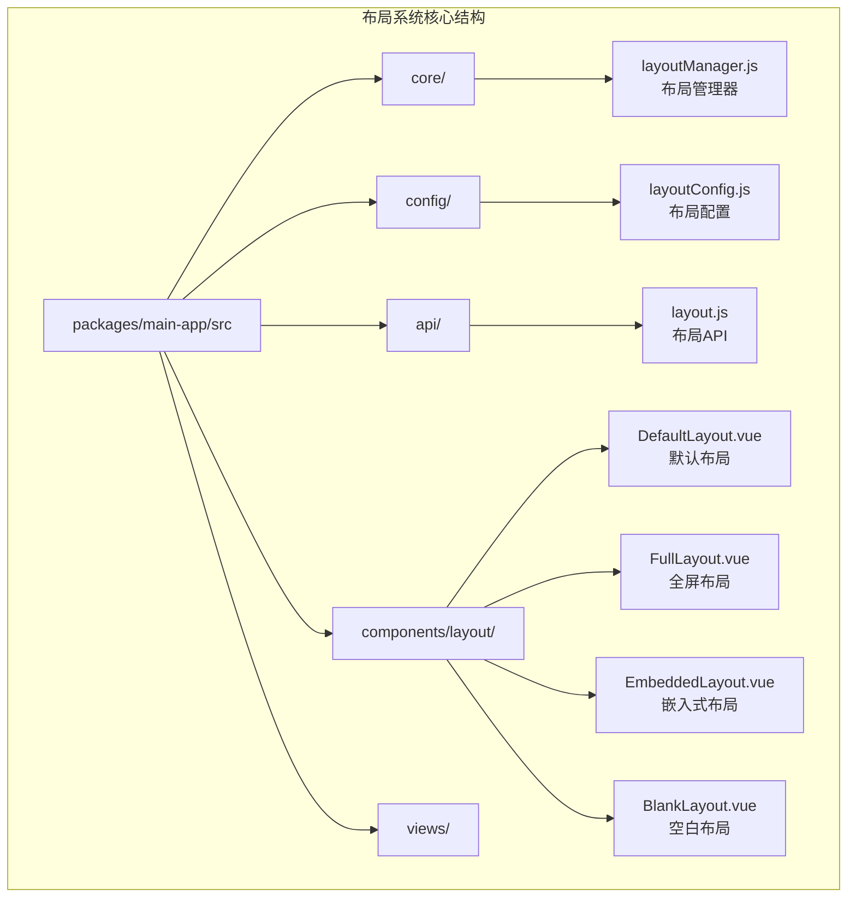
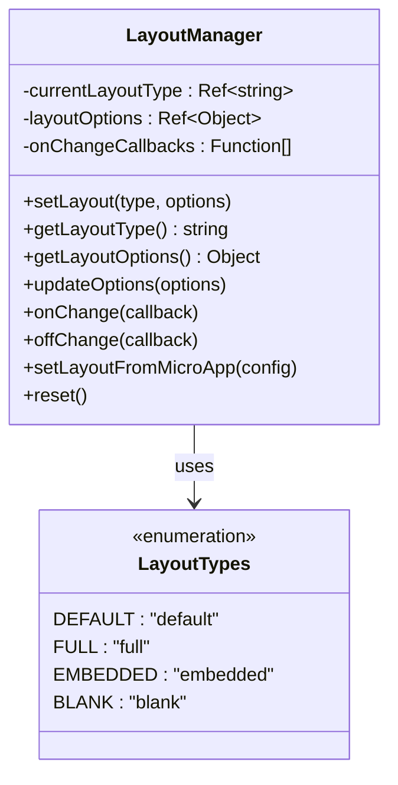
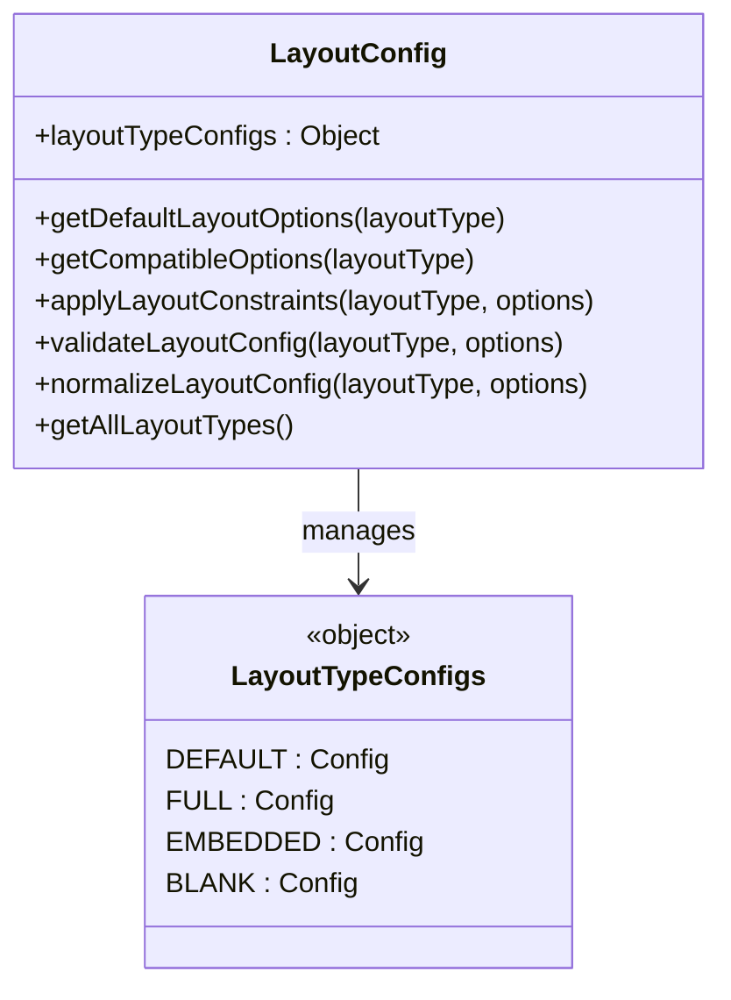
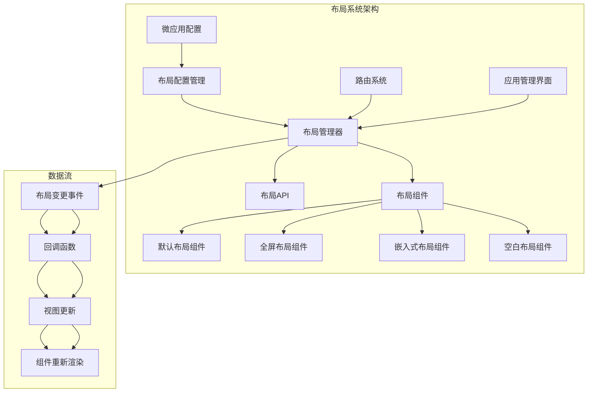
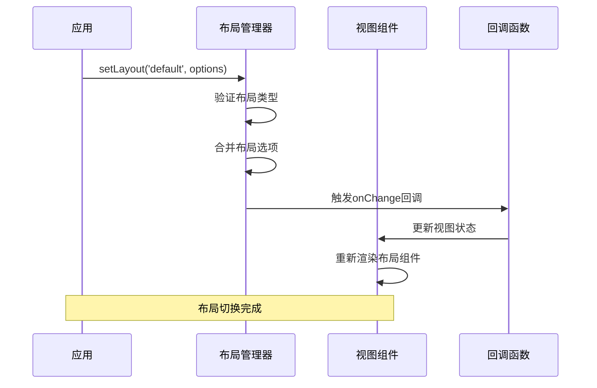
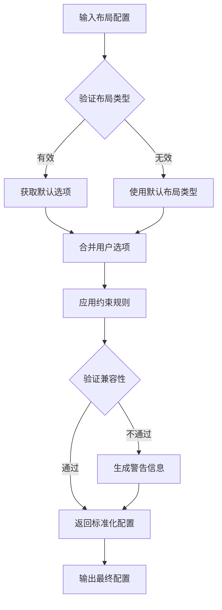
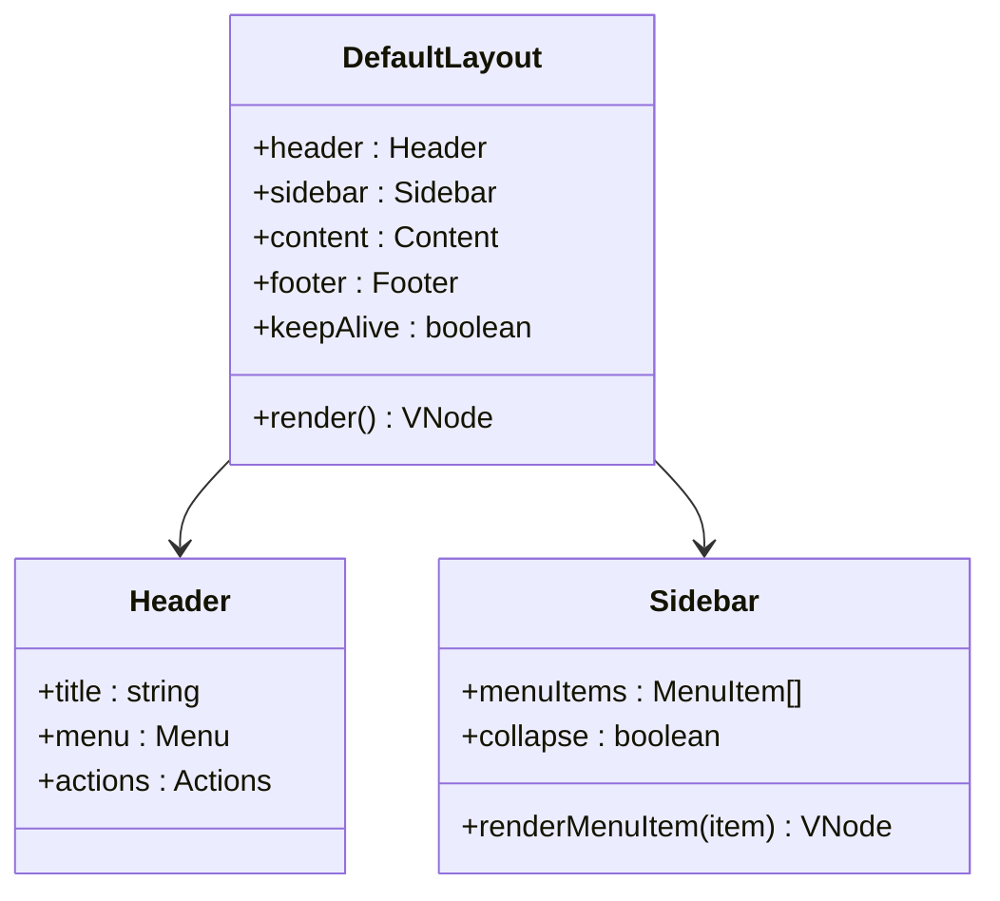
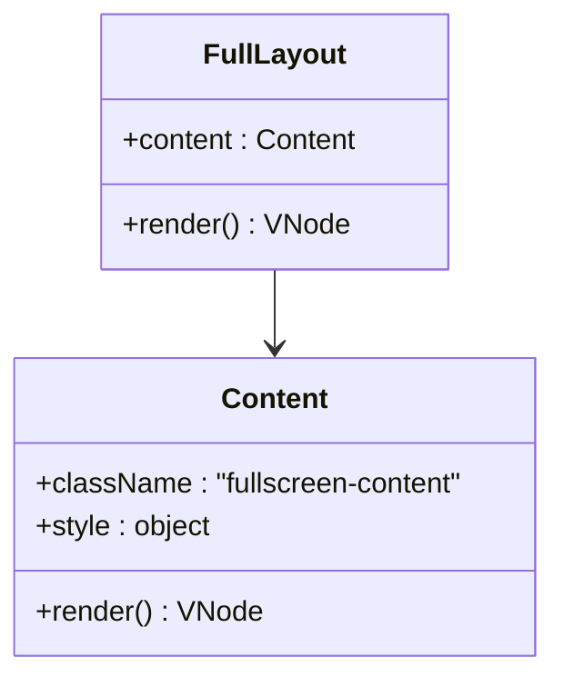
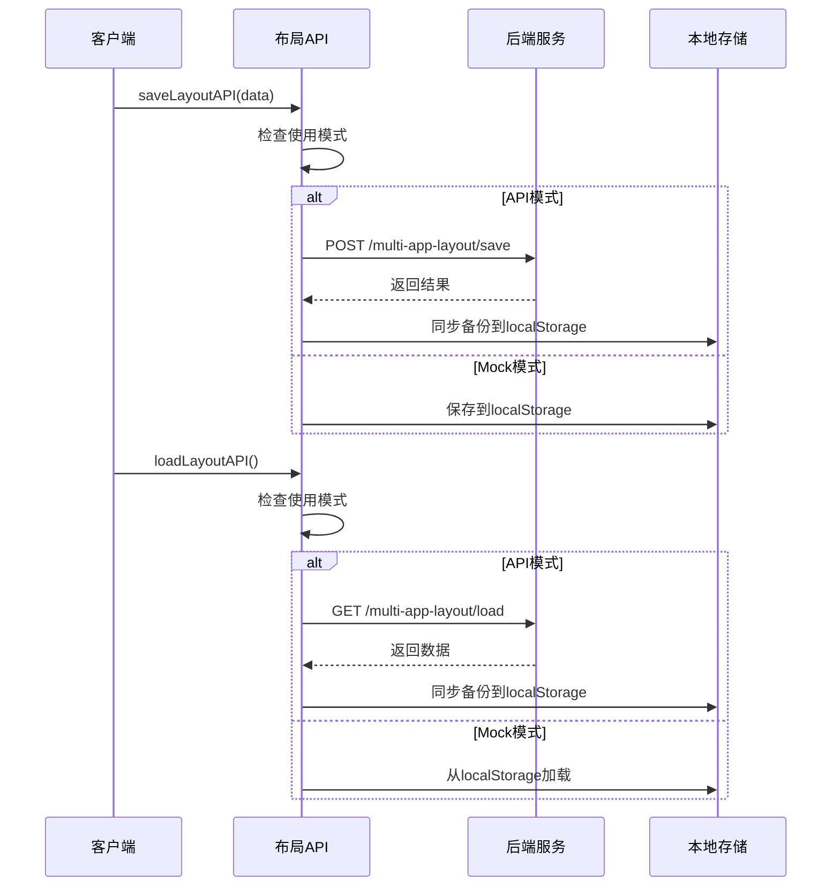
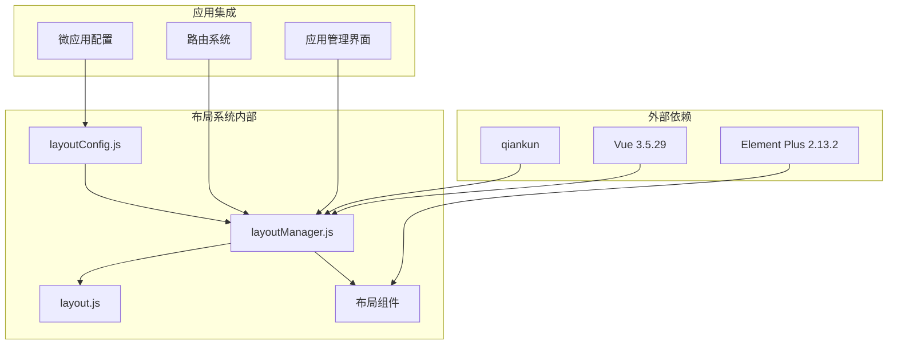

# 布局系统完整指南

<cite>
**本文档引用的文件**
- [README.md](file://README.md)
- [layout-system-complete-guide.md](file://user-docs/guide/layout-system-complete-guide.md)
- [layout-system.md](file://user-docs/guide/layout-system.md)
- [QUICK_START.md](file://QUICK_START.md)
- [layoutManager.js](file://packages/main-app/src/core/layoutManager.js)
- [layoutConfig.js](file://packages/main-app/src/config/layoutConfig.js)
- [layout.js](file://packages/main-app/src/api/layout.js)
- [DefaultLayout.vue](file://packages/main-app/src/components/layout/DefaultLayout.vue)
- [FullLayout.vue](file://packages/main-app/src/components/layout/FullLayout.vue)
- [EmbeddedLayout.vue](file://packages/main-app/src/components/layout/EmbeddedLayout.vue)
- [BlankLayout.vue](file://packages/main-app/src/components/layout/BlankLayout.vue)
</cite>

## 目录
1. [简介](#简介)
2. [项目结构](#项目结构)
3. [核心组件](#核心组件)
4. [架构概览](#架构概览)
5. [详细组件分析](#详细组件分析)
6. [依赖关系分析](#依赖关系分析)
7. [性能考虑](#性能考虑)
8. [故障排除指南](#故障排除指南)
9. [结论](#结论)
10. [附录](#附录)

## 简介

Artisan Base Frontend 提供了一套完整的布局编排系统，支持四种不同的布局类型，可以满足各种业务场景的需求。该系统采用现代化的微前端架构，基于 qiankun 框架实现主应用对多类型子应用的统一加载与管理。

### 核心特性

- **四种布局类型**：default（默认）、full（全屏）、embedded（嵌入式）、blank（空白）
- **标准化配置**：layoutType + layoutOptions 配置模式
- **动态切换**：运行时根据应用需求自动切换布局
- **智能约束**：布局选项的约束与建议机制
- **多应用实例**：支持 Grid/Split 布局，同时加载多个不同子应用

## 项目结构

布局系统位于主应用的 `packages/main-app/src` 目录下，主要包含以下核心文件：



**图表来源**
- [layoutManager.js:1-142](file://packages/main-app/src/core/layoutManager.js#L1-L142)
- [layoutConfig.js:1-205](file://packages/main-app/src/config/layoutConfig.js#L1-L205)
- [layout.js:1-156](file://packages/main-app/src/api/layout.js#L1-L156)

**章节来源**
- [README.md:159-181](file://README.md#L159-L181)
- [QUICK_START.md:54-78](file://QUICK_START.md#L54-L78)

## 核心组件

### 布局管理器（LayoutManager）

布局管理器是布局系统的核心控制器，负责管理当前布局类型和布局选项，提供动态切换和监听机制。



**图表来源**
- [layoutManager.js:17-139](file://packages/main-app/src/core/layoutManager.js#L17-L139)

### 布局配置管理

布局配置管理模块定义了不同布局类型对应的默认选项和约束规则，提供配置的标准化、验证和建议功能。



**图表来源**
- [layoutConfig.js:26-205](file://packages/main-app/src/config/layoutConfig.js#L26-L205)

**章节来源**
- [layoutManager.js:1-142](file://packages/main-app/src/core/layoutManager.js#L1-L142)
- [layoutConfig.js:1-205](file://packages/main-app/src/config/layoutConfig.js#L1-L205)

## 架构概览

布局系统采用分层架构设计，从底层的配置管理到上层的视图渲染形成完整的布局解决方案：



**图表来源**
- [layoutManager.js:39-66](file://packages/main-app/src/core/layoutManager.js#L39-L66)
- [layoutConfig.js:184-193](file://packages/main-app/src/config/layoutConfig.js#L184-L193)

### 布局类型详解

系统支持四种不同的布局类型，每种类型都有其特定的使用场景和约束规则：

| 布局类型 | 特点 | 默认选项 | 使用场景 |
|---------|------|----------|----------|
| **default** | 包含完整的头部导航栏和侧边栏 | showHeader: true, showSidebar: true, keepAlive: false | 后台管理系统、企业应用 |
| **full** | 无头部和侧边栏，最大化内容展示 | showHeader: false, showSidebar: false, keepAlive: false | 数据大屏、全屏展示、沉浸式体验 |
| **embedded** | 轻量级布局，至少显示头部或侧边栏之一 | showHeader: true, showSidebar: false, keepAlive: false | 嵌入第三方应用、轻量化展示 |
| **blank** | 最简化布局，无任何导航装饰 | showHeader: false, showSidebar: false, keepAlive: false | 登录页、欢迎页、极简页面 |

**章节来源**
- [layout-system-complete-guide.md:7-100](file://user-docs/guide/layout-system-complete-guide.md#L7-L100)
- [layout-system.md:9-15](file://user-docs/guide/layout-system.md#L9-L15)

## 详细组件分析

### 布局管理器实现

布局管理器采用单例模式设计，提供完整的布局管理功能：



**图表来源**
- [layoutManager.js:39-66](file://packages/main-app/src/core/layoutManager.js#L39-L66)

#### 核心功能分析

1. **布局类型验证**：确保传入的布局类型在支持范围内
2. **选项合并**：将传入的选项与现有选项合并
3. **回调通知**：通知所有监听者布局变更
4. **状态管理**：使用 Vue 响应式系统管理布局状态

**章节来源**
- [layoutManager.js:34-135](file://packages/main-app/src/core/layoutManager.js#L34-L135)

### 布局配置约束机制

布局配置管理器实现了智能的约束机制，确保布局配置的合理性和一致性：



**图表来源**
- [layoutConfig.js:184-193](file://packages/main-app/src/config/layoutConfig.js#L184-L193)

#### 约束规则详解

不同布局类型具有不同的约束规则：

| 布局类型 | 约束规则 | 影响范围 |
|---------|----------|----------|
| **default** | 无强制约束 | 所有选项均可自由配置 |
| **full** | 强制隐藏 header、sidebar | 仅 keepAlive 可用 |
| **embedded** | 强制隐藏 sidebar | 仅 keepAlive 可用 |
| **blank** | 强制隐藏 header、sidebar | 无兼容选项 |

**章节来源**
- [layoutConfig.js:26-87](file://packages/main-app/src/config/layoutConfig.js#L26-L87)
- [layout-system-complete-guide.md:215-227](file://user-docs/guide/layout-system-complete-guide.md#L215-L227)

### 布局组件实现

系统提供了四种布局组件，每种组件都针对特定的使用场景进行了优化：

#### 默认布局组件

默认布局组件是最复杂的布局类型，包含完整的头部导航和侧边栏：



**图表来源**
- [DefaultLayout.vue](file://packages/main-app/src/components/layout/DefaultLayout.vue)

#### 全屏布局组件

全屏布局组件提供沉浸式的用户体验，最大化内容展示区域：



**图表来源**
- [FullLayout.vue](file://packages/main-app/src/components/layout/FullLayout.vue)

**章节来源**
- [DefaultLayout.vue](file://packages/main-app/src/components/layout/DefaultLayout.vue)
- [FullLayout.vue](file://packages/main-app/src/components/layout/FullLayout.vue)
- [EmbeddedLayout.vue](file://packages/main-app/src/components/layout/EmbeddedLayout.vue)
- [BlankLayout.vue](file://packages/main-app/src/components/layout/BlankLayout.vue)

### 布局API管理

布局API提供了多应用布局数据的持久化管理功能：



**图表来源**
- [layout.js:26-144](file://packages/main-app/src/api/layout.js#L26-L144)

#### API模式与Mock模式

布局API支持两种运行模式，确保在不同环境下都能正常工作：

| 模式 | 配置项 | 数据存储 | 适用场景 |
|------|--------|----------|----------|
| **API模式** | VITE_USE_LAYOUT_API=true | 后端API + localStorage | 生产环境 |
| **Mock模式** | VITE_USE_LAYOUT_API=false | localStorage | 开发/演示环境 |

**章节来源**
- [layout.js:1-156](file://packages/main-app/src/api/layout.js#L1-L156)

## 依赖关系分析

布局系统各组件之间的依赖关系形成了清晰的层次结构：



**图表来源**
- [layoutManager.js:1-142](file://packages/main-app/src/core/layoutManager.js#L1-L142)
- [layoutConfig.js:1-205](file://packages/main-app/src/config/layoutConfig.js#L1-L205)
- [layout.js:1-156](file://packages/main-app/src/api/layout.js#L1-L156)

### 组件耦合度分析

布局系统的组件设计遵循了低耦合、高内聚的原则：

- **布局管理器**：独立的业务逻辑层，不依赖具体视图实现
- **布局配置**：纯配置管理，无副作用
- **布局组件**：专注于视图渲染，依赖布局管理器的状态
- **布局API**：独立的数据持久化层

**章节来源**
- [layoutManager.js:1-142](file://packages/main-app/src/core/layoutManager.js#L1-L142)
- [layoutConfig.js:1-205](file://packages/main-app/src/config/layoutConfig.js#L1-L205)

## 性能考虑

### 布局切换性能优化

布局系统在设计时充分考虑了性能优化：

1. **响应式状态管理**：使用 Vue 3 的响应式系统，只更新受影响的组件
2. **组件缓存**：支持 keepAlive 选项，在合适的情况下缓存组件状态
3. **按需加载**：布局组件按需渲染，减少初始加载时间
4. **事件驱动**：通过回调机制通知布局变更，避免轮询

### 内存管理

布局系统采用了有效的内存管理策略：

- **回调清理**：提供 offChange 方法清理不再使用的回调函数
- **状态重置**：reset 方法提供完整的状态重置功能
- **组件卸载**：布局组件支持正常的 Vue 组件生命周期

## 故障排除指南

### 常见问题及解决方案

#### 问题1：布局切换后没有生效

**可能原因**：
- 微应用配置中的 `layoutType` 值不在支持的4种类型中
- `layoutOptions` 配置被约束自动覆盖

**解决方案**：
```javascript
import { getMicroApp } from '@/config/microApps'
import { layoutManager } from '@/core/layoutManager'

// 检查微应用配置
const appConfig = getMicroApp(appId)
console.log('Layout config:', appConfig.layoutType, appConfig.layoutOptions)

// 手动设置布局
layoutManager.setLayout(appConfig.layoutType, appConfig.layoutOptions)
```

**章节来源**
- [layout-system-complete-guide.md:283-303](file://user-docs/guide/layout-system-complete-guide.md#L283-L303)

#### 问题2：Embedded布局的showSidebar无法设为true

**原因**：`config/layoutConfig.js`中embedded布局的约束固定`showSidebar: false`

**解决方案**：如需侧边栏，请改用`default`布局类型。

#### 问题3：keepAlive不生效

**可能原因**：
- 布局类型不兼容keepAlive（full和blank的`compatibleOptions`不含keepAlive）
- 组件没有设置`name`选项

**解决方案**：
```javascript
// keepAlive仅在default和embedded布局中兼容
layoutOptions: {
  keepAlive: true
}

// 组件中必须设置name
export default {
  name: 'MyComponent'
}
```

**章节来源**
- [layout-system-complete-guide.md:304-327](file://user-docs/guide/layout-system-complete-guide.md#L304-L327)

### 调试技巧

1. **启用控制台日志**：布局管理器会在布局变更时输出详细日志
2. **使用Vue DevTools**：检查布局状态的响应式更新
3. **验证配置**：使用`validateLayoutConfig`函数验证布局配置的有效性
4. **检查约束**：使用`normalizeLayoutConfig`查看配置的标准化结果

## 结论

Artisan Base Frontend的布局系统是一个设计精良、功能完整的解决方案。它通过以下特点实现了优秀的用户体验：

1. **灵活性**：支持四种不同的布局类型，满足各种业务场景需求
2. **智能化**：内置约束机制，确保布局配置的合理性和一致性
3. **可扩展性**：模块化设计，易于扩展新的布局类型
4. **易用性**：提供简单直观的API和丰富的配置选项
5. **可靠性**：完善的错误处理和降级机制

该布局系统为微前端应用提供了强大的页面布局能力，是构建复杂企业级应用的理想选择。

## 附录

### 最佳实践建议

#### ✅ 推荐做法

1. **根据场景选择合适的布局类型**
   - 后台管理 → default
   - 数据大屏 → full
   - 嵌入应用 → embedded
   - 登录注册 → blank

2. **合理使用KeepAlive**
   - 需要频繁切换的应用启用keepAlive
   - 全屏展示类应用不启用keepAlive

3. **保持布局一致性**
   - 同一应用内尽量使用相同的布局类型
   - 避免频繁切换布局类型造成用户体验割裂

#### ❌ 避免做法

1. **不要为embedded布局设置showSidebar为true**
2. **不要在full/blank布局中启用KeepAlive**
3. **避免在不需要的情况下使用复杂的布局配置**

### 相关文档

- [布局系统完整指南](./user-docs/guide/layout-system-complete-guide.md)
- [布局系统快速参考](./user-docs/guide/layout-system.md)
- [快速开始指南](./QUICK_START.md)
- [主应用开发指南](./user-docs/guide/main-app.md)