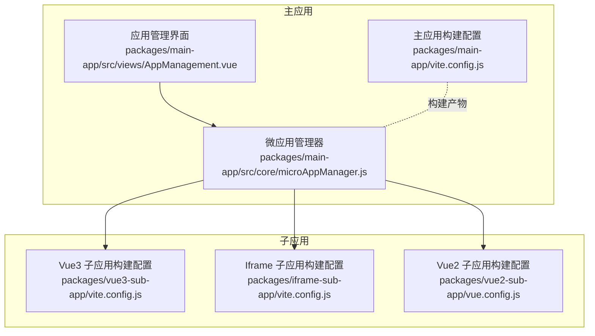
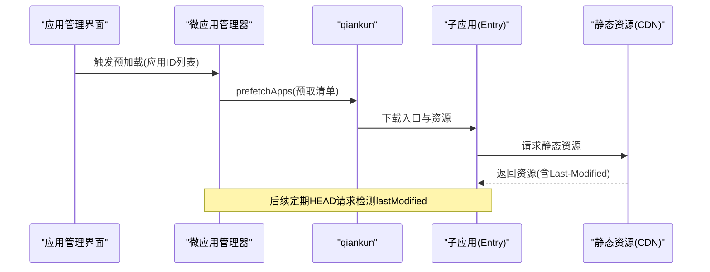
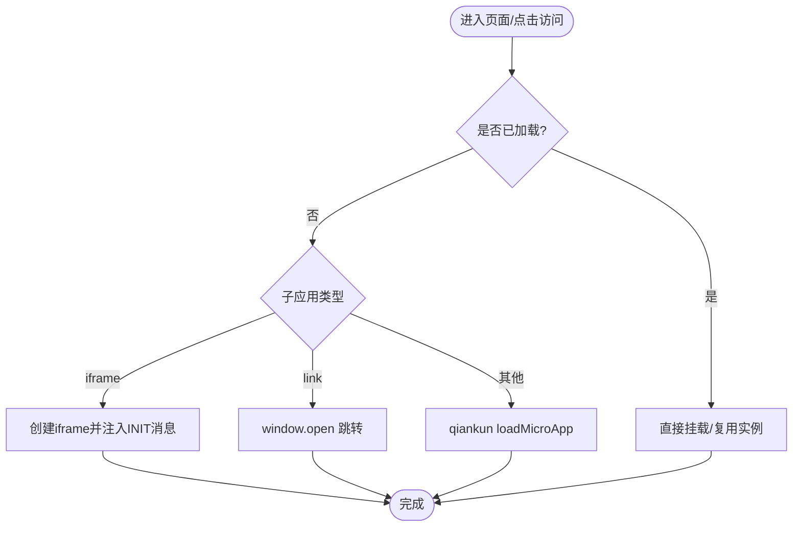
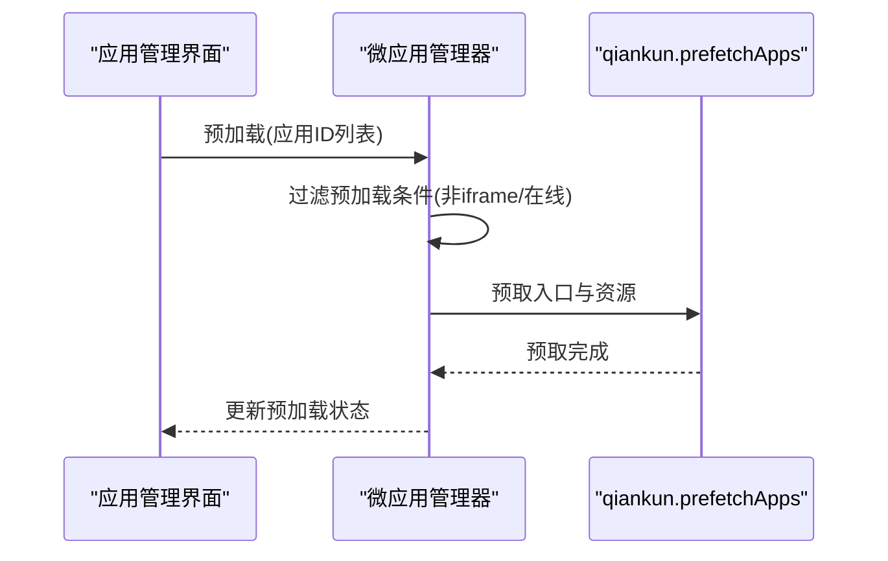
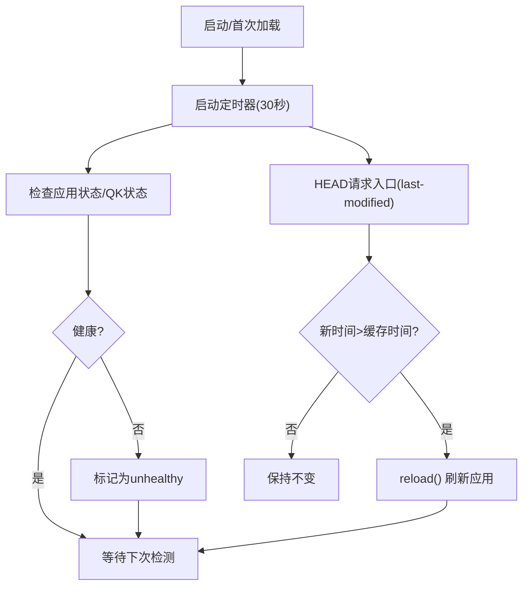
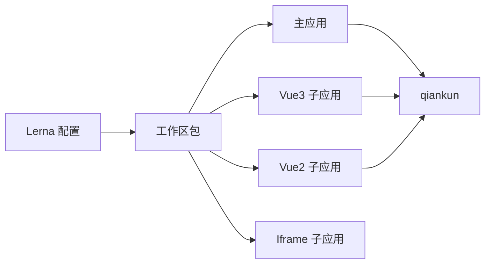

# 性能优化

<cite>
**本文引用的文件**
- [README.md](file://README.md)
- [package.json](file://package.json)
- [lerna.json](file://lerna.json)
- [packages/main-app/vite.config.js](file://packages/main-app/vite.config.js)
- [packages/vue3-sub-app/vite.config.js](file://packages/vue3-sub-app/vite.config.js)
- [packages/iframe-sub-app/vite.config.js](file://packages/iframe-sub-app/vite.config.js)
- [packages/vue2-sub-app/vue.config.js](file://packages/vue2-sub-app/vue.config.js)
- [packages/main-app/src/core/microAppManager.js](file://packages/main-app/src/core/microAppManager.js)
- [packages/main-app/src/views/AppManagement.vue](file://packages/main-app/src/views/AppManagement.vue)
</cite>

## 目录
1. [引言](#引言)
2. [项目结构](#项目结构)
3. [核心组件](#核心组件)
4. [架构总览](#架构总览)
5. [详细组件分析](#详细组件分析)
6. [依赖关系分析](#依赖关系分析)
7. [性能考量](#性能考量)
8. [故障排查指南](#故障排查指南)
9. [结论](#结论)
10. [附录](#附录)

## 引言
本指南围绕微前端平台的性能优化展开，结合仓库中现有实现，系统讲解懒加载策略（按需加载、路由级延迟加载、资源预取）、预加载机制（Last-Modified 热更新检测与心跳检测）、缓存策略（浏览器/CDN/应用内缓存）、资源压缩与打包优化（Tree Shaking、代码分割、Bundle 分析），并提供监控与性能测量方法及生产环境调优建议。内容严格基于仓库源码与配置文件，确保可落地与可验证。

## 项目结构
本项目采用 Monorepo 架构，通过 Lerna 管理工作区，主应用与多类子应用分别位于独立包中，便于独立开发、构建与部署。主应用负责微应用编排与管理，子应用通过 qiankun 实现沙箱隔离与动态加载。

图表来源
- [packages/main-app/vite.config.js](file://packages/main-app/vite.config.js#L1-L40)
- [packages/main-app/src/core/microAppManager.js](file://packages/main-app/src/core/microAppManager.js#L1-L515)
- [packages/main-app/src/views/AppManagement.vue](file://packages/main-app/src/views/AppManagement.vue#L35-L73)
- [packages/vue3-sub-app/vite.config.js](file://packages/vue3-sub-app/vite.config.js#L1-L41)
- [packages/iframe-sub-app/vite.config.js](file://packages/iframe-sub-app/vite.config.js#L1-L23)
- [packages/vue2-sub-app/vue.config.js](file://packages/vue2-sub-app/vue.config.js#L1-L21)

章节来源
- [README.md](file://README.md#L62-L76)
- [package.json](file://package.json#L1-L50)
- [lerna.json](file://lerna.json#L1-L25)

## 核心组件
- 微应用管理器：负责应用加载/卸载、预加载、心跳检测、热更新检测（Last-Modified）、错误日志与状态管理。
- 主应用构建配置：定义别名、CSS 预处理器、开发服务器、构建输出目录与 Rollup 手动分包策略。
- 子应用构建配置：Vue3 子应用启用 qiankun 插件；Vue2 子应用配置 UMD 输出；Iframe 子应用多入口构建。
- 应用管理界面：展示应用状态、lastModified 时间、预加载开关与按钮，支持手动触发预加载。

章节来源
- [packages/main-app/src/core/microAppManager.js](file://packages/main-app/src/core/microAppManager.js#L1-L515)
- [packages/main-app/src/views/AppManagement.vue](file://packages/main-app/src/views/AppManagement.vue#L35-L73)
- [packages/main-app/vite.config.js](file://packages/main-app/vite.config.js#L1-L40)
- [packages/vue3-sub-app/vite.config.js](file://packages/vue3-sub-app/vite.config.js#L1-L41)
- [packages/iframe-sub-app/vite.config.js](file://packages/iframe-sub-app/vite.config.js#L1-L23)
- [packages/vue2-sub-app/vue.config.js](file://packages/vue2-sub-app/vue.config.js#L1-L21)

## 架构总览
微前端平台通过主应用统一调度，子应用按需加载或预加载。主应用对子应用进行心跳健康监测与热更新检测，保障运行稳定性与最新资源可用性。

图表来源
- [packages/main-app/src/core/microAppManager.js](file://packages/main-app/src/core/microAppManager.js#L417-L440)
- [packages/main-app/src/views/AppManagement.vue](file://packages/main-app/src/views/AppManagement.vue#L64-L73)

## 详细组件分析

### 懒加载与按需加载
- 按需加载：主应用在路由切换或用户点击时，调用管理器加载目标子应用，避免一次性加载全部子应用。
- 路由级延迟加载：通过路由守卫或异步组件方式，在进入页面时才动态引入子应用加载逻辑，减少首屏负担。
- 子应用类型差异：iframe 类型走独立加载流程；link 类型直接外部跳转；其他类型通过 qiankun 动态加载。

图表来源
- [packages/main-app/src/core/microAppManager.js](file://packages/main-app/src/core/microAppManager.js#L49-L232)

章节来源
- [packages/main-app/src/core/microAppManager.js](file://packages/main-app/src/core/microAppManager.js#L49-L232)

### 资源预取与预加载
- 预加载接口：管理器提供预加载方法，筛选标记为预加载且在线的非 iframe 应用，调用 qiankun 的预取能力。
- 预加载状态反馈：界面根据管理器的预加载状态进行展示，支持手动触发。
- 生产建议：将高频访问的应用加入预加载清单；对 iframe 子应用不适用预加载（管理器已过滤）。

图表来源
- [packages/main-app/src/core/microAppManager.js](file://packages/main-app/src/core/microAppManager.js#L417-L440)
- [packages/main-app/src/views/AppManagement.vue](file://packages/main-app/src/views/AppManagement.vue#L49-L73)

章节来源
- [packages/main-app/src/core/microAppManager.js](file://packages/main-app/src/core/microAppManager.js#L417-L440)
- [packages/main-app/src/views/AppManagement.vue](file://packages/main-app/src/views/AppManagement.vue#L49-L73)

### 预加载机制：Last-Modified 热更新检测与心跳检测
- Last-Modified 热更新检测：管理器定期对子应用入口发起 HEAD 请求，读取响应头的 last-modified，与缓存时间比较，若新值更大则触发刷新。
- 心跳检测：对非 iframe 应用，通过 qiankun 提供的状态轮询；对 iframe 应用，通过桥接向子应用发送 PING 消息，维持健康状态感知。
- 心跳周期：30 秒检测一次，及时发现异常状态并标记为不健康。

图表来源
- [packages/main-app/src/core/microAppManager.js](file://packages/main-app/src/core/microAppManager.js#L336-L415)

章节来源
- [packages/main-app/src/core/microAppManager.js](file://packages/main-app/src/core/microAppManager.js#L336-L415)

### 缓存策略设计
- 浏览器缓存：通过构建配置关闭 Source Map，减少体积；子应用入口返回的静态资源由 CDN 控制缓存策略（Last-Modified 由服务端设置）。
- CDN 缓存：子应用入口与静态资源由 CDN 提供，配合 ETag/Last-Modified 实现缓存命中与失效控制。
- 应用内缓存：管理器维护 lastModifiedCache，避免重复解析与网络请求；同时记录错误日志与预加载状态，辅助运维与诊断。

章节来源
- [packages/main-app/vite.config.js](file://packages/main-app/vite.config.js#L29-L38)
- [packages/main-app/src/core/microAppManager.js](file://packages/main-app/src/core/microAppManager.js#L19-L26)
- [packages/main-app/src/core/microAppManager.js](file://packages/main-app/src/core/microAppManager.js#L392-L415)

### 资源压缩与打包优化
- 代码分割：主应用构建配置中通过 Rollup 的 manualChunks 将 element-plus 与 vue-vendor 等第三方库拆分为独立块，提升缓存命中率。
- Tree Shaking：Vite 默认开启按 ESModule 分析的 Tree Shaking，结合按需引入可进一步减小体积。
- Bundle 分析：建议在 CI 中集成打包分析工具，识别大体积依赖与重复模块，持续优化 vendor 拆分策略。

章节来源
- [packages/main-app/vite.config.js](file://packages/main-app/vite.config.js#L30-L38)

### 监控与性能测量
- 加载时间统计：管理器记录应用加载起始时间，结合挂载完成事件可计算加载耗时。
- 内存使用监控：建议在子应用生命周期中上报内存指标（如 PerformanceObserver/Global Metrics），主应用集中采集。
- 用户体验指标：关注 FCP/LCP/CLS 等 Web Vitals 指标，结合业务关键路径埋点评估。

章节来源
- [packages/main-app/src/core/microAppManager.js](file://packages/main-app/src/core/microAppManager.js#L123-L133)

## 依赖关系分析
- 主应用依赖 qiankun 进行微应用加载与预取；子应用通过 qiankun 插件注册自身生命周期。
- 构建工具链：主应用使用 Vite；Vue2 子应用使用 Vue CLI；Iframe 子应用多入口构建。
- Monorepo 管理：Lerna 统一发布与版本管理，npm scripts 并行启动各应用。

图表来源
- [lerna.json](file://lerna.json#L1-L25)
- [package.json](file://package.json#L1-L50)

章节来源
- [lerna.json](file://lerna.json#L1-L25)
- [package.json](file://package.json#L1-L50)

## 性能考量
- 懒加载与预加载平衡：仅对高频应用启用预加载，避免带宽浪费；对低频应用采用按需加载。
- 资源缓存与失效：合理设置 CDN 缓存策略与入口资源的 Last-Modified，结合管理器的热更新检测，确保用户始终获得最新资源。
- 代码分割与 Tree Shaking：持续优化 vendor 拆分，减少重复依赖；按需引入组件与工具函数，降低首屏体积。
- 心跳与健康监控：30 秒心跳周期可及时发现异常，建议结合告警策略与自动重试机制。
- 构建优化：关闭不必要的 Source Map；在 CI 中进行 Bundle 分析与体积趋势监控。

## 故障排查指南
- 应用无法加载：检查容器是否存在、应用状态是否为 online、是否已重复加载。
- 预加载无效：确认应用类型非 iframe、状态为 online、入口地址可达。
- 热更新未生效：检查子应用入口是否正确返回 last-modified 头，管理器是否成功解析并缓存。
- 心跳异常：非 iframe 应用可通过 qiankun 状态判断；iframe 应用需确保桥接消息通道正常。

章节来源
- [packages/main-app/src/core/microAppManager.js](file://packages/main-app/src/core/microAppManager.js#L38-L80)
- [packages/main-app/src/core/microAppManager.js](file://packages/main-app/src/core/microAppManager.js#L417-L440)
- [packages/main-app/src/core/microAppManager.js](file://packages/main-app/src/core/microAppManager.js#L336-L386)

## 结论
本指南基于仓库现有实现，总结了微前端平台在懒加载、预加载、热更新检测、心跳监控、缓存与打包优化等方面的实践路径。建议在生产环境中结合业务场景，制定差异化策略，并通过持续的监控与分析迭代优化性能表现。

## 附录
- 开发与构建命令：主应用、Vue3/Vue2/Iframe 子应用分别提供独立启动与构建脚本，支持并行启动与一键构建。
- CLI 使用：通过 artisan CLI 快速创建主应用与各类子应用模板。

章节来源
- [README.md](file://README.md#L26-L96)
- [package.json](file://package.json#L10-L26)