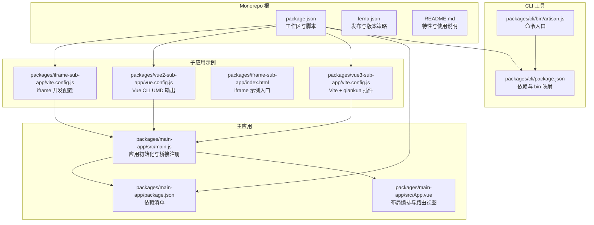
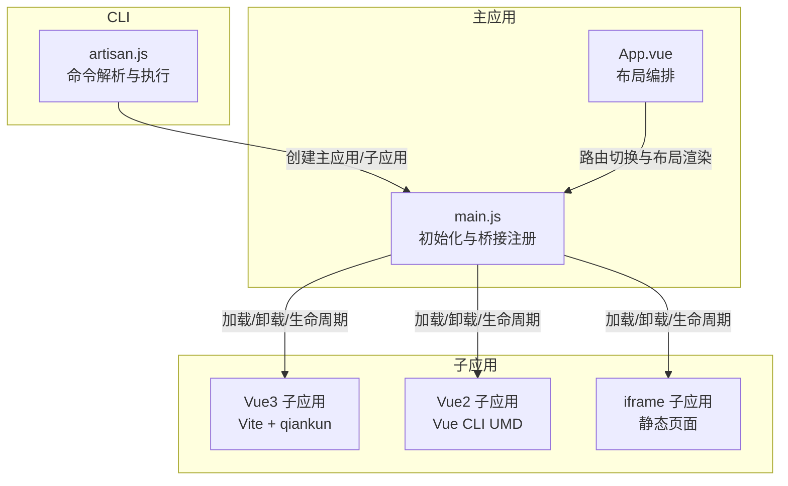
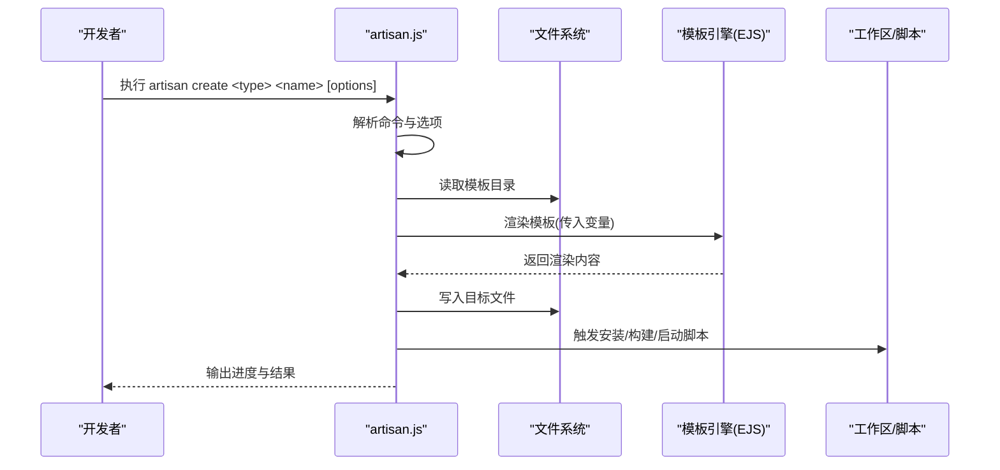
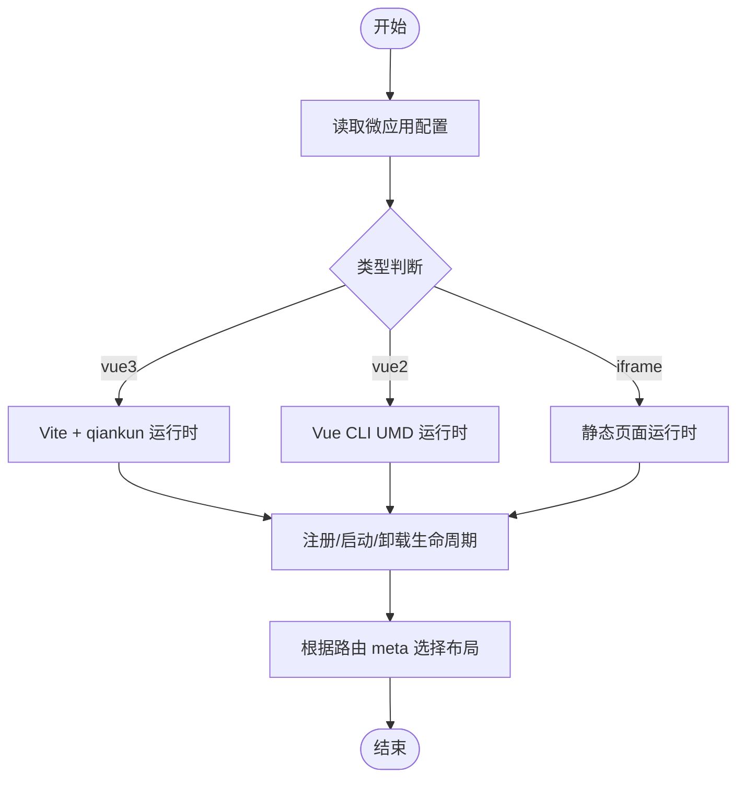
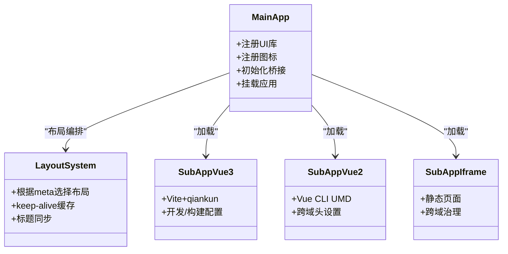
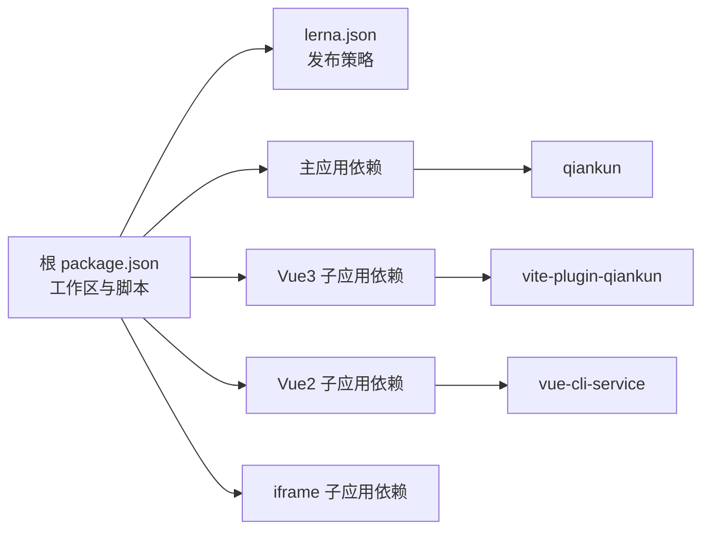

# 扩展开发

<cite>
**本文引用的文件**
- [README.md](file://README.md)
- [package.json](file://package.json)
- [lerna.json](file://lerna.json)
- [packages/cli/bin/artisan.js](file://packages/cli/bin/artisan.js)
- [packages/cli/package.json](file://packages/cli/package.json)
- [packages/main-app/src/main.js](file://packages/main-app/src/main.js)
- [packages/main-app/src/App.vue](file://packages/main-app/src/App.vue)
- [packages/vue3-sub-app/vite.config.js](file://packages/vue3-sub-app/vite.config.js)
- [packages/vue2-sub-app/vue.config.js](file://packages/vue2-sub-app/vue.config.js)
- [packages/iframe-sub-app/index.html](file://packages/iframe-sub-app/index.html)
- [packages/iframe-sub-app/vite.config.js](file://packages/iframe-sub-app/vite.config.js)
- [packages/main-app/package.json](file://packages/main-app/package.json)
</cite>

## 目录
1. [简介](#简介)
2. [项目结构](#项目结构)
3. [核心组件](#核心组件)
4. [架构总览](#架构总览)
5. [详细组件分析](#详细组件分析)
6. [依赖分析](#依赖分析)
7. [性能考虑](#性能考虑)
8. [故障排查指南](#故障排查指南)
9. [结论](#结论)
10. [附录](#附录)

## 简介
本指南面向需要在微前端平台上进行扩展开发的工程师，围绕以下主题展开：插件/扩展机制与开发模式、自定义微应用类型的开发方法（接口规范、生命周期与配置）、自定义组件的注册与样式隔离、第三方集成最佳实践（外部库接入、API 封装与兼容性）、CLI 工具扩展（命令扩展、模板定制与自动化流程）、扩展测试与质量保障策略，以及完整开发示例与调试技巧。

## 项目结构
该仓库采用 Monorepo 架构，使用 Lerna 管理工作区，核心包包括：
- 主应用：packages/main-app（Vue3 + 路由 + Pinia + qiankun 集成）
- 子应用示例：packages/vue3-sub-app、packages/vue2-sub-app、packages/iframe-sub-app
- CLI 工具：packages/cli（脚手架命令行工具）

图表来源
- [package.json](file://package.json#L1-L50)
- [lerna.json](file://lerna.json#L1-L25)
- [packages/cli/bin/artisan.js](file://packages/cli/bin/artisan.js#L1-L53)
- [packages/cli/package.json](file://packages/cli/package.json#L1-L32)
- [packages/main-app/src/main.js](file://packages/main-app/src/main.js#L1-L40)
- [packages/main-app/src/App.vue](file://packages/main-app/src/App.vue#L1-L70)
- [packages/vue3-sub-app/vite.config.js](file://packages/vue3-sub-app/vite.config.js#L1-L41)
- [packages/vue2-sub-app/vue.config.js](file://packages/vue2-sub-app/vue.config.js#L1-L21)
- [packages/iframe-sub-app/index.html](file://packages/iframe-sub-app/index.html#L1-L20)
- [packages/iframe-sub-app/vite.config.js](file://packages/iframe-sub-app/vite.config.js#L1-L41)

章节来源
- [README.md](file://README.md#L62-L76)
- [package.json](file://package.json#L6-L26)
- [lerna.json](file://lerna.json#L1-L25)

## 核心组件
- 主应用初始化与桥接注册：在应用入口完成 UI 框架、状态管理、路由挂载，并注册跨应用通信桥接；同时暴露微应用管理器便于调试。
- 布局编排系统：通过路由 meta 动态选择布局组件，支持默认、全屏、多标签页、嵌入式与空白布局。
- 子应用运行时：Vue3 子应用使用 Vite + vite-plugin-qiankun；Vue2 子应用使用 Vue CLI 并输出 UMD；iframe 子应用以静态页面形式接入。
- CLI 脚手架：提供创建主应用与子应用的命令，支持模板列表与参数化生成。

章节来源
- [packages/main-app/src/main.js](file://packages/main-app/src/main.js#L1-L40)
- [packages/main-app/src/App.vue](file://packages/main-app/src/App.vue#L1-L70)
- [packages/vue3-sub-app/vite.config.js](file://packages/vue3-sub-app/vite.config.js#L1-L41)
- [packages/vue2-sub-app/vue.config.js](file://packages/vue2-sub-app/vue.config.js#L1-L21)
- [packages/iframe-sub-app/index.html](file://packages/iframe-sub-app/index.html#L1-L20)
- [packages/cli/bin/artisan.js](file://packages/cli/bin/artisan.js#L1-L53)

## 架构总览
下图展示了主应用与多类型子应用的交互关系，以及 CLI 的创建流程。

图表来源
- [packages/main-app/src/main.js](file://packages/main-app/src/main.js#L1-L40)
- [packages/main-app/src/App.vue](file://packages/main-app/src/App.vue#L1-L70)
- [packages/vue3-sub-app/vite.config.js](file://packages/vue3-sub-app/vite.config.js#L1-L41)
- [packages/vue2-sub-app/vue.config.js](file://packages/vue2-sub-app/vue.config.js#L1-L21)
- [packages/iframe-sub-app/index.html](file://packages/iframe-sub-app/index.html#L1-L20)
- [packages/cli/bin/artisan.js](file://packages/cli/bin/artisan.js#L1-L53)

## 详细组件分析

### CLI 工具扩展开发指南
- 命令扩展点
  - 新增命令：在命令解析处添加新的 command，并绑定 action 回调。
  - 参数与选项：通过 option 定义参数，结合 inquirer 实现交互式问答。
  - 错误处理：统一捕获异常并输出带颜色的日志，便于用户定位问题。
- 模板定制
  - 使用 EJS 渲染模板文件，通过 fs-extra 写入目标路径。
  - 可扩展模板变量与目录结构，满足不同微应用类型需求。
- 自动化流程
  - 结合脚本钩子与工作区管理，实现创建后的依赖安装与端口配置。
- 调试技巧
  - 使用全局变量或日志级别区分调试信息。
  - 对模板渲染结果进行预览与校验，避免生成错误文件。

图表来源
- [packages/cli/bin/artisan.js](file://packages/cli/bin/artisan.js#L1-L53)
- [packages/cli/package.json](file://packages/cli/package.json#L1-L32)

章节来源
- [packages/cli/bin/artisan.js](file://packages/cli/bin/artisan.js#L9-L38)
- [packages/cli/package.json](file://packages/cli/package.json#L12-L18)

### 自定义微应用类型的开发方法
- 接口规范
  - 微应用配置对象包含唯一标识、名称、入口地址、激活规则、容器选择器、状态、版本、预加载、类型、布局类型与布局选项等字段。
  - 不同类型子应用的运行时差异体现在打包方式与加载策略上。
- 生命周期管理
  - 主应用通过微应用管理器负责子应用的注册、启动、卸载与更新。
  - 子应用在开发与生产环境下的生命周期钩子由 qiankun 注入，确保资源正确注入与释放。
- 配置选项
  - 布局类型支持 default/full/tabs/embedded/blank。
  - 布局选项可控制头部、侧边栏、缓存与多标签页行为。
- 开发模式要点
  - Vue3 子应用使用 Vite + vite-plugin-qiankun，支持开发期热更新与生产期构建。
  - Vue2 子应用使用 Vue CLI 并输出 UMD，适配传统工程。
  - iframe 子应用以静态页面接入，适合非框架类或第三方页面。

图表来源
- [README.md](file://README.md#L98-L120)
- [packages/main-app/src/App.vue](file://packages/main-app/src/App.vue#L30-L44)
- [packages/vue3-sub-app/vite.config.js](file://packages/vue3-sub-app/vite.config.js#L10-L24)
- [packages/vue2-sub-app/vue.config.js](file://packages/vue2-sub-app/vue.config.js#L13-L19)
- [packages/iframe-sub-app/index.html](file://packages/iframe-sub-app/index.html#L1-L20)

章节来源
- [README.md](file://README.md#L98-L120)
- [packages/main-app/src/App.vue](file://packages/main-app/src/App.vue#L30-L44)
- [packages/vue3-sub-app/vite.config.js](file://packages/vue3-sub-app/vite.config.js#L6-L24)
- [packages/vue2-sub-app/vue.config.js](file://packages/vue2-sub-app/vue.config.js#L4-L20)
- [packages/iframe-sub-app/index.html](file://packages/iframe-sub-app/index.html#L1-L20)

### 自定义组件的开发流程
- 组件注册
  - 在主应用中集中注册 UI 组件库与图标，确保全局可用。
  - 子应用按需引入或共享组件，避免重复打包。
- 依赖管理
  - 通过工作区管理公共依赖，减少重复安装与版本冲突。
  - 对第三方库进行白名单与版本锁定，保证一致性。
- 样式隔离
  - 使用作用域样式或 CSS Modules 避免样式污染。
  - 在 iframe 场景下天然隔离，注意跨域限制与安全策略。
- 布局编排
  - 通过路由 meta 选择布局组件，结合 keep-alive 控制缓存。
  - 多标签页场景下维护缓存视图集合，提升切换性能。

图表来源
- [packages/main-app/src/main.js](file://packages/main-app/src/main.js#L15-L34)
- [packages/main-app/src/App.vue](file://packages/main-app/src/App.vue#L13-L54)
- [packages/vue3-sub-app/vite.config.js](file://packages/vue3-sub-app/vite.config.js#L9-L39)
- [packages/vue2-sub-app/vue.config.js](file://packages/vue2-sub-app/vue.config.js#L7-L12)
- [packages/iframe-sub-app/vite.config.js](file://packages/iframe-sub-app/vite.config.js#L25-L32)

章节来源
- [packages/main-app/src/main.js](file://packages/main-app/src/main.js#L1-L40)
- [packages/main-app/src/App.vue](file://packages/main-app/src/App.vue#L1-L70)
- [packages/vue3-sub-app/vite.config.js](file://packages/vue3-sub-app/vite.config.js#L1-L41)
- [packages/vue2-sub-app/vue.config.js](file://packages/vue2-sub-app/vue.config.js#L1-L21)
- [packages/iframe-sub-app/vite.config.js](file://packages/iframe-sub-app/vite.config.js#L1-L41)

### 第三方集成最佳实践
- 外部库接入
  - 在主应用集中引入通用库，子应用按需使用，避免重复打包。
  - 对于需要全局样式的库，确保在主应用中统一引入。
- API 封装
  - 将第三方 API 封装为业务层服务，提供统一的错误处理与重试逻辑。
  - 在微应用间共享 API 服务时，通过桥接或共享模块实现。
- 兼容性处理
  - 对不同版本的浏览器与框架进行兼容性测试。
  - 在 iframe 场景下注意跨域限制与安全策略，确保通信与资源加载正常。

章节来源
- [packages/main-app/package.json](file://packages/main-app/package.json#L12-L22)
- [packages/main-app/src/main.js](file://packages/main-app/src/main.js#L1-L40)

### 测试策略与质量保证
- 单元测试
  - 为 CLI 命令与模板渲染逻辑编写单元测试，覆盖参数解析与文件生成。
- 集成测试
  - 在本地启动多应用进行集成验证，检查路由切换、布局渲染与跨应用通信。
- 端到端测试
  - 使用自动化工具模拟真实用户操作，验证从创建到运行的完整流程。
- 质量门禁
  - 在 CI 中执行 lint、测试与构建，确保变更符合规范。

章节来源
- [packages/cli/package.json](file://packages/cli/package.json#L9-L10)
- [package.json](file://package.json#L23-L26)

## 依赖分析
- 工作区与脚本
  - 根 package.json 定义了工作区与并行开发/构建脚本，便于统一管理各包。
  - Lerna 配置定义了发布策略与忽略变更规则，保证版本与发布质量。
- 主应用依赖
  - 包含 Vue3、路由、状态管理、UI 组件库、qiankun、HTTP 客户端与工具库。
- 子应用依赖
  - Vue3 子应用依赖 Vite 与 qiankun 插件；Vue2 子应用依赖 Vue CLI；iframe 子应用依赖静态页面与开发服务器配置。

图表来源
- [package.json](file://package.json#L6-L26)
- [lerna.json](file://lerna.json#L1-L25)
- [packages/main-app/package.json](file://packages/main-app/package.json#L12-L22)
- [packages/vue3-sub-app/vite.config.js](file://packages/vue3-sub-app/vite.config.js#L3-L3)
- [packages/vue2-sub-app/vue.config.js](file://packages/vue2-sub-app/vue.config.js#L1-L1)

章节来源
- [package.json](file://package.json#L6-L26)
- [lerna.json](file://lerna.json#L1-L25)
- [packages/main-app/package.json](file://packages/main-app/package.json#L12-L22)

## 性能考虑
- 资源加载优化
  - 启用预加载与按需加载，减少首屏时间。
  - 对第三方库进行分包与缓存，降低重复下载。
- 运行时性能
  - 合理使用 keep-alive 缓存，避免过度缓存导致内存压力。
  - 在多标签页场景下动态维护缓存集合，平衡性能与内存。
- 构建优化
  - 使用 Rollup 输出与库模式，减少体积与冗余代码。
  - 在开发环境下启用热更新，在生产环境下进行压缩与拆分。

章节来源
- [packages/main-app/src/App.vue](file://packages/main-app/src/App.vue#L5-L7)
- [packages/vue3-sub-app/vite.config.js](file://packages/vue3-sub-app/vite.config.js#L33-L39)
- [packages/vue2-sub-app/vue.config.js](file://packages/vue2-sub-app/vue.config.js#L13-L19)

## 故障排查指南
- CLI 创建失败
  - 检查命令类型是否受支持，确认模板渲染与文件写入流程。
  - 查看错误日志并定位具体异常，必要时开启详细日志。
- 子应用无法加载
  - 核对入口地址、激活规则与容器选择器，确保与主应用配置一致。
  - 检查开发服务器端口与跨域头设置，避免资源加载失败。
- 布局不生效
  - 确认路由 meta 中的布局类型与布局组件映射表一致。
  - 检查 keep-alive 的缓存集合与路由变化监听逻辑。
- 调试技巧
  - 在主应用入口暴露微应用管理器，便于在浏览器控制台查看与调试。
  - 使用浏览器网络面板检查资源加载与跨域响应头。

章节来源
- [packages/cli/bin/artisan.js](file://packages/cli/bin/artisan.js#L24-L37)
- [packages/main-app/src/main.js](file://packages/main-app/src/main.js#L36-L37)
- [packages/main-app/src/App.vue](file://packages/main-app/src/App.vue#L38-L54)
- [packages/vue3-sub-app/vite.config.js](file://packages/vue3-sub-app/vite.config.js#L25-L32)
- [packages/vue2-sub-app/vue.config.js](file://packages/vue2-sub-app/vue.config.js#L7-L12)

## 结论
本指南从架构与实现层面梳理了微前端平台的扩展开发路径，涵盖 CLI 扩展、自定义微应用类型、组件开发与样式隔离、第三方集成与兼容性处理、测试与质量保障，以及调试技巧。建议在实际扩展中遵循统一的配置规范、依赖管理策略与测试流程，确保扩展的稳定性与可维护性。

## 附录
- 快速开始与端口配置
  - 主应用与各子应用的默认端口与启动脚本见根 README 与根 package.json。
- CLI 使用示例
  - 全局安装后，使用 artisan create 命令创建主应用与子应用，支持模板列表与参数化生成。

章节来源
- [README.md](file://README.md#L17-L54)
- [package.json](file://package.json#L10-L26)
- [packages/cli/bin/artisan.js](file://packages/cli/bin/artisan.js#L78-L96)