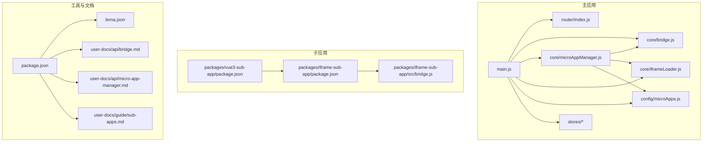
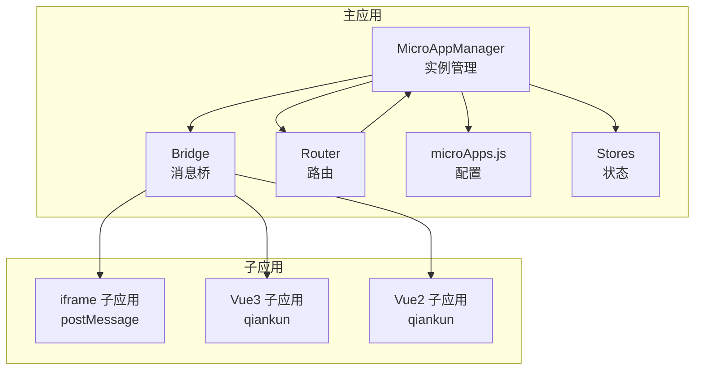
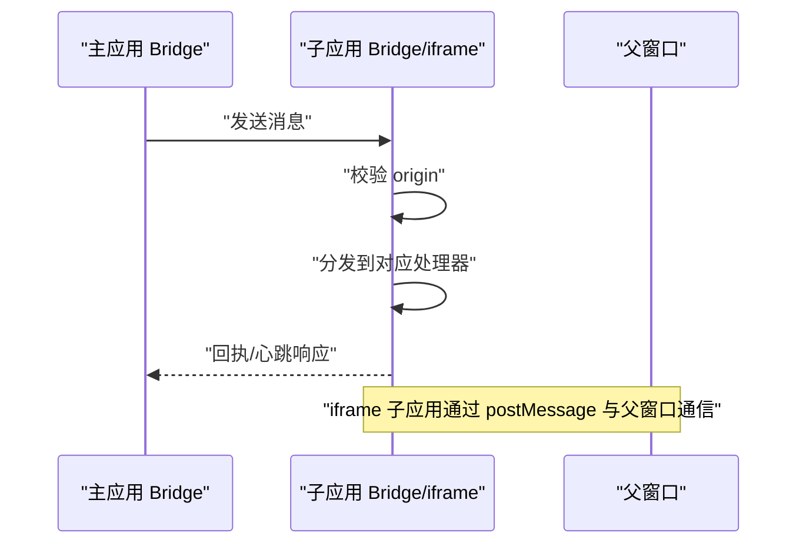
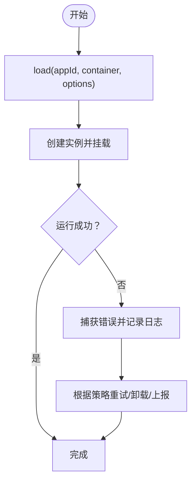
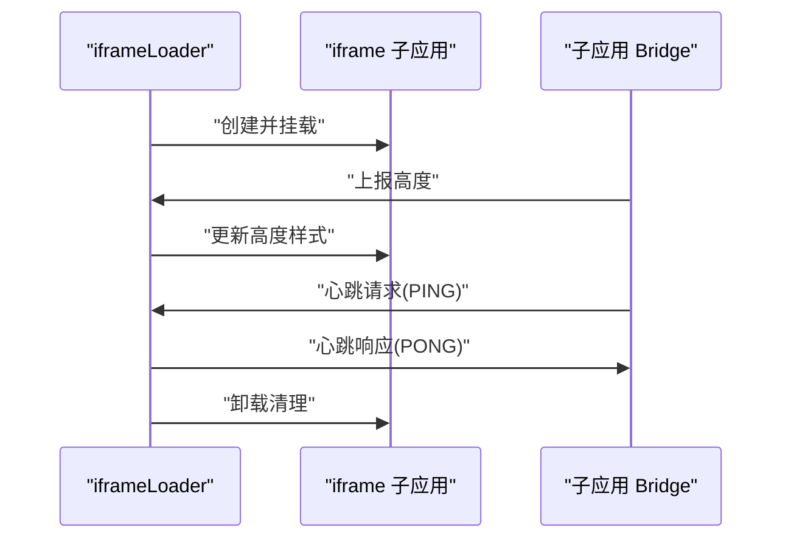
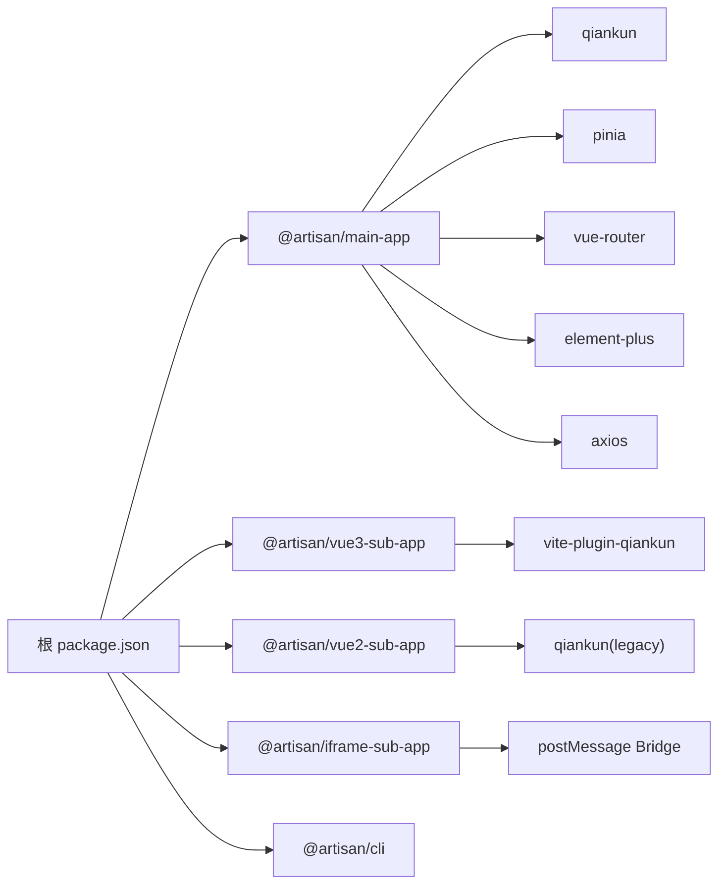

# 故障诊断与监控

<cite>
**本文引用的文件**
- [README.md](file://README.md)
- [package.json](file://package.json)
- [lerna.json](file://lerna.json)
- [packages/main-app/src/core/bridge.js](file://packages/main-app/src/core/bridge.js)
- [packages/main-app/src/core/microAppManager.js](file://packages/main-app/src/core/microAppManager.js)
- [packages/main-app/src/core/iframeLoader.js](file://packages/main-app/src/core/iframeLoader.js)
- [packages/main-app/src/config/microApps.js](file://packages/main-app/src/config/microApps.js)
- [packages/main-app/src/main.js](file://packages/main-app/src/main.js)
- [packages/main-app/src/router/index.js](file://packages/main-app/src/router/index.js)
- [packages/main-app/src/stores/app.js](file://packages/main-app/src/stores/app.js)
- [packages/main-app/src/stores/tabs.js](file://packages/main-app/src/stores/tabs.js)
- [packages/main-app/src/stores/user.js](file://packages/main-app/src/stores/user.js)
- [packages/iframe-sub-app/src/bridge.js](file://packages/iframe-sub-app/src/bridge.js)
- [packages/vue3-sub-app/package.json](file://packages/vue3-sub-app/package.json)
- [packages/iframe-sub-app/package.json](file://packages/iframe-sub-app/package.json)
- [user-docs/api/bridge.md](file://user-docs/api/bridge.md)
- [user-docs/api/micro-app-manager.md](file://user-docs/api/micro-app-manager.md)
- [user-docs/guide/sub-apps.md](file://user-docs/guide/sub-apps.md)
</cite>

## 目录
1. [简介](#简介)
2. [项目结构](#项目结构)
3. [核心组件](#核心组件)
4. [架构总览](#架构总览)
5. [详细组件分析](#详细组件分析)
6. [依赖关系分析](#依赖关系分析)
7. [性能考量](#性能考量)
8. [故障排查指南](#故障排查指南)
9. [结论](#结论)
10. [附录](#附录)

## 简介
本指南面向运维与开发工程师，聚焦微前端平台在生产环境中的故障诊断与监控实践。围绕微应用加载失败、通信异常、路由冲突等常见问题，提供系统化的排查步骤；解释日志体系的使用与配置要点；阐述监控告警的实现机制与最佳实践；并给出调试工具与生产环境定位技巧，帮助快速恢复线上服务。

## 项目结构
该仓库采用 Monorepo 架构，使用 Lerna 管理工作区，核心模块包括：
- 主应用：承载路由、布局编排、微应用生命周期管理与跨应用通信桥
- 子应用：Vue3/Vue2 示例与 iframe 示例，演示不同类型的微应用接入方式
- CLI：脚手架工具，用于快速生成主应用与子应用模板
- 用户文档：API 与使用指南，涵盖 Bridge 通信、微应用管理器等

图表来源
- [packages/main-app/src/main.js](file://packages/main-app/src/main.js#L1-L200)
- [packages/main-app/src/router/index.js](file://packages/main-app/src/router/index.js#L1-L200)
- [packages/main-app/src/core/bridge.js](file://packages/main-app/src/core/bridge.js#L1-L200)
- [packages/main-app/src/core/microAppManager.js](file://packages/main-app/src/core/microAppManager.js#L1-L200)
- [packages/main-app/src/core/iframeLoader.js](file://packages/main-app/src/core/iframeLoader.js#L1-L200)
- [packages/main-app/src/config/microApps.js](file://packages/main-app/src/config/microApps.js#L1-L200)
- [packages/main-app/src/stores/app.js](file://packages/main-app/src/stores/app.js#L1-L200)
- [packages/main-app/src/stores/tabs.js](file://packages/main-app/src/stores/tabs.js#L1-L200)
- [packages/main-app/src/stores/user.js](file://packages/main-app/src/stores/user.js#L1-L200)
- [packages/vue3-sub-app/package.json](file://packages/vue3-sub-app/package.json#L1-L23)
- [packages/iframe-sub-app/package.json](file://packages/iframe-sub-app/package.json#L1-L15)
- [packages/iframe-sub-app/src/bridge.js](file://packages/iframe-sub-app/src/bridge.js#L1-L250)
- [package.json](file://package.json#L1-L50)
- [lerna.json](file://lerna.json#L1-L25)
- [user-docs/api/bridge.md](file://user-docs/api/bridge.md#L1-L150)
- [user-docs/api/micro-app-manager.md](file://user-docs/api/micro-app-manager.md#L1-L143)
- [user-docs/guide/sub-apps.md](file://user-docs/guide/sub-apps.md#L1-L170)

章节来源
- [README.md](file://README.md#L62-L76)
- [package.json](file://package.json#L1-L50)
- [lerna.json](file://lerna.json#L1-L25)

## 核心组件
- 跨应用通信桥（Bridge）：基于 postMessage 的消息通道，支持主应用与子应用间的消息收发、心跳检测、高度上报、令牌同步与导航跳转
- 微应用管理器（MicroAppManager）：负责微应用的加载、卸载、刷新、预加载、状态控制与错误日志采集
- IFrame 加载器（iframeLoader）：封装 iframe 子应用的加载、生命周期与安全策略
- 配置中心（microApps.js）：集中管理各微应用的入口、激活规则、容器、布局与状态
- 路由与状态：主应用路由负责应用切换与导航；Pinia stores 提供用户态、标签页与应用状态持久化

章节来源
- [packages/main-app/src/core/bridge.js](file://packages/main-app/src/core/bridge.js#L1-L200)
- [packages/main-app/src/core/microAppManager.js](file://packages/main-app/src/core/microAppManager.js#L1-L200)
- [packages/main-app/src/core/iframeLoader.js](file://packages/main-app/src/core/iframeLoader.js#L1-L200)
- [packages/main-app/src/config/microApps.js](file://packages/main-app/src/config/microApps.js#L1-L200)
- [packages/main-app/src/router/index.js](file://packages/main-app/src/router/index.js#L1-L200)
- [packages/main-app/src/stores/app.js](file://packages/main-app/src/stores/app.js#L1-L200)
- [packages/main-app/src/stores/tabs.js](file://packages/main-app/src/stores/tabs.js#L1-L200)
- [packages/main-app/src/stores/user.js](file://packages/main-app/src/stores/user.js#L1-L200)

## 架构总览
下图展示主应用与子应用之间的交互关系，以及关键组件在运行期的职责分工。

图表来源
- [packages/main-app/src/core/bridge.js](file://packages/main-app/src/core/bridge.js#L1-L200)
- [packages/main-app/src/core/microAppManager.js](file://packages/main-app/src/core/microAppManager.js#L1-L200)
- [packages/main-app/src/router/index.js](file://packages/main-app/src/router/index.js#L1-L200)
- [packages/main-app/src/config/microApps.js](file://packages/main-app/src/config/microApps.js#L1-L200)
- [packages/iframe-sub-app/src/bridge.js](file://packages/iframe-sub-app/src/bridge.js#L1-L250)

## 详细组件分析

### 组件A：跨应用通信桥（Bridge）
- 功能要点
  - 监听 window.message，进行 origin 校验后分发消息
  - 支持内置消息类型：导航、令牌同步、心跳、高度上报、通用消息
  - 提供 send、sendToIframe、broadcast、syncToken、navigateTo、navigateToMain 等方法
- 关键流程
  - 初始化时注册消息处理器与监听器
  - 接收消息后按类型调用对应处理器
  - 对 iframe 子应用支持高度上报与心跳响应
- 日志与可观测性
  - 控制台记录消息接收与处理过程，便于本地调试
  - 建议在生产环境将日志降级为结构化输出并接入统一日志平台

图表来源
- [packages/main-app/src/core/bridge.js](file://packages/main-app/src/core/bridge.js#L60-L114)
- [packages/iframe-sub-app/src/bridge.js](file://packages/iframe-sub-app/src/bridge.js#L94-L110)

章节来源
- [packages/main-app/src/core/bridge.js](file://packages/main-app/src/core/bridge.js#L1-L200)
- [packages/iframe-sub-app/src/bridge.js](file://packages/iframe-sub-app/src/bridge.js#L1-L250)
- [user-docs/api/bridge.md](file://user-docs/api/bridge.md#L1-L150)

### 组件B：微应用管理器（MicroAppManager）
- 功能要点
  - 负责微应用的加载、卸载、刷新、预加载
  - 提供实例计数、实例映射、错误日志采集与清理
  - 支持设置应用上下线状态与批量预加载
- 关键流程
  - load：根据配置与容器创建实例，注入 props
  - unload/reload：销毁或重建实例，清理事件与资源
  - preload：提前拉起应用以降低首开延迟
  - 错误日志：捕获并记录加载/渲染异常，便于后续分析

图表来源
- [packages/main-app/src/core/microAppManager.js](file://packages/main-app/src/core/microAppManager.js#L1-L200)
- [user-docs/api/micro-app-manager.md](file://user-docs/api/micro-app-manager.md#L1-L143)

章节来源
- [packages/main-app/src/core/microAppManager.js](file://packages/main-app/src/core/microAppManager.js#L1-L200)
- [user-docs/api/micro-app-manager.md](file://user-docs/api/micro-app-manager.md#L1-L143)

### 组件C：IFrame 加载器（iframeLoader）
- 功能要点
  - 封装 iframe 子应用的加载与生命周期管理
  - 与 Bridge 协作，上报高度、处理心跳与令牌同步
  - 严格遵循安全策略：origin 校验、sandbox 限制、卸载清理
- 关键流程
  - 创建 iframe 并注入容器
  - 监听 REPORT_HEIGHT，动态调整高度
  - 卸载时移除监听器与事件，避免内存泄漏

图表来源
- [packages/main-app/src/core/iframeLoader.js](file://packages/main-app/src/core/iframeLoader.js#L1-L200)
- [packages/iframe-sub-app/src/bridge.js](file://packages/iframe-sub-app/src/bridge.js#L77-L88)
- [packages/iframe-sub-app/src/bridge.js](file://packages/iframe-sub-app/src/bridge.js#L180-L198)

章节来源
- [packages/main-app/src/core/iframeLoader.js](file://packages/main-app/src/core/iframeLoader.js#L1-L200)
- [packages/iframe-sub-app/src/bridge.js](file://packages/iframe-sub-app/src/bridge.js#L1-L250)

### 组件D：路由与状态（Router + Stores）
- 功能要点
  - 路由负责应用切换与导航，结合 Bridge 实现跨应用跳转
  - Store 提供用户态、标签页与应用状态持久化，保障用户体验
- 关键流程
  - 路由变化触发微应用切换
  - Store 变化驱动 UI 更新与持久化

章节来源
- [packages/main-app/src/router/index.js](file://packages/main-app/src/router/index.js#L1-L200)
- [packages/main-app/src/stores/app.js](file://packages/main-app/src/stores/app.js#L1-L200)
- [packages/main-app/src/stores/tabs.js](file://packages/main-app/src/stores/tabs.js#L1-L200)
- [packages/main-app/src/stores/user.js](file://packages/main-app/src/stores/user.js#L1-L200)

## 依赖关系分析
- 主应用依赖 qiankun 进行 Vue 子应用托管，依赖 Element Plus、Axios、Lodash 等生态库
- 子应用示例分别演示 Vue3/Vue2 的 qiankun 接入与 iframe 的 postMessage 通信
- CLI 工具提供脚手架能力，简化项目初始化与应用生成

图表来源
- [package.json](file://package.json#L1-L50)
- [packages/main-app/package.json](file://packages/main-app/package.json#L1-L31)
- [packages/vue3-sub-app/package.json](file://packages/vue3-sub-app/package.json#L1-L23)
- [packages/iframe-sub-app/package.json](file://packages/iframe-sub-app/package.json#L1-L15)

章节来源
- [package.json](file://package.json#L1-L50)
- [packages/main-app/package.json](file://packages/main-app/package.json#L1-L31)
- [packages/vue3-sub-app/package.json](file://packages/vue3-sub-app/package.json#L1-L23)
- [packages/iframe-sub-app/package.json](file://packages/iframe-sub-app/package.json#L1-L15)

## 性能考量
- 预加载策略：利用 MicroAppManager 的预加载能力，提前拉起高频应用，降低首开延迟
- 资源隔离：iframe 子应用启用 sandbox 与严格 CSP，减少对主应用的影响
- 通信优化：Bridge 消息尽量轻量化，避免频繁大对象传输；必要时采用分片或节流
- 路由与状态：合理拆分路由与 Store，避免单点过载；对长列表与复杂计算进行缓存与异步化

## 故障排查指南

### 一、微应用加载失败
- 症状
  - 控制台出现网络错误或跨域错误
  - 页面空白或白屏
- 排查步骤
  1) 检查微应用入口地址与端口是否可达
     - 参考端口配置与启动命令
  2) 核对微应用配置（入口、激活规则、容器）
  3) 查看微应用管理器的错误日志与实例映射
  4) 若为 iframe 子应用，确认 sandbox 与 CSP 配置
- 相关文件
  - [packages/main-app/src/config/microApps.js](file://packages/main-app/src/config/microApps.js#L1-L200)
  - [packages/main-app/src/core/microAppManager.js](file://packages/main-app/src/core/microAppManager.js#L1-L200)
  - [user-docs/api/micro-app-manager.md](file://user-docs/api/micro-app-manager.md#L1-L143)

章节来源
- [README.md](file://README.md#L17-L25)
- [packages/main-app/src/config/microApps.js](file://packages/main-app/src/config/microApps.js#L1-L200)
- [packages/main-app/src/core/microAppManager.js](file://packages/main-app/src/core/microAppManager.js#L1-L200)
- [user-docs/api/micro-app-manager.md](file://user-docs/api/micro-app-manager.md#L1-L143)

### 二、通信异常（Bridge）
- 症状
  - 消息无法送达或被拒绝
  - 心跳超时或高度上报无效
- 排查步骤
  1) 检查 Bridge 的 allowedOrigins 配置是否正确
  2) 确认 postMessage 的目标 origin 与目标窗口是否有效
  3) 观察控制台日志，定位消息类型与处理链路
  4) 对 iframe 子应用，确认其 Bridge 实例已初始化且未被卸载
- 相关文件
  - [packages/main-app/src/core/bridge.js](file://packages/main-app/src/core/bridge.js#L1-L200)
  - [packages/iframe-sub-app/src/bridge.js](file://packages/iframe-sub-app/src/bridge.js#L1-L250)
  - [user-docs/api/bridge.md](file://user-docs/api/bridge.md#L1-L150)

章节来源
- [packages/main-app/src/core/bridge.js](file://packages/main-app/src/core/bridge.js#L1-L200)
- [packages/iframe-sub-app/src/bridge.js](file://packages/iframe-sub-app/src/bridge.js#L1-L250)
- [user-docs/api/bridge.md](file://user-docs/api/bridge.md#L1-L150)

### 三、路由冲突
- 症状
  - 多个子应用同时匹配同一路由
  - 路由跳转后页面不更新或重复渲染
- 排查步骤
  1) 检查各子应用的激活规则与前缀是否冲突
  2) 确认主应用路由守卫与子应用路由基座配置
  3) 使用 Bridge 的 navigateTo/navigateToMain 进行显式跳转
- 相关文件
  - [packages/main-app/src/router/index.js](file://packages/main-app/src/router/index.js#L1-L200)
  - [packages/main-app/src/config/microApps.js](file://packages/main-app/src/config/microApps.js#L1-L200)
  - [user-docs/guide/sub-apps.md](file://user-docs/guide/sub-apps.md#L1-L170)

章节来源
- [packages/main-app/src/router/index.js](file://packages/main-app/src/router/index.js#L1-L200)
- [packages/main-app/src/config/microApps.js](file://packages/main-app/src/config/microApps.js#L1-L200)
- [user-docs/guide/sub-apps.md](file://user-docs/guide/sub-apps.md#L1-L170)

### 四、日志系统使用与配置
- 日志级别与输出
  - 开发阶段：控制台日志用于快速定位
  - 生产阶段：建议将日志结构化输出，接入统一日志平台（如 ELK/OTel）
- 输出格式
  - 包含时间戳、应用 ID、实例 ID、消息类型、payload 摘要
- 存储策略
  - 分层存储：内存缓冲短期聚合，定期落盘；按天/周轮转；保留周期与容量阈值
- 相关文件
  - [packages/main-app/src/core/bridge.js](file://packages/main-app/src/core/bridge.js#L60-L114)
  - [packages/iframe-sub-app/src/bridge.js](file://packages/iframe-sub-app/src/bridge.js#L203-L209)
  - [packages/main-app/src/core/microAppManager.js](file://packages/main-app/src/core/microAppManager.js#L1-L200)

章节来源
- [packages/main-app/src/core/bridge.js](file://packages/main-app/src/core/bridge.js#L60-L114)
- [packages/iframe-sub-app/src/bridge.js](file://packages/iframe-sub-app/src/bridge.js#L203-L209)
- [packages/main-app/src/core/microAppManager.js](file://packages/main-app/src/core/microAppManager.js#L1-L200)

### 五、监控告警实现机制
- 性能指标
  - 首次内容绘制（FCP）、最大内容绘制（LCP）、交互时间（LCP）、应用帧率（FPS）
  - 微应用加载耗时、路由切换耗时、Bridge 消息往返时延
- 错误追踪
  - 捕获微应用加载异常、通信异常、路由异常
  - 结合错误日志与堆栈信息进行归因
- 实时告警
  - 基于阈值的告警：加载失败率、平均响应时间、错误频次
  - 告警渠道：IM/邮件/电话，分级处理
- 相关文件
  - [packages/main-app/src/core/microAppManager.js](file://packages/main-app/src/core/microAppManager.js#L1-L200)
  - [user-docs/api/micro-app-manager.md](file://user-docs/api/micro-app-manager.md#L1-L143)

章节来源
- [packages/main-app/src/core/microAppManager.js](file://packages/main-app/src/core/microAppManager.js#L1-L200)
- [user-docs/api/micro-app-manager.md](file://user-docs/api/micro-app-manager.md#L1-L143)

### 六、调试工具使用
- 浏览器开发者工具
  - Network：观察微应用资源加载、跨域与缓存策略
  - Console：查看 Bridge 与管理器日志
  - Sources：断点定位子应用生命周期钩子
- 网络监控
  - 使用 Performance 面板分析首屏与交互性能
  - 使用 Application 面板检查 Storage 与 Cookie
- 性能分析
  - 结合 Chrome DevTools 的 Lighthouse 评估页面质量
  - 使用 Memory 面板检测内存泄漏（尤其是 iframe 卸载后）

### 七、生产环境问题定位技巧
- 错误日志分析
  - 从 MicroAppManager 的错误日志入手，定位具体应用与实例
  - 结合 Bridge 日志判断是加载问题还是通信问题
- 用户行为追踪
  - 记录路由变更、应用切换、Bridge 消息序列
  - 使用埋点系统关联用户路径与异常发生点
- 系统状态监控
  - 监控主应用与子应用的健康检查接口
  - 关注 CPU、内存、网络与磁盘 IO 指标

章节来源
- [packages/main-app/src/core/microAppManager.js](file://packages/main-app/src/core/microAppManager.js#L1-L200)
- [packages/main-app/src/core/bridge.js](file://packages/main-app/src/core/bridge.js#L1-L200)

### 八、故障预防与应急处理流程
- 预防措施
  - 规范化配置：统一入口、激活规则与容器命名
  - 严格的 CORS 与 CSP 策略，避免跨域与 XSS 风险
  - 预加载与缓存策略，提升可用性与稳定性
- 应急处理
  1) 快速隔离：将故障应用置为 offline，避免影响其他用户
  2) 回滚版本：若升级导致异常，回退至上一稳定版本
  3) 清理资源：强制卸载异常实例，释放内存与事件监听
  4) 修复发布：修复后重新上线并持续观察指标
- 相关文件
  - [packages/main-app/src/core/microAppManager.js](file://packages/main-app/src/core/microAppManager.js#L1-L200)
  - [user-docs/api/micro-app-manager.md](file://user-docs/api/micro-app-manager.md#L1-L143)

章节来源
- [packages/main-app/src/core/microAppManager.js](file://packages/main-app/src/core/microAppManager.js#L1-L200)
- [user-docs/api/micro-app-manager.md](file://user-docs/api/micro-app-manager.md#L1-L143)

## 结论
通过规范的配置、完善的日志与监控体系、清晰的故障排查流程与应急处理机制，可以显著降低微前端平台在生产环境中的风险与停机时间。建议团队将 Bridge 与 MicroAppManager 的可观测性作为重点建设方向，持续完善自动化告警与自愈能力。

## 附录
- 快速参考
  - 端口与启动命令：参见根目录 README 的“端口配置”与“快速开始”
  - Bridge API：参见用户文档的 Bridge API 与微应用管理器 API
  - 子应用接入：参见子应用指南，区分 Vue 与 iframe 的接入差异

章节来源
- [README.md](file://README.md#L17-L54)
- [user-docs/api/bridge.md](file://user-docs/api/bridge.md#L1-L150)
- [user-docs/api/micro-app-manager.md](file://user-docs/api/micro-app-manager.md#L1-L143)
- [user-docs/guide/sub-apps.md](file://user-docs/guide/sub-apps.md#L1-L170)