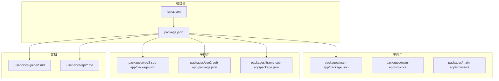
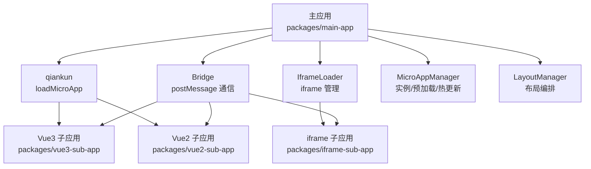
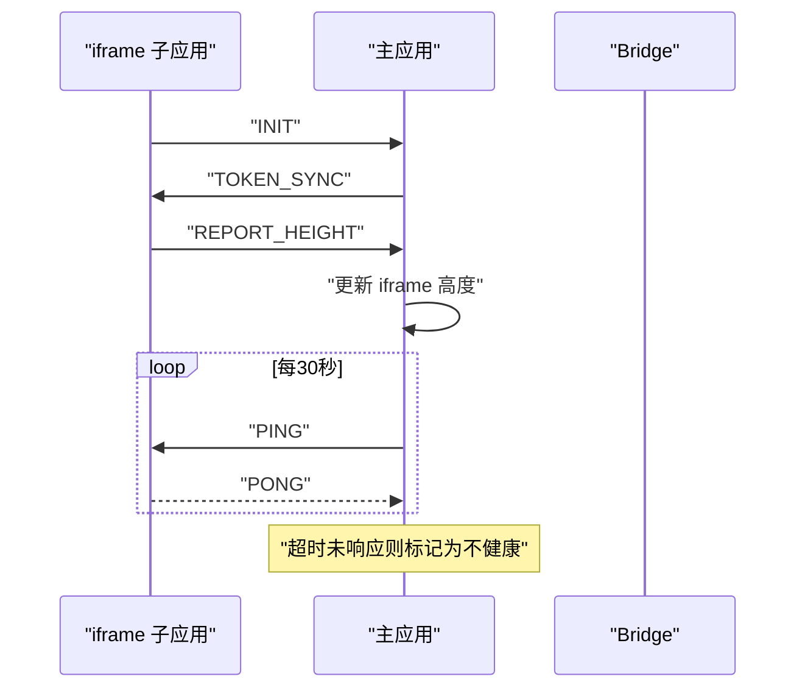
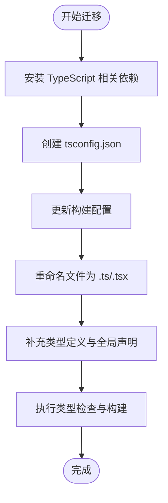
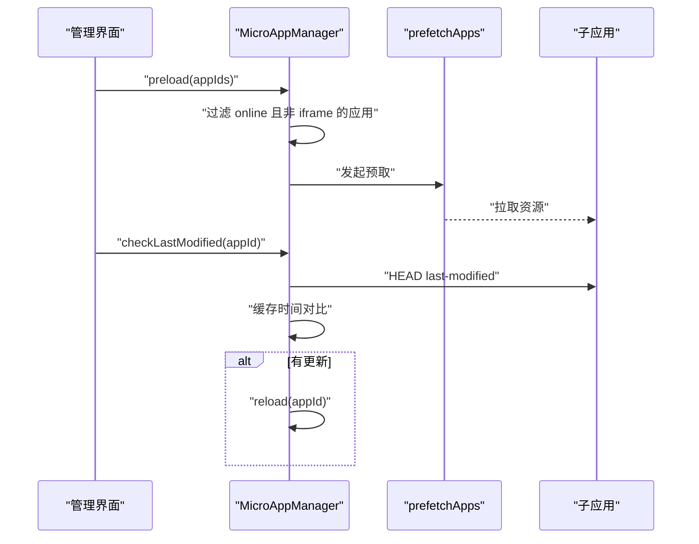
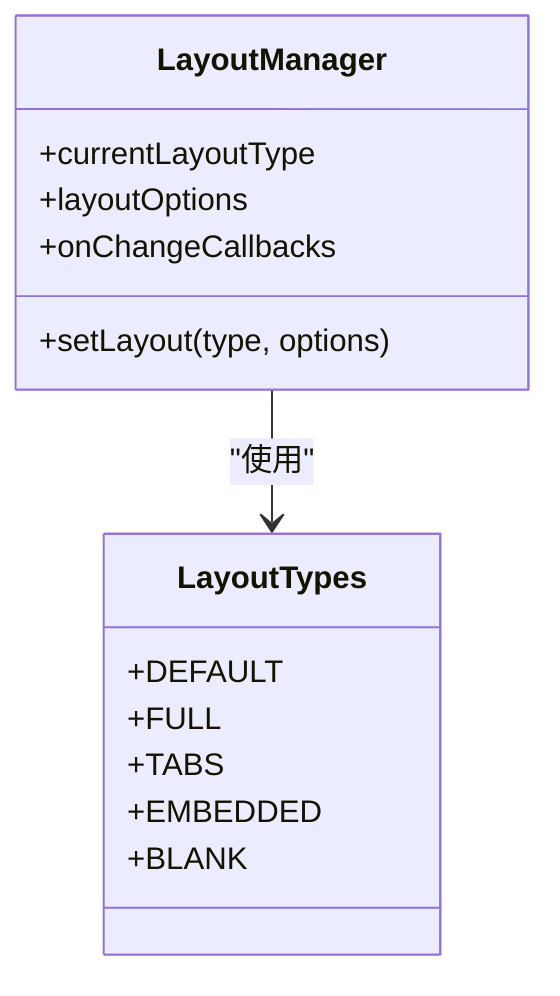
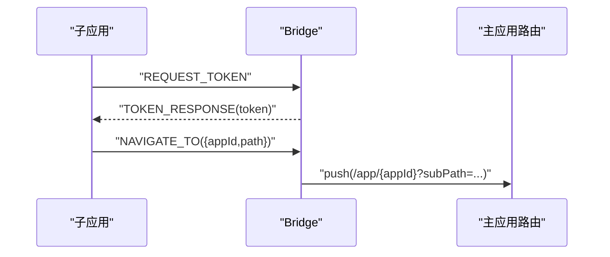
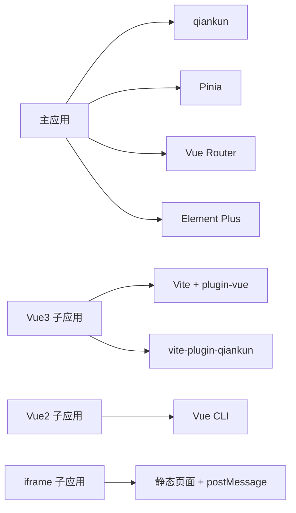

# 高级主题

<cite>
**本文引用的文件**
- [README.md](file://README.md)
- [package.json](file://package.json)
- [lerna.json](file://lerna.json)
- [packages/main-app/package.json](file://packages/main-app/package.json)
- [packages/vue3-sub-app/package.json](file://packages/vue3-sub-app/package.json)
- [packages/vue2-sub-app/package.json](file://packages/vue2-sub-app/package.json)
- [packages/iframe-sub-app/package.json](file://packages/iframe-sub-app/package.json)
- [user-docs/guide/iframe-governance.md](file://user-docs/guide/iframe-governance.md)
- [user-docs/guide/typescript-migration.md](file://user-docs/guide/typescript-migration.md)
- [user-docs/guide/main-app.md](file://user-docs/guide/main-app.md)
- [user-docs/api/micro-app-manager.md](file://user-docs/api/micro-app-manager.md)
- [user-docs/api/bridge.md](file://user-docs/api/bridge.md)
- [packages/main-app/src/core/bridge.js](file://packages/main-app/src/core/bridge.js)
- [packages/main-app/src/core/iframeLoader.js](file://packages/main-app/src/core/iframeLoader.js)
- [packages/main-app/src/core/microAppManager.js](file://packages/main-app/src/core/microAppManager.js)
- [packages/main-app/src/core/layoutManager.js](file://packages/main-app/src/core/layoutManager.js)
- [packages/main-app/src/views/AppManagement.vue](file://packages/main-app/src/views/AppManagement.vue)
- [packages/iframe-sub-app/index.html](file://packages/iframe-sub-app/index.html)
- [packages/iframe-sub-app/list.html](file://packages/iframe-sub-app/list.html)
</cite>

## 目录
1. [引言](#引言)
2. [项目结构](#项目结构)
3. [核心组件](#核心组件)
4. [架构总览](#架构总览)
5. [详细组件分析](#详细组件分析)
6. [依赖关系分析](#依赖关系分析)
7. [性能考虑](#性能考虑)
8. [故障排查指南](#故障排查指南)
9. [结论](#结论)
10. [附录](#附录)

## 引言
本指南面向高级用户，聚焦微前端平台的高级功能与扩展能力，围绕以下主题展开：
- iframe 跨域治理的安全策略、沙箱隔离与权限控制
- TypeScript 迁移的完整流程、类型定义与开发配置
- 性能优化策略：懒加载、预加载、缓存与资源压缩
- 扩展开发：插件系统、自定义组件与第三方集成
- 故障诊断、日志分析与监控告警最佳实践

平台采用 Monorepo 架构，基于 Lerna + npm workspaces 管理，主应用与多类子应用（Vue3/Vue2/iframe/link）协同工作，结合 qiankun 的 loadMicroApp 模式实现微前端编排。

章节来源
- file://README.md#L1-L158

## 项目结构
仓库采用 Monorepo 结构，核心目录如下：
- packages/main-app：主应用（Vue3 + Vite + qiankun）
- packages/vue3-sub-app / packages/vue2-sub-app：Vue 子应用示例
- packages/iframe-sub-app：iframe 子应用示例
- user-docs：VitePress 文档与指南
- 根目录脚本与发布配置：package.json、lerna.json

图示来源
- [package.json](file://package.json#L1-L50)
- [lerna.json](file://lerna.json#L1-L25)

章节来源
- file://package.json#L1-L50
- file://lerna.json#L1-L25

## 核心组件
- 桥接通信（Bridge）：基于 postMessage 的主子应用双向通信，内置消息类型与安全校验
- iframe 加载器（IframeLoader）：负责 iframe 的加载、沙箱、高度自适应、心跳检测与卸载清理
- 微应用实例管理器（MicroAppManager）：多实例加载、lastModified 热更新检测、预加载、上下线控制
- 布局管理器（LayoutManager）：动态布局切换与选项配置
- 应用管理视图（AppManagement.vue）：应用状态、预加载与热更新可视化

章节来源
- file://user-docs/guide/main-app.md#L1-L95
- file://packages/main-app/src/core/bridge.js#L1-L240
- file://packages/main-app/src/core/iframeLoader.js#L1-L333
- file://packages/main-app/src/core/microAppManager.js#L389-L433
- file://packages/main-app/src/core/layoutManager.js#L1-L67
- file://packages/main-app/src/views/AppManagement.vue#L35-L73

## 架构总览
平台整体由“主应用 + 多类型子应用”构成，主应用通过 qiankun 管理子应用生命周期，通过 Bridge 实现跨应用通信；iframe 子应用通过沙箱与 postMessage 协议进行安全交互。

图示来源
- [packages/main-app/src/core/bridge.js](file://packages/main-app/src/core/bridge.js#L1-L240)
- [packages/main-app/src/core/iframeLoader.js](file://packages/main-app/src/core/iframeLoader.js#L1-L333)
- [packages/main-app/src/core/microAppManager.js](file://packages/main-app/src/core/microAppManager.js#L389-L433)
- [packages/main-app/src/core/layoutManager.js](file://packages/main-app/src/core/layoutManager.js#L1-L67)
- [packages/main-app/package.json](file://packages/main-app/package.json#L1-L31)
- [packages/vue3-sub-app/package.json](file://packages/vue3-sub-app/package.json#L1-L23)
- [packages/vue2-sub-app/package.json](file://packages/vue2-sub-app/package.json#L1-L31)
- [packages/iframe-sub-app/package.json](file://packages/iframe-sub-app/package.json#L1-L15)

## 详细组件分析

### 组件A：iframe 跨域治理与安全策略
- 安全策略
  - 禁止直接访问 iframe DOM，统一通过 postMessage 通信
  - 主应用维护允许的 origin 白名单，严格校验消息来源
  - iframe 使用 sandbox 限制能力，仅开放必要权限
- 通信协议
  - 消息格式包含 type 与 payload
  - 内置消息类型：INIT、TOKEN_SYNC、TOKEN_RESPONSE、REQUEST_TOKEN、REPORT_HEIGHT、NAVIGATE_TO、PING/PONG
- 高度自适应与心跳检测
  - 子应用在 load/resize 时上报高度，主应用动态调整 iframe 高度
  - 主应用周期性发送 PING，子应用响应 PONG；超时标记为不健康
- 卸载清理
  - 移除消息监听、停止心跳、断开 ResizeObserver、移除 DOM 并清理缓存

图示来源
- [user-docs/guide/iframe-governance.md](file://user-docs/guide/iframe-governance.md#L1-L138)
- [packages/main-app/src/core/bridge.js](file://packages/main-app/src/core/bridge.js#L1-L240)
- [packages/main-app/src/core/iframeLoader.js](file://packages/main-app/src/core/iframeLoader.js#L1-L333)

章节来源
- file://user-docs/guide/iframe-governance.md#L1-L138
- file://packages/main-app/src/core/bridge.js#L1-L240
- file://packages/main-app/src/core/iframeLoader.js#L1-L333

### 组件B：TypeScript 迁移与类型定义
- 迁移步骤
  - 主应用：安装 TypeScript、@types/node、vue-tsc；创建 tsconfig.json；更新 vite.config；重命名文件为 .ts；补充类型定义
  - Vue3/Vue2 子应用：按各自构建工具添加 TS 支持与 tsconfig
  - CLI：安装 @types/inquirer 等类型包，重命名并补注解
- 关键类型
  - 微应用配置接口、Pinia store 类型、Bridge 接口与全局声明
- Monorepo 注意事项
  - 每个包独立 tsconfig；使用 references 建立包间引用；可启用 composite 提升增量编译效率

图示来源
- [user-docs/guide/typescript-migration.md](file://user-docs/guide/typescript-migration.md#L1-L175)

章节来源
- file://user-docs/guide/typescript-migration.md#L1-L175

### 组件C：微应用实例管理与预加载
- 实例管理
  - 支持多实例加载、卸载、刷新；记录实例映射与错误日志；提供实例计数与状态查询
- 预加载
  - 基于 prefetchApps 预取资源；对非 iframe 且 online 的应用执行预加载
- 热更新
  - 通过 HEAD 请求检查 lastModified，若变更则触发 reload

图示来源
- [user-docs/api/micro-app-manager.md](file://user-docs/api/micro-app-manager.md#L1-L143)
- [packages/main-app/src/core/microAppManager.js](file://packages/main-app/src/core/microAppManager.js#L389-L433)
- [packages/main-app/src/views/AppManagement.vue](file://packages/main-app/src/views/AppManagement.vue#L35-L73)

章节来源
- file://user-docs/api/micro-app-manager.md#L1-L143
- file://packages/main-app/src/core/microAppManager.js#L389-L433
- file://packages/main-app/src/views/AppManagement.vue#L35-L73

### 组件D：布局编排系统
- 布局类型
  - default/full/tabs/embedded/blank 五种布局
- 动态切换
  - 通过 LayoutManager 设置布局类型与选项，触发回调以更新 UI
- 与路由配合
  - 通过路由参数控制子应用激活规则与容器选择器

图示来源
- [packages/main-app/src/core/layoutManager.js](file://packages/main-app/src/core/layoutManager.js#L1-L67)

章节来源
- file://packages/main-app/src/core/layoutManager.js#L1-L67

### 组件E：跨应用通信桥（Bridge）
- 功能
  - on/off 注册/移除消息处理器
  - send/sendToIframe 广播/定向发送
  - syncToken 同步令牌
  - navigateTo/navigateToMain 路由跳转
- 安全
  - 维护允许的 origin 列表
  - 通过 window.__ARTISAN_BRIDGE__ 暴露给子应用使用

图示来源
- [packages/main-app/src/core/bridge.js](file://packages/main-app/src/core/bridge.js#L1-L240)
- [user-docs/api/bridge.md](file://user-docs/api/bridge.md#L1-L102)

章节来源
- file://packages/main-app/src/core/bridge.js#L1-L240
- file://user-docs/api/bridge.md#L1-L102

## 依赖关系分析
- 主应用依赖 qiankun、Vue3、Pinia、Element Plus 等
- 子应用分别使用 Vite 或 Vue CLI，按类型引入对应插件
- 文档与脚手架工具位于 user-docs 与 packages/cli

图示来源
- [packages/main-app/package.json](file://packages/main-app/package.json#L1-L31)
- [packages/vue3-sub-app/package.json](file://packages/vue3-sub-app/package.json#L1-L23)
- [packages/vue2-sub-app/package.json](file://packages/vue2-sub-app/package.json#L1-L31)
- [packages/iframe-sub-app/package.json](file://packages/iframe-sub-app/package.json#L1-L15)

章节来源
- file://packages/main-app/package.json#L1-L31
- file://packages/vue3-sub-app/package.json#L1-L23
- file://packages/vue2-sub-app/package.json#L1-L31
- file://packages/iframe-sub-app/package.json#L1-L15

## 性能考虑
- 懒加载与预加载
  - 非 iframe 子应用支持预加载，减少首次渲染延迟
  - 热更新检测基于 lastModified，按需刷新
- 缓存机制
  - 预加载结果缓存于 prefetchApps；lastModified 时间缓存于内存
- 资源压缩与构建优化
  - Vite 默认启用压缩与打包优化；建议开启长缓存与资源指纹
- 运行时优化
  - iframe 高度自适应使用防抖；心跳检测避免频繁通信
  - 布局切换与路由跳转尽量复用实例，减少重复创建

章节来源
- file://packages/main-app/src/core/microAppManager.js#L389-L433
- file://packages/main-app/src/core/iframeLoader.js#L1-L333
- file://packages/main-app/src/core/bridge.js#L1-L240

## 故障排查指南
- iframe 通信问题
  - 检查主应用 allowedOrigins 与子应用目标 origin 是否匹配
  - 确认 sandbox 配置是否允许必要能力（如 allow-scripts、allow-same-origin）
  - 核对消息类型与 payload 结构，确保双方约定一致
- 心跳与健康检查
  - 若出现“心跳超时”，检查子应用是否正确响应 PONG；排查网络与 CSP 限制
- 预加载与热更新
  - 确认子应用入口支持 HEAD 请求；lastModified 返回值是否正确
  - 预加载仅对非 iframe 生效，注意在管理界面的禁用状态
- 日志与监控
  - 利用 MicroAppManager 的错误日志接口收集异常信息
  - 在 Bridge 中输出关键事件日志，便于定位通信链路问题

章节来源
- file://user-docs/guide/iframe-governance.md#L1-L138
- file://packages/main-app/src/core/iframeLoader.js#L1-L333
- file://packages/main-app/src/core/microAppManager.js#L389-L433
- file://packages/main-app/src/core/bridge.js#L1-L240

## 结论
本指南从安全、类型系统、性能与扩展四个维度，系统梳理了平台的高级能力与最佳实践。通过严格的跨域治理与沙箱策略保障 iframe 安全，借助 TypeScript 提升开发质量与可维护性，结合预加载与热更新优化用户体验，配合完善的日志与监控体系实现稳定运维。高级用户可在此基础上进一步定制插件、组件与第三方集成方案，充分发挥平台的扩展潜力。

## 附录
- 快速开始与端口配置参见根 README
- CLI 使用与微应用配置示例参见根 README
- 布局类型与跨应用跳转示例参见根 README

章节来源
- file://README.md#L1-L158