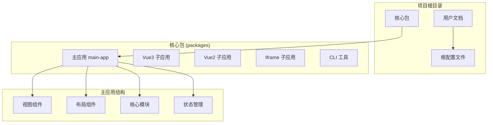
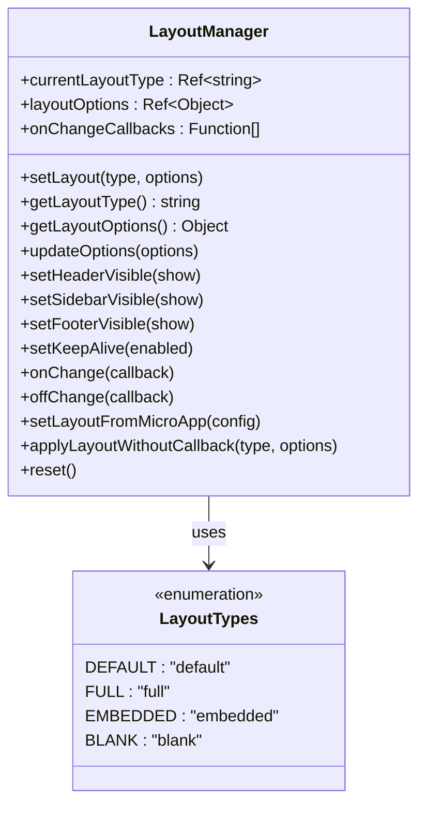
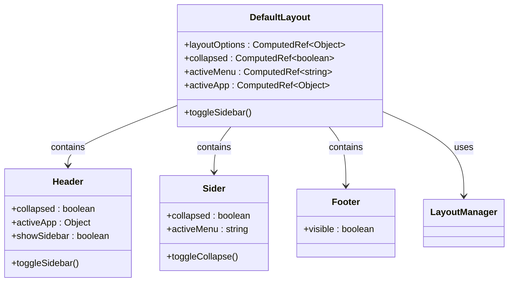
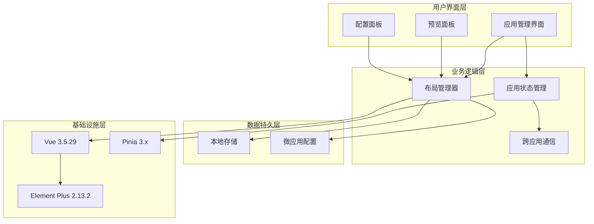
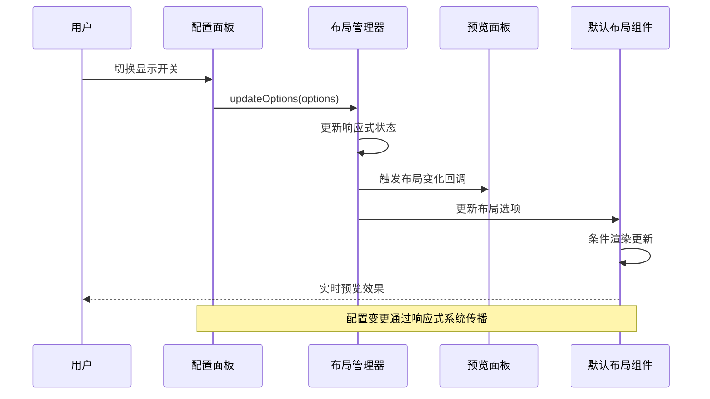
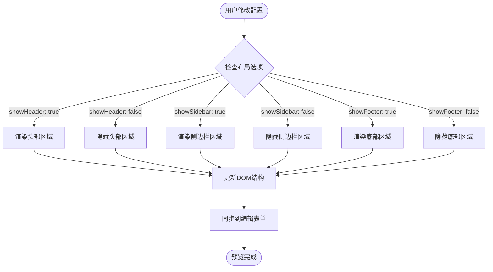
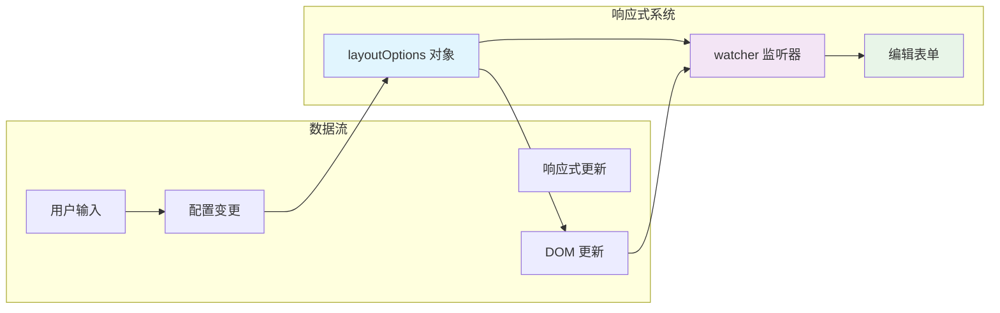
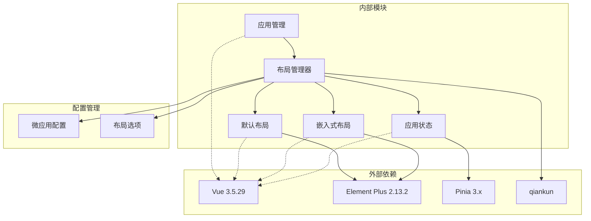
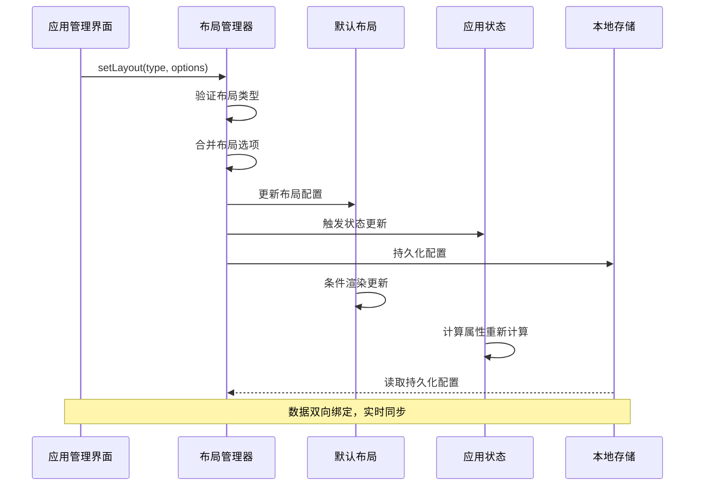
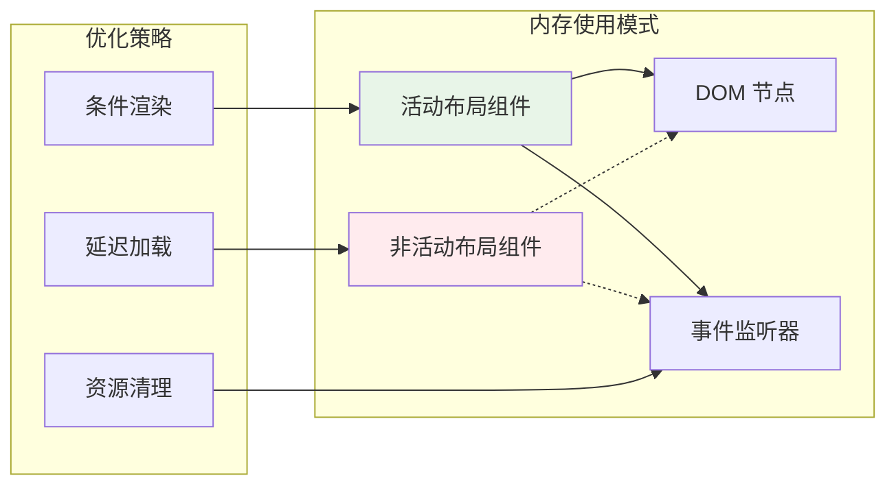

# 默认布局预览动态配置

<cite>
**本文档引用的文件**
- [README.md](file://README.md)
- [default-layout-preview-dynamic.md](file://user-docs/guide/default-layout-preview-dynamic.md)
- [AppManagement.vue](file://packages/main-app/src/views/AppManagement.vue)
- [DefaultLayout.vue](file://packages/main-app/src/components/layout/DefaultLayout.vue)
- [EmbeddedLayout.vue](file://packages/main-app/src/components/layout/EmbeddedLayout.vue)
- [layoutManager.js](file://packages/main-app/src/core/layoutManager.js)
- [app.js](file://packages/main-app/src/stores/app.js)
- [package.json](file://packages/main-app/package.json)
- [package.json](file://package.json)
</cite>

## 目录
1. [简介](#简介)
2. [项目结构](#项目结构)
3. [核心组件](#核心组件)
4. [架构概览](#架构概览)
5. [详细组件分析](#详细组件分析)
6. [依赖关系分析](#依赖关系分析)
7. [性能考虑](#性能考虑)
8. [故障排除指南](#故障排除指南)
9. [结论](#结论)

## 简介

默认布局预览动态配置是 Artisan Base Frontend 微前端平台中的一个重要功能，它允许用户在应用管理界面中实时预览和调整默认布局的各种配置选项。该功能通过条件渲染机制，根据 `layoutOptions` 配置动态显示或隐藏布局的不同区域，包括头部（Header）、侧边栏（Sidebar）和底部（Footer）。

这个功能的核心价值在于为用户提供直观的视觉反馈，帮助他们更好地理解和配置微前端应用的布局系统。通过实时预览，用户可以立即看到不同配置组合的效果，从而做出更明智的设计决策。

## 项目结构

该项目采用 Monorepo 架构，主要包含以下关键目录：

**图表来源**
- [package.json](file://package.json#L6-L8)
- [README.md](file://README.md#L68-L82)

**章节来源**
- [package.json](file://package.json#L1-L50)
- [README.md](file://README.md#L68-L82)

## 核心组件

### 布局管理器 (LayoutManager)

布局管理器是整个布局系统的核心控制器，负责管理布局类型和布局选项的状态。它提供了完整的 API 来操作布局配置，并支持回调机制来通知布局变化。

**图表来源**
- [layoutManager.js](file://packages/main-app/src/core/layoutManager.js#L17-L191)

### 默认布局组件 (DefaultLayout)

默认布局组件实现了完整的布局结构，支持条件渲染的头部、侧边栏和底部区域。它使用 Element Plus 组件库构建，并集成了响应式布局管理。

**图表来源**
- [DefaultLayout.vue](file://packages/main-app/src/components/layout/DefaultLayout.vue#L1-L84)

### 嵌入式布局组件 (EmbeddedLayout)

嵌入式布局组件提供了简化的布局结构，主要用于特定场景下的内容展示。它同样支持条件渲染的底部区域。

**章节来源**
- [DefaultLayout.vue](file://packages/main-app/src/components/layout/DefaultLayout.vue#L1-L84)
- [EmbeddedLayout.vue](file://packages/main-app/src/components/layout/EmbeddedLayout.vue#L1-L51)
- [layoutManager.js](file://packages/main-app/src/core/layoutManager.js#L1-L197)

## 架构概览

默认布局预览动态配置的整体架构采用了分层设计模式，确保了良好的可维护性和扩展性：

**图表来源**
- [AppManagement.vue](file://packages/main-app/src/views/AppManagement.vue#L1-L51)
- [layoutManager.js](file://packages/main-app/src/core/layoutManager.js#L1-L197)
- [app.js](file://packages/main-app/src/stores/app.js#L1-L110)

## 详细组件分析

### 布局选项配置系统

布局选项配置系统是实现动态预览的核心机制，它通过响应式数据绑定实现了配置与界面的实时同步。

**图表来源**
- [layoutManager.js](file://packages/main-app/src/core/layoutManager.js#L88-L93)
- [DefaultLayout.vue](file://packages/main-app/src/components/layout/DefaultLayout.vue#L47-L58)

### 条件渲染实现机制

条件渲染是实现动态预览的关键技术，它通过 Vue 的 `v-if` 指令实现了 DOM 节点的动态创建和销毁。

**图表来源**
- [DefaultLayout.vue](file://packages/main-app/src/components/layout/DefaultLayout.vue#L4-L27)

### 响应式数据绑定

响应式数据绑定确保了配置变更能够实时反映在预览界面中，这是通过 Vue 3 的响应式系统实现的。

**图表来源**
- [layoutManager.js](file://packages/main-app/src/core/layoutManager.js#L88-L93)

**章节来源**
- [default-layout-preview-dynamic.md](file://user-docs/guide/default-layout-preview-dynamic.md#L12-L100)
- [DefaultLayout.vue](file://packages/main-app/src/components/layout/DefaultLayout.vue#L1-L84)
- [layoutManager.js](file://packages/main-app/src/core/layoutManager.js#L1-L197)

## 依赖关系分析

### 核心依赖关系

系统中的核心依赖关系体现了清晰的分层架构：

**图表来源**
- [package.json](file://packages/main-app/package.json#L14-L24)
- [layoutManager.js](file://packages/main-app/src/core/layoutManager.js#L38-L48)

### 组件间交互关系

组件间的交互关系展示了数据流向和控制流程：

**图表来源**
- [layoutManager.js](file://packages/main-app/src/core/layoutManager.js#L39-L66)
- [app.js](file://packages/main-app/src/stores/app.js#L48-L54)

**章节来源**
- [package.json](file://packages/main-app/package.json#L1-L35)
- [layoutManager.js](file://packages/main-app/src/core/layoutManager.js#L1-L197)
- [app.js](file://packages/main-app/src/stores/app.js#L1-L110)

## 性能考虑

### 渲染性能优化

默认布局预览动态配置在设计时充分考虑了性能因素：

1. **条件渲染优化**: 使用 `v-if` 而非 `v-show`，避免渲染不需要的 DOM 节点
2. **响应式更新**: 通过 Vue 3 的响应式系统实现精确的状态更新
3. **内存管理**: 及时清理不再使用的布局组件实例

### 内存使用分析

### 性能监控指标

- **首屏渲染时间**: 通过条件渲染减少初始 DOM 节点数量
- **内存占用**: 动态销毁不使用的布局组件
- **响应速度**: 响应式系统提供即时的界面更新

## 故障排除指南

### 常见问题及解决方案

| 问题类型 | 症状描述 | 可能原因 | 解决方案 |
|---------|----------|----------|----------|
| 预览不更新 | 配置变更后预览无变化 | 响应式绑定失效 | 检查 `layoutOptions` 的响应式状态 |
| 布局错位 | 预览布局显示异常 | CSS 样式冲突 | 验证样式作用域和优先级 |
| 性能问题 | 预览切换卡顿 | 过多 DOM 操作 | 优化条件渲染逻辑 |
| 配置丢失 | 刷新后配置恢复默认 | 本地存储异常 | 检查浏览器存储权限 |

### 调试技巧

1. **开发者工具**: 使用 Vue DevTools 监控响应式状态变化
2. **控制台日志**: 检查布局管理器的日志输出
3. **网络监控**: 确认微应用配置的正确加载

**章节来源**
- [default-layout-preview-dynamic.md](file://user-docs/guide/default-layout-preview-dynamic.md#L329-L347)

## 结论

默认布局预览动态配置功能成功地实现了微前端平台中布局配置的可视化管理。通过条件渲染、响应式数据绑定和完善的架构设计，该功能为用户提供了直观、实时的布局配置体验。

### 主要成就

1. **实时反馈**: 用户可以立即看到配置变更的效果
2. **一致性保证**: 预览结构与实际布局组件保持完全一致
3. **灵活性**: 支持所有可能的配置组合
4. **用户体验**: 提供了直观的视觉反馈和操作指导

### 技术亮点

- 采用 Vue 3 响应式系统实现精确的状态管理
- 通过条件渲染优化 DOM 结构和性能
- 设计清晰的分层架构便于维护和扩展
- 提供完整的错误处理和调试支持

该功能不仅提升了开发效率，也为用户提供了更好的使用体验，是 Artisan Base Frontend 微前端平台的重要组成部分。