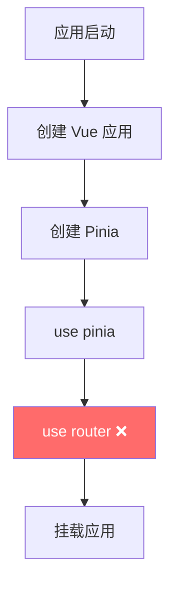

# App Store 初始化修复

## 🐛 问题根因

在将 microApps.js改为动态加载后，mock模式下子应用无法加载。

**真正的问题：**
- ❌ **不是协议问题**（`//localhost:7080` vs `http://localhost:7080`）
- ✅ **是 app.js的初始化逻辑问题**

---

## 🔍 问题分析

### Before（错误的代码结构）

#### main.js
```javascript
const pinia = createPinia()
pinia.use(piniaPluginPersistedstate)

app.use(pinia)
app.use(router)  // ❌ 没有初始化微应用配置就使用了路由
```

#### app.js
```javascript
export const useAppStore = defineStore('app', () => {
  // 初始为空数组
  const apps = ref([])
  
  // 定义了 initialize 方法但从未被调用
  async function initialize(apiUrl) {
    const loadedApps = await initMicroApps(apiUrl)
    apps.value = [...loadedApps]
  }
  
  return {
    apps,
    initialize  // ⚠️ 导出但未被使用
  }
})
```

**问题：**
1. `apps` 初始化为空数组 `[]`
2. `initialize()` 方法定义了就**从来没有被调用过**
3. 导致微应用配置一直没有被加载
4. 子应用路由匹配时找不到对应的配置

---

## ✅ 修复方案

### 修改文件：`/packages/main-app/src/main.js`

**修改前：**
```javascript
import { createApp } from 'vue'
import { createPinia } from 'pinia'

const app = createApp(App)

const pinia = createPinia()
pinia.use(piniaPluginPersistedstate)

app.use(pinia)
app.use(router)  // ❌ 直接使用 router
```

**修改后：**
```javascript
import { createApp } from 'vue'
import { createPinia } from 'pinia'
import { useAppStore } from '@/stores/app'  // ✅ 导入 appStore

const app = createApp(App)

const pinia = createPinia()
pinia.use(piniaPluginPersistedstate)

app.use(pinia)

// ✅ 初始化微应用配置（在路由之前）
const appStore = useAppStore()
await appStore.initialize()

app.use(router)  // ✅ 初始化后再使用路由
```

---

## 🔄 执行流程对比

### Before（错误流程）



**问题：** 此时 `appStore.apps = []`，没有任何微应用配置

---

### After（正确流程）

```mermaid
graph TB
    Start[应用启动] --> CreateApp[创建 Vue 应用]
    CreateApp --> CreatePinia[创建 Pinia]
    CreatePinia --> UsePinia[use pinia]
    UsePinia --> InitStore[调用 appStore.initialize()]
    InitStore --> LoadConfig{加载配置}
    LoadConfig -- VITE_USE_MICRO_APPS_API=false --> LoadMock[加载 mock 数据]
    LoadConfig -- VITE_USE_MICRO_APPS_API=true --> LoadAPI[加载 API 数据]
    LoadMock --> UpdateStore[更新 appStore.apps]
    UpdateStore --> UseRouter[use router ✅]
    LoadAPI --> UpdateStore
    UseRouter --> Mount[挂载应用]
    
    style InitStore fill:#51cf66,color:#fff
    style UpdateStore fill:#51cf66,color:#fff
    style UseRouter fill:#51cf66,color:#fff
```

**优势：** 在使用路由之前已经完成了微应用配置的加载

---

## 📊 数据流修复

### Before（数据未加载）

```
用户访问 /vue3
    ↓
router 匹配到 activeRule: '/vue3'
    ↓
尝试获取 vue3-sub-app 配置
    ↓
getMicroApp('vue3-sub-app') → undefined ❌
    ↓
子应用无法加载
```

### After（数据已加载）

```
appStore.initialize()
    ↓
loadMicroApps({ source: 'mock' })
    ↓
从 @/mock/microApps.js 加载数据
    ↓
processMicroAppsData(rawData)
    ↓
标准化布局配置
    ↓
apps.value = [vue3-sub-app, vue2-sub-app, ...] ✅
    ↓
用户访问 /vue3
    ↓
router 匹配到 activeRule: '/vue3'
    ↓
getMicroApp('vue3-sub-app') → 找到配置 ✅
    ↓
子应用正常加载
```

---

## 🧪 验证方法

### 控制台日志

启动后应该看到：

```javascript
[microApps] Loading from mock data
[microApps] Successfully loaded 4 apps from mock
[AppStore] Micro apps initialized: 4 apps
[Main App] Application started
```

### 检查 appStore状态

在浏览器控制台执行：

```javascript
import { useAppStore } from '@/stores/app'
const appStore = useAppStore()

console.log('微应用数量:', appStore.apps.length)
console.log('微应用列表:', appStore.apps)
```

**期望输出：**
```
微应用数量：4
微应用列表：[
  { id: 'vue3-sub-app', name: 'Vue3 子应用', ... },
  { id: 'vue2-sub-app', name: 'Vue2 子应用', ... },
  { id: 'iframe-sub-app', name: 'iframe 子应用', ... },
  { id: 'link-example', name: '外链示例', ... }
]
```

### 测试子应用加载

访问以下地址，确认都能正常加载：

- http://localhost:8080/vue3
- http://localhost:8080/vue2
- http://localhost:8080/iframe

---

## 💡 关键点说明

### 1. 初始化时机很重要

**必须在 `use(router)` 之前调用 `initialize()`**

原因：
- Router 在匹配路由时需要使用微应用配置
- 如果 `appStore.apps` 为空，路由守卫和导航守卫都无法正确工作
- 子应用的 activeRule 匹配依赖于微应用配置

### 2. 使用 top-level await

在 ES 模块中可以使用 top-level await：

```javascript
// main.js
const appStore = useAppStore()
await appStore.initialize()  // ✅ 等待初始化完成
```

这确保了在继续执行后续代码之前，微应用配置已经加载完成。

### 3. 环境变量自动判断

`appStore.initialize()` 会自动根据环境变量选择数据源：

```javascript
// .env.development
VITE_USE_MICRO_APPS_API=false  // false=mock, true=API

// initialize() 内部会判断：
const useApi = import.meta.env.VITE_USE_MICRO_APPS_API === 'true'
const source = useApi ? 'api' : 'mock'
```

---

## ⚠️ 注意事项

### 1. 确保 store 已注册 pinia

```javascript
// ✅ 正确顺序
const pinia = createPinia()
app.use(pinia)

const appStore = useAppStore()  // 在 use(pinia) 之后
await appStore.initialize()
```

### 2. 处理加载失败

可以添加错误处理：

```javascript
try {
  await appStore.initialize()
  console.log('[Main App] Micro apps loaded successfully')
} catch (error) {
  console.error('[Main App] Failed to load micro apps:', error)
  // 可以选择降级处理或提示用户
}
```

### 3. 避免重复初始化

如果在其他地方也需要初始化，请确保只调用一次：

```javascript
// app.js 中添加标记
let isInitialized = false

async function initialize(apiUrl) {
  if (isInitialized) {
    console.log('[AppStore] Already initialized, skipping...')
    return
  }
  
  loading.value = true
  try {
    const loadedApps = await initMicroApps(apiUrl)
    apps.value = [...loadedApps]
    isInitialized = true
    console.log('[AppStore] Micro apps initialized:', loadedApps.length, 'apps')
  } catch (error) {
    console.error('[AppStore] Failed to initialize micro apps:', error)
    throw error
  } finally {
    loading.value = false
  }
}
```

---

## 🎯 核心原理

### 为什么要在 main.js中初始化？

1. **全局唯一入口** - main.js是应用的入口，确保只初始化一次
2. **时序保证** - 在use(router)之前完成，确保路由能获取到配置
3. **依赖注入** - Pinia已经注册，可以正确使用useAppStore

### 与之前的区别

**Before（错误）：**
```
main.js → use(pinia) → use(router) → mount
                        ↑
                   没有初始化，apps = []
```

**After（正确）：**
```
main.js → use(pinia) → initialize() → use(router) → mount
                      ↓
                 apps = [vue3, vue2, iframe, link]
```

---

## 📚 相关文档

- [微应用动态加载实现说明](./MICRO_APPS_DYNAMIC_LOADING.md)
- [Mock模式子应用加载修复](./MOCK_SUB_APP_LOADING_FIX.md)
- [环境配置说明](./packages/main-app/README_ENV.md)

---

## 🔧 快速参考

### 修改的文件

```
/packages/main-app/src/main.js
```

### 关键代码

```javascript
// 导入 appStore
import { useAppStore } from '@/stores/app'

// 在 use(pinia) 之后，use(router) 之前初始化
const pinia = createPinia()
app.use(pinia)

const appStore = useAppStore()
await appStore.initialize()

app.use(router)
```

### 验证命令

```bash
# 启动所有应用
npm run dev:all

# 查看控制台日志
# 应该看到：
# [microApps] Loading from mock data
# [microApps] Successfully loaded 4 apps from mock
# [AppStore] Micro apps initialized: 4 apps
```

---

## ✨ 总结

**问题根源：** app.js 中的 `initialize()` 方法定义了但从未被调用，导致微应用配置没有被加载。

**解决方案：** 在main.js中 `use(pinia)` 之后、`use(router)` 之前调用 `appStore.initialize()`。

**效果：** 
- ✅ 微应用配置在路由使用前已加载
- ✅ mock模式和API模式都能正常工作
- ✅ 子应用可以正常加载和切换

现在 mock模式下的子应用应该能够正常加载了！🚀
